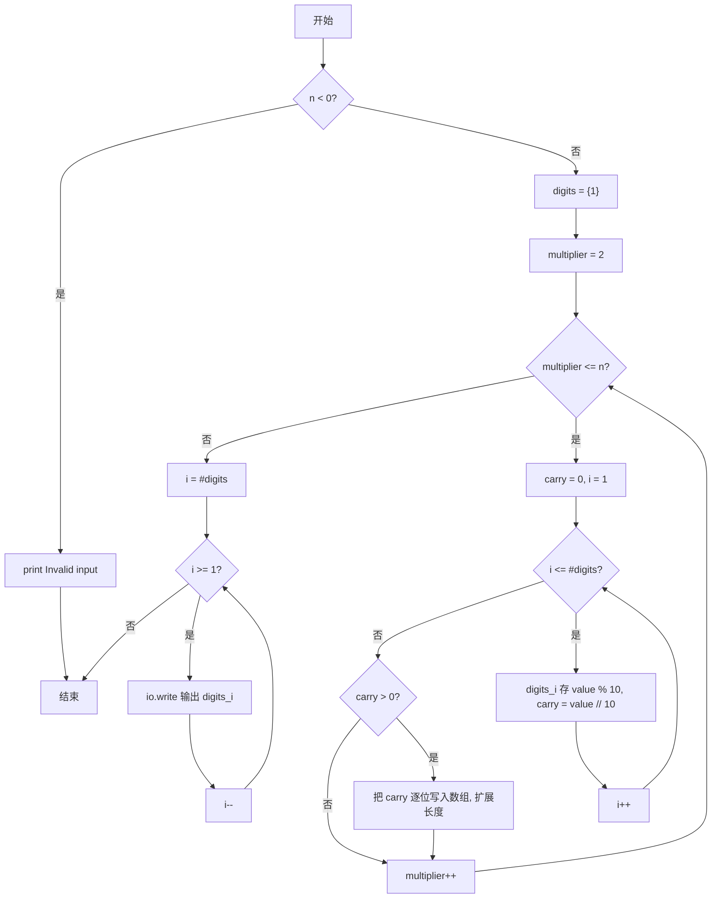
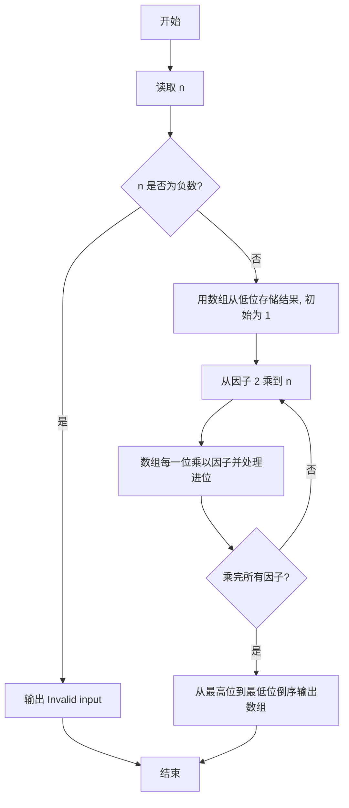

# PTA基础编程题目集 6-10阶乘计算升级版（Lua语言实现）

## 题目描述

本题要求实现一个打印非负整数阶乘的函数。

### 函数接口定义

```lua
function Print_Factorial(n)  -- n 非负时在一行打印 n!，否则打印 "Invalid input"
end
```

其中`N`是用户传入的参数，其值不超过1000。如果`N`是非负整数，则该函数必须在一行中打印出`N`!的值，否则打印"Invalid input"。

### 裁判测试程序样例

```lua
function Print_Factorial(n)
    -- 你的代码将被嵌在这里
end

local N = io.read("*n")
Print_Factorial(N)
print()
```

### 输入样例

```in
15
```

### 输出样例

```out
1307674368000
```

## 解题思路

这道题的核心是**大数乘法模拟**：`1000!` 远超普通整数范围，用数组 digits 从低位到高位逐位存储结果，每乘一个因子就逐位相乘并处理进位。

### 核心问题分析

1. **大数存储**：用数组 `digits` 从低位到高位逐位存储结果的每一位，初始 `digits = { 1 }`（即 0!）。
2. **逐位相乘**：`value = digits[i] * multiplier + carry`，当前位存 `value % 10`，进位为 `value // 10`。
3. **进位扩展**：进位不止一位时逐位扩展数组长度（`digits[#digits + 1]`）。
4. **倒序输出**：用 `io.write` 从最高位到最低位输出每一位。

### 算法原理说明

`n` 最大为 1000，`1000!` 远超普通整数范围，必须用**大数乘法**模拟。思路：用数组 `digits` 从低位到高位逐位存储结果的每一位，初始 `digits = { 1 }`（即 0!）。从因子 2 乘到 `n`，每次乘法把数组的每一位乘以当前因子并处理进位：`value = digits[i] * multiplier + carry`，当前位存 `value % 10`，进位为 `value // 10`；进位不止一位时逐位扩展数组长度。最后用 `io.write` 倒序输出每一位即为最终阶乘结果。

### 具体计算步骤

1. 判断 `n < 0`：成立则用 `print("Invalid input")` 输出提示并返回。
2. 初始化数组 `digits = { 1 }`，表示结果最低位为 1（即 0!）。
3. 外层循环 `multiplier` 从 2 到 `n`，每次把当前结果乘以 `multiplier`。
4. 内层循环遍历 `digits` 的每一位：`value = digits[i] * multiplier + carry`，当前位存 `value % 10`，进位为 `value // 10`。
5. 若乘完后仍有进位 `carry > 0`，用 `digits[#digits + 1]` 逐位写入数组并扩展长度。
6. 所有因子乘完后，用 `io.write` 从最高位到最低位倒序输出每一位。

## 完整代码

```lua
-- 6-10 阶乘计算升级版
-- 题目描述：实现函数 Print_Factorial，打印非负整数阶乘，非法打印 Invalid input
--[[
 实现原理：大数乘法模拟，用数组从低位到高位逐位存储，逐位相乘处理进位
 参数说明：n - 非负整数，不超过 1000
 时间复杂度：O(n*m) -- n 因子数，m 结果位数
 空间复杂度：O(m) -- 存储大数各位
]]
function Print_Factorial(n)
    if n < 0 then
        io.write("Invalid input") -- 非法输入，与主程序的 print() 配合只产生一个换行
        return
    end
    local digits = {1} -- 低位到高位存储，初始 0! =1
    for multiplier = 2, n do
        local carry = 0 -- 进位
        for i = 1, #digits do
            local v = digits[i] * multiplier + carry -- 当前位相乘加进位
            digits[i] = v % 10 -- 当前位保留
            carry = v // 10 -- 更新进位
        end
        while carry > 0 do
            table.insert(digits, carry % 10) -- 扩展高位
            carry = carry // 10
        end
    end
    for i = #digits, 1, -1 do io.write(digits[i]) end -- 倒序输出
end

-- 主程序：按裁判样例结构读取输入并调用函数
local N = io.read("*n") -- 读取 N
Print_Factorial(N)
print() -- 换行
```

## 代码流程说明

1. 判断 `n < 0`：成立则用 `print("Invalid input")` 输出提示并返回。
2. 初始化数组 `digits = { 1 }`，表示结果最低位为 1（即 0!）。
3. 外层循环 `multiplier` 从 2 到 `n`，每次把当前结果乘以 `multiplier`。
4. 内层循环遍历 `digits` 的每一位：`value = digits[i] * multiplier + carry`，当前位存 `value % 10`，进位为 `value // 10`。
5. 若乘完后仍有进位 `carry > 0`，用 `digits[#digits + 1]` 逐位写入数组并扩展长度。
6. 所有因子乘完后，用 `io.write` 从最高位到最低位倒序输出每一位。

## 代码流程图



## 解题流程图



## 复杂度分析

设 `m` 为 `n!` 的十进制位数。每个因子都要遍历当前结果的各位，因此时间复杂度为 `O(n·m)`，数组存储大整数所需的空间复杂度为 `O(m)`。

## 常见易错点

1. `1000!` 不能用普通整数直接保存，必须用数组逐位模拟乘法并处理进位。
2. 数组按低位到高位保存，输出时必须从 `#digits` 倒序到 `1`。
3. `0!` 和 `1!` 都是 `1`，结果数组应从 `{1}` 开始。
4. 负数输入应输出 `Invalid input` 并提前返回，不能把它当作空循环处理。
