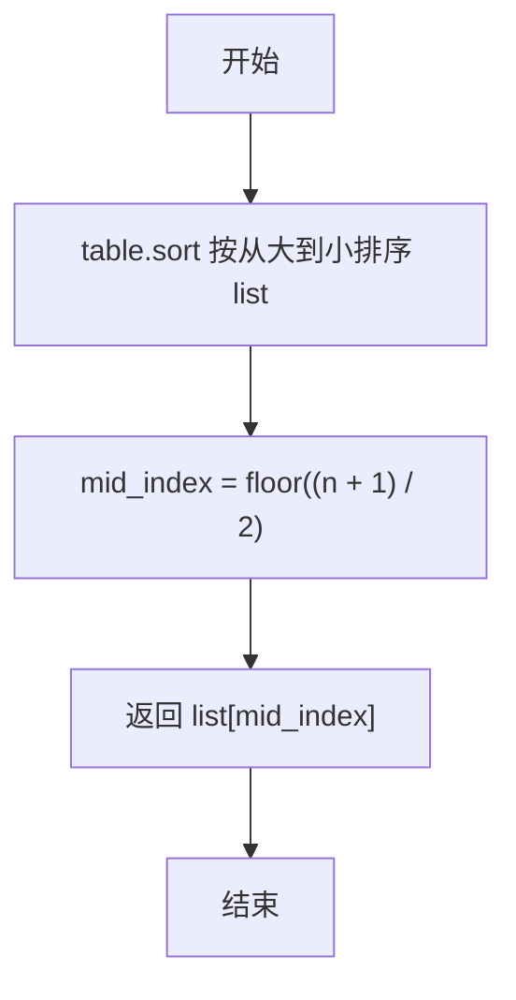
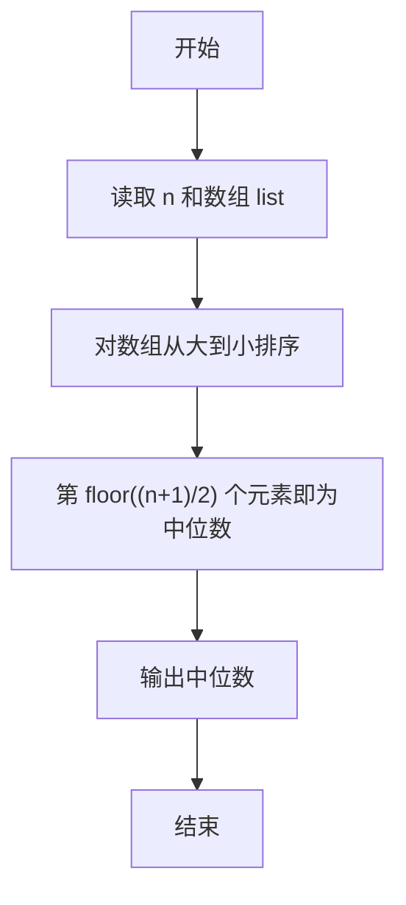

# PTA基础编程题目集 6-11求自定类型元素序列的中位数（Lua语言实现）

## 题目描述

本题要求实现一个函数，求N个集合元素A[]的中位数，即序列中第⌊(N+1)/2⌋大的元素。其中集合元素的类型为自定义的ElementType。

### 函数接口定义

```lua
function Median(list, n)  -- 返回 list 中前 n 个元素的中位数
end
```

其中给定集合元素存放在数组A[]中，正整数N是数组元素个数。该函数须返回N个A[]元素的中位数，其值也必须是ElementType类型。

### 裁判测试程序样例

```lua
function Median(list, n)
    -- 你的代码将被嵌在这里
end

local N = io.read("*n")
local list = {}
for i = 1, N do list[i] = io.read("*n") end
print(string.format("%.2f", Median(list, N)))
```

### 输入样例

```in
3
12.3 34 -5
```

### 输出样例

```out
12.30
```

## 解题思路

这道题的核心是**排序定位**：中位数是排序后位于第 ⌊(N+1)/2⌋ 大的元素，先用 table.sort 按从大到小排序，再按公式计算下标返回对应元素。

### 核心问题分析

1. **排序方式**：`table.sort` 配合比较函数 `function(a, b) return a > b end` 把数组按从大到小排序。
2. **中位数下标**：第 ⌊(N+1)/2⌋ 大的元素位于下标 `math.floor((n + 1) / 2)`（Lua 下标从 1 开始）。
3. **直接返回**：返回该下标对应的元素即为中位数。

### 算法原理说明

中位数定义为排序后位于第 ⌊(N+1)/2⌋ 大的元素。思路：先用 `table.sort` 配合比较函数 `function(a, b) return a > b end` 把数组 `list` 按从大到小排序，排序后第 ⌊(N+1)/2⌋ 大的元素正好位于下标 `math.floor((n + 1) / 2)`（Lua 下标从 1 开始），直接返回该下标对应的元素即为中位数。

### 具体计算步骤

1. 调用 `table.sort(list, function(a, b) return a > b end)` 将数组 `list` 按从大到小排序。
2. 排序后第 ⌊(N+1)/2⌋ 大的元素位于下标 `math.floor((n + 1) / 2)`。
3. 返回 `list[math.floor((n + 1) / 2)]` 作为中位数。

## 完整代码

```lua
-- 6-11 求自定类型元素序列的中位数
-- 题目描述：实现函数 Median，求 N 个元素的中位数（第 ⌊(N+1)/2⌋ 大的元素）
--[[
 实现原理：table.sort 按从大到小排序，再按公式取下标
 参数说明：list - 元素数组(1基)，n - 元素个数
 时间复杂度：O(n log n) -- 排序主导
 空间复杂度：O(1) -- 原地排序
]]
function Median(list, n)
    table.sort(list, function(a, b) return a > b end) -- 从大到小排序
    local mid = math.floor((n + 1) / 2) -- 中位数下标
    return list[mid]
end

-- 主程序：按裁判样例结构读取输入并调用函数
local N = io.read("*n") -- 读取元素个数
local list = {} -- 元素数组
for i = 1, N do list[i] = io.read("*n") end -- 读取 N 个元素
print(string.format("%.2f", Median(list, N)))
```

## 代码流程说明

1. 调用 `table.sort(list, function(a, b) return a > b end)` 将数组 `list` 按从大到小排序。
2. 排序后第 ⌊(N+1)/2⌋ 大的元素位于下标 `math.floor((n + 1) / 2)`。
3. 返回 `list[math.floor((n + 1) / 2)]` 作为中位数。

## 代码流程图



## 解题流程图



## 复杂度分析

主要耗时来自对 `n` 个元素进行排序，时间复杂度为 `O(n log n)`；函数在原数组上排序，只使用固定数量的辅助变量，额外空间复杂度为 `O(1)`（不计输入数组本身）。

## 常见易错点

1. 题目定义的是第 `floor((n+1)/2)` 大的元素，因此比较函数必须按从大到小排序。
2. Lua 数组下标从 `1` 开始，不能直接套用从 `0` 开始的数组下标公式。
3. 这里的中位数不是偶数个元素时取中间两数平均，而是严格按题目给出的排名定义选取一个元素。
4. `table.sort` 会改变原数组顺序；如果调用方需要保留原顺序，应先复制数组，但本题不需要。
