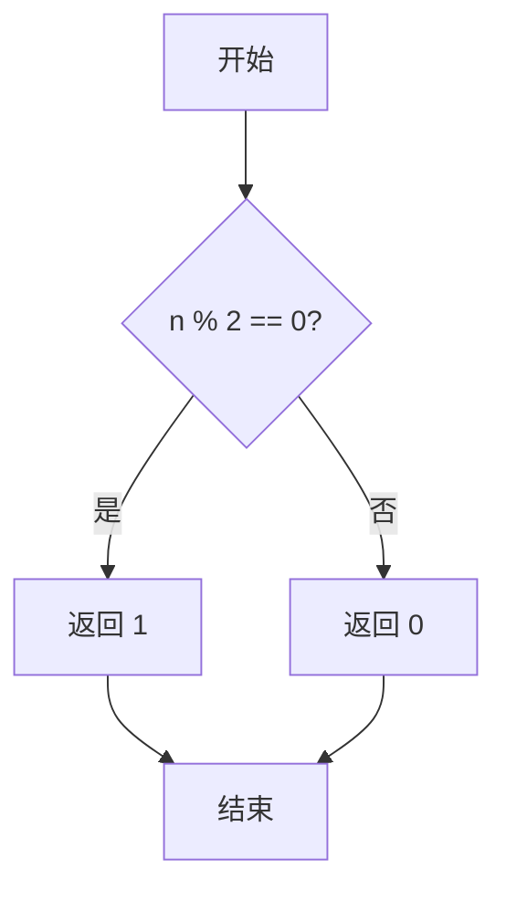
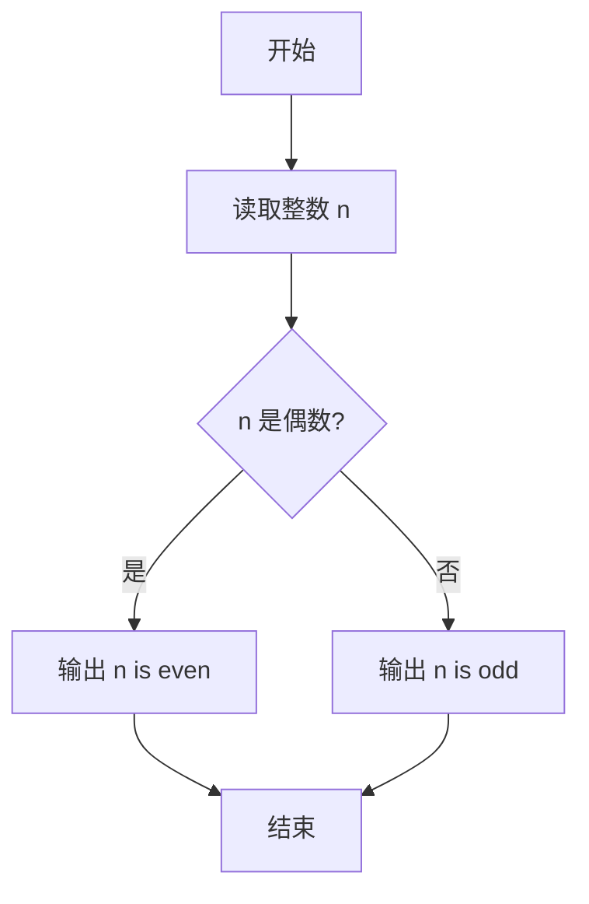

# PTA基础编程题目集 6-12判断奇偶性（Lua语言实现）

## 题目描述

本题要求实现判断给定整数奇偶性的函数。

### 函数接口定义

```lua
function even(n)  -- n 为偶数时返回 1，n 为奇数时返回 0
end
```

其中`n`是用户传入的整型参数。当`n`为偶数时，函数返回1；`n`为奇数时返回0。注意：0是偶数。

### 裁判测试程序样例

```lua
function even(n)
    -- 你的代码将被嵌在这里
end

local n = io.read("*n")
if even(n) ~= 0 then
    print(string.format("%d is even.", n))
else
    print(string.format("%d is odd.", n))
end
```

### 输入样例1

```in
-6
```

### 输出样例1

```out
-6 is even.
```

### 输入样例2

```in
5
```

### 输出样例2

```out
5 is odd.
```

## 解题思路

这道题的核心是**取模判奇偶**：`n % 2 == 0` 说明是偶数返回 1，否则是奇数返回 0，注意 0 也是偶数。

### 核心问题分析

1. **奇偶判定**：`n % 2 == 0` 成立为偶数，否则为奇数。
2. **返回约定**：偶数返回 1，奇数返回 0。
3. **零的处理**：0 是偶数，`n % 2 == 0` 能正确判定。

### 算法原理说明

判断奇偶性只需看 `n` 是否能被 2 整除：`n % 2 == 0` 说明是偶数，否则是奇数。题目约定偶数返回 1、奇数返回 0，因此用 Lua 的 `and` / `or` 表达式实现：`n % 2 == 0` 成立时取 1，否则取 0。注意 0 也是偶数，能被该条件正确判定。

### 具体计算步骤

1. 计算 `n % 2`。
2. 判断 `n % 2 == 0`：成立（偶数）则表达式 `n % 2 == 0 and 1 or 0` 返回 1，不成立（奇数）返回 0。

## 完整代码

```lua
-- 6-12 判断奇偶性
-- 题目描述：实现函数 even，偶数返回 1，奇数返回 0
--[[
 实现原理：n % 2 ==0 为偶数，注意 0 也是偶数
 参数说明：n - 整型参数
 时间复杂度：O(1) -- 常数计算
 空间复杂度：O(1) -- 仅用常数变量
]]
function even(n)
    return n % 2 == 0 and 1 or 0 -- 偶数 1，奇数 0
end

-- 主程序：按裁判样例结构读取输入并调用函数
local n = io.read("*n") -- 读取整数 n
if even(n) ~= 0 then
    print(string.format("%d is even.", n))
else
    print(string.format("%d is odd.", n))
end
```

## 代码流程说明

1. 计算 `n % 2`。
2. 判断 `n % 2 == 0`：成立（偶数）则表达式 `n % 2 == 0 and 1 or 0` 返回 1，不成立（奇数）返回 0。

## 代码流程图



## 解题流程图



## 复杂度分析

函数只进行一次取模和条件判断，时间复杂度为 `O(1)`，额外空间复杂度为 `O(1)`。

## 常见易错点

1. 偶数应返回 `1`，奇数应返回 `0`，不要直接返回布尔值。
2. `0 % 2 == 0`，零属于偶数，不能单独判为奇数。
3. 负数同样可以通过对 `2` 取模判断奇偶性，不需要先转为正数。
