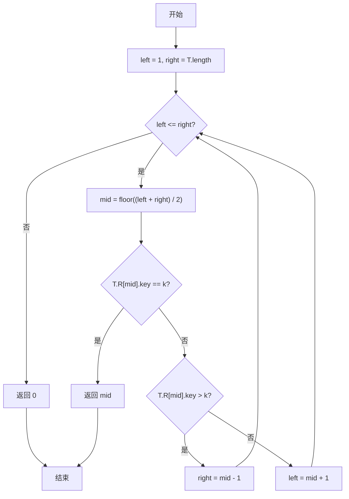
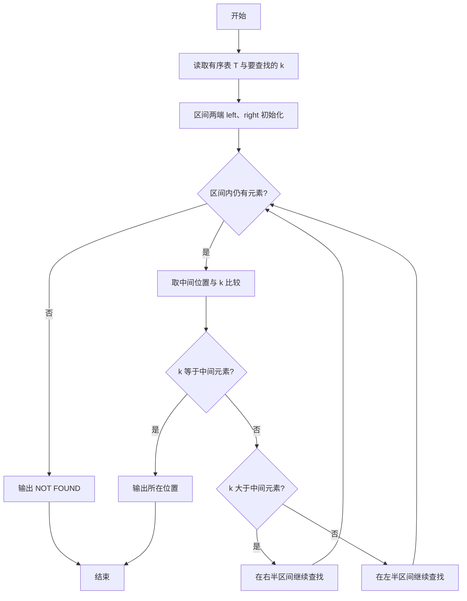

# PTA基础编程题目集 6-13折半查找（Lua语言实现）

## 题目描述

给一个严格递增数列，函数int Search_Bin(SSTable T, KeyType k)用来二分地查找k在数列中的位置。

### 函数接口定义

```lua
-- 有序表 T 用表表示：{ R = { { key = 关键字 }, ... }, length = 元素个数 }
-- R 按下标 1 开始存放，与题目中 C 代码的数组存储方式一致。
function Search_Bin(T, k)  -- 二分查找 k 在有序表 T 中的位置
end
```

其中T是有序表，k是查找的值。

### 裁判测试程序样例

```lua
-- 有序表结点：{ key = 关键字 }，有序表：{ R = 结点表, length = 元素个数 }
function Search_Bin(T, k)
    -- 你的代码将被嵌在这里
end

local n = io.read("*n")
local T = { R = {}, length = n }
for i = 1, n do T.R[i] = { key = io.read("*n") } end
local k = io.read("*n")
local pos = Search_Bin(T, k)
if pos == 0 then print("NOT FOUND") else print(pos) end
```

### 输入格式

第一行输入一个整数n，表示有序表的元素个数，接下来一行n个数字，依次为表内元素值。 然后输入一个要查找的值。

### 输出格式

输出这个值在表内的位置，如果没有找到，输出"NOT FOUND"。

### 输入样例

```in
5
1 3 5 7 9
7
```

### 输出样例

```out
4
```

### 输入样例2

```in
5
1 3 5 7 9
10
```

### 输出样例2

```out
NOT FOUND
```

## 解题思路

这道题的核心是**折半查找**：有序表中不断取中间位置与目标值比较，相等即找到；否则根据大小关系把区间缩小一半，直到区间为空。

### 核心问题分析

1. **区间初始化**：Lua 下标从 1 开始，`left = 1`，`right = T.length`。
2. **中间位置**：`mid = math.floor((left + right) / 2)`。
3. **比较与收缩**：相等返回 `mid`；`T.R[mid].key > k` 则 `right = mid - 1`；否则 `left = mid + 1`。
4. **查找失败**：`left > right` 时区间为空，返回 0 表示未找到。

### 算法原理说明

二分查找适用于有序表，核心思路是不断把查找区间折半：用 `left`、`right` 指向区间两端（Lua 下标从 1 开始，`left = 1`，`right = T.length`），取中间位置 `mid = math.floor((left + right) / 2)` 与 `k` 比较——相等则找到并返回 `mid`；`T.R[mid].key` 大于 `k` 则说明目标在左半区，把 `right` 移到 `mid - 1`；否则目标在右半区，把 `left` 移到 `mid + 1`。当 `left > right` 时区间为空，说明未找到。

### 具体计算步骤

1. 初始化查找区间 `left = 1`，`right = T.length`。
2. `while left <= right` 循环：区间非空时继续查找。
3. 取中间位置 `mid = math.floor((left + right) / 2)`。
4. 若 `T.R[mid].key == k`，直接返回 `mid`。
5. 若 `T.R[mid].key > k`，说明目标在左半区，`right = mid - 1`；否则目标在右半区，`left = mid + 1`。
6. 循环结束仍未找到，返回 0（按题意表示未找到）。

## 完整代码

```lua
-- 6-13 折半查找
-- 题目描述：实现函数 Search_Bin，在严格递增有序表中二分查找 k 的位置
--[[
 实现原理：left=1, right=length 为区间，取 mid 比较后折半缩小区间
 参数说明：T - 有序表 {R={ {key},... }, length}，k - 查找值
 时间复杂度：O(log n) -- 二分折半
 空间复杂度：O(1) -- 仅用常数变量
]]
function Search_Bin(T, k)
    local left = 1 -- 左边界
    local right = T.length -- 右边界
    while left <= right do
        local mid = math.floor((left + right) / 2) -- 中间位置
        if T.R[mid].key == k then
            return mid -- 找到返回位置
        elseif T.R[mid].key > k then
            right = mid - 1 -- 在左半区
        else
            left = mid + 1 -- 在右半区
        end
    end
    return 0 -- 未找到返回 0
end

-- 主程序：按裁判样例结构读取输入并调用函数
local n = io.read("*n") -- 读取元素个数
local T = { R = {}, length = n } -- 有序表
for i = 1, n do T.R[i] = { key = io.read("*n") } end -- 读取有序表元素
local k = io.read("*n") -- 读取待查值
local pos = Search_Bin(T, k)
if pos == 0 then print("NOT FOUND") else print(pos) end
```

## 代码流程说明

1. 初始化查找区间 `left = 1`，`right = T.length`。
2. `while left <= right` 循环：区间非空时继续查找。
3. 取中间位置 `mid = math.floor((left + right) / 2)`。
4. 若 `T.R[mid].key == k`，直接返回 `mid`。
5. 若 `T.R[mid].key > k`，说明目标在左半区，`right = mid - 1`；否则目标在右半区，`left = mid + 1`。
6. 循环结束仍未找到，返回 0（按题意表示未找到）。

## 代码流程图



## 解题流程图


