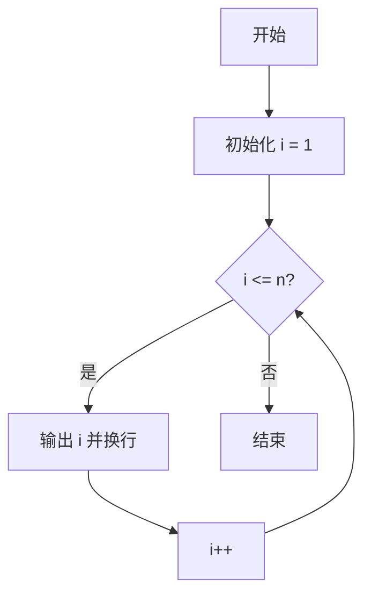
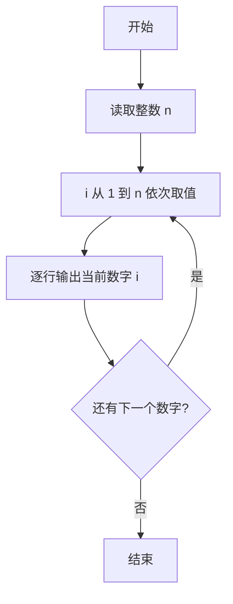

# PTA基础编程题目集 6-1简单输出整数（Lua语言实现）

## 题目描述

本题要求实现一个函数，对给定的正整数`N`，打印从1到`N`的全部正整数。

### 函数接口定义

```lua
function PrintN(n)  -- 将 1 到 n 的全部正整数顺序打印出来，每个数字占 1 行
end
```

其中`N`是用户传入的参数。该函数必须将从1到`N`的全部正整数顺序打印出来，每个数字占1行。

### 裁判测试程序样例

```lua
function PrintN(n)
    -- 你的代码将被嵌在这里
end

local N = io.read("*n")
PrintN(N)
```

### 输入样例

```in
3
```

### 输出样例

```out
1
2
3
```

## 解题思路

这道题的核心是**顺序输出整数序列**：函数收到参数 N 后，把 1 到 N 的每个整数按行打印出来，不需要返回值。

### 核心问题分析

1. **输出范围**：从 1 到 N 共 N 个正整数，逐行输出。
2. **输出格式**：每个数字占 1 行，即每次打印后换行。
3. **实现手段**：Lua 的 `print` 自带换行，无需额外处理。

### 算法原理说明

使用 for 循环让循环变量 i 从 1 递增到 N，循环体内调用 `print(i)` 输出当前数字并自动换行。循环结束即完成全部输出。

### 具体计算步骤

1. for 循环初始化循环变量 i = 1。
2. 判断 i <= n 是否成立：成立则进入循环体，不成立则结束函数。
3. 循环体内调用 `print(i)` 输出当前数字并换行。
4. 执行 i 自增，回到第 2 步继续判断。

## 完整代码

```lua
-- 6-1 简单输出整数
-- 题目描述：实现函数 PrintN，将 1 到 n 的全部正整数顺序打印，每行一个
--[[
 实现原理：for 循环从 1 到 n 逐个打印
 参数说明：n -- 正整数上限
 时间复杂度：O(n) -- 需遍历 n 个数
 空间复杂度：O(1) -- 仅用循环变量
]]
function PrintN(n)
    for i = 1, n do
        print(i) -- 每个数字占一行，print 自带换行
    end
end

-- 主程序：按裁判样例结构读取输入并调用函数
local N = io.read("*n") -- 读取 N
PrintN(N)
```

## 代码流程说明

1. for 循环初始化循环变量 i = 1。
2. 判断 i <= n 是否成立：成立则进入循环体，不成立则结束函数。
3. 循环体内调用 print(i) 输出当前数字并换行。
4. 执行 i 自增，回到第 2 步继续判断。

## 代码流程图



## 解题流程图


