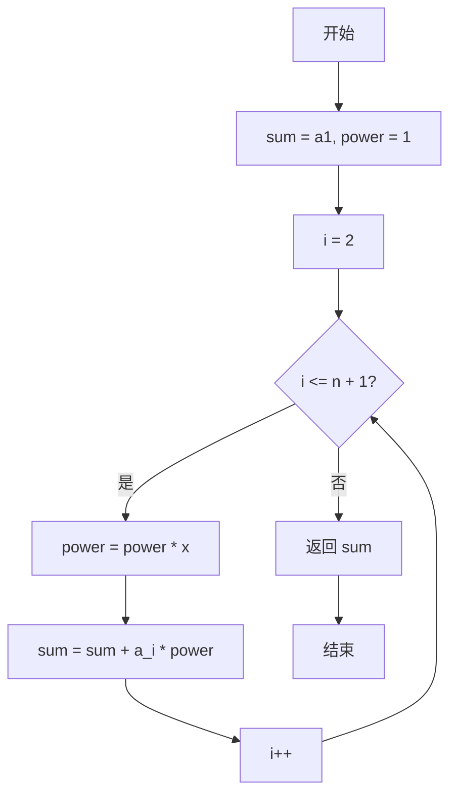
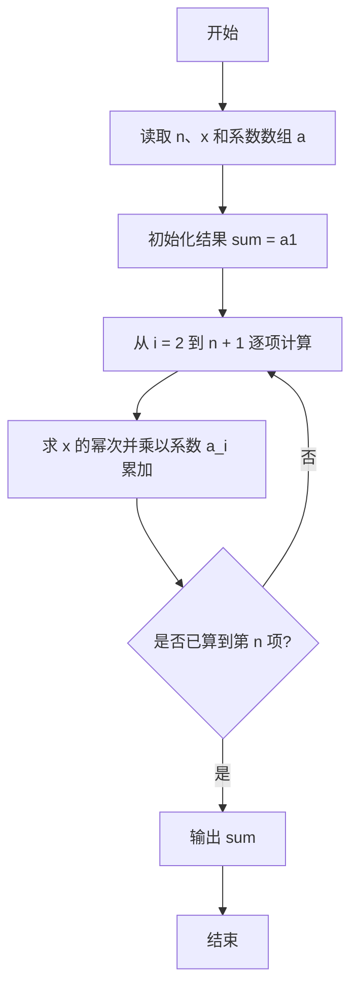

# PTA基础编程题目集 6-2多项式求值（Lua语言实现）

## 题目描述

本题要求实现一个函数，计算阶数为`n`，系数为`a[0]` ... `a[n]`的多项式*f*(*x*)=∑^n^~i=0~*(*a*[*i*]*×x^i^) 在`x`点的值。

### 函数接口定义

```lua
function f(n, a, x)  -- n 为阶数，a 存储系数，x 为给定点，返回多项式 f(x) 的值
end
```

其中`n`是多项式的阶数，`a[]`中存储系数，`x`是给定点。函数须返回多项式`f(x)`的值。

### 裁判测试程序样例

```lua
function f(n, a, x)
    -- 你的代码将被嵌在这里
end

local n, x = io.read("*n", "*n")
local a = {}
for i = 1, n + 1 do a[i] = io.read("*n") end
print(string.format("%.1f", f(n, a, x)))
```

### 输入样例

```in
2 1.1
1 2.5 -38.7
```

### 输出样例

```out
-43.1
```

## 解题思路

这道题的核心是**逐项累乘求多项式值**：利用变量 power 保存当前的 x 幂次，每轮迭代递推得到下一幂次，从而避免重复计算幂，在 O(n) 时间内完成求值。

### 核心问题分析

1. **数组下标映射**：Lua 数组下标从 1 开始，`a[1]` 对应常数项，`a[2]` ~ `a[n+1]` 对应其余系数。
2. **幂次递推**：用 `power` 保存当前的 `x^i`，每轮 `power = power * x` 得到下一幂次。
3. **累加求和**：每轮把 `a[i] * power` 累加到 `sum`。

### 算法原理说明

多项式求值通常用**逐项累乘**的方式：先计算 `x^i` 再乘以系数 `a[i]` 累加。为避免每项都重新计算幂，代码用变量 `power` 保存当前的 `x` 幂次（初始为 1，即 x^0），每轮迭代 `power = power * x` 即可得到下一幂次，从而在 O(n) 时间内完成求值。注意 Lua 数组下标从 1 开始，`a[1]` 对应常数项，`a[2]` ~ `a[n+1]` 对应其余系数。

### 具体计算步骤

1. 用 `sum = a[1]` 保存常数项，`power = 1` 表示当前的 x 幂次。
2. 循环变量 `i` 从 2 递增到 `n + 1`，覆盖系数数组的其余各项。
3. 每轮先 `power = power * x` 得到下一幂次，再累加 `sum = sum + a[i] * power`。
4. 循环结束后返回 `sum`，即为多项式在 `x` 点的值。

## 完整代码

```lua
-- 6-2 多项式求值
-- 题目描述：计算阶数为 n，系数为 a[0..n] 的多项式在 x 点的值
--[[
 实现原理：逐项累乘，用 power 递推 x^i 避免重复计算
 参数说明：n - 阶数，a - 系数表(1基，a[1]对应常数项)，x - 给定点
 时间复杂度：O(n) -- 遍历 n+1 个系数
 空间复杂度：O(1) -- 仅用常数辅助变量
]]
function f(n, a, x)
    local sum = a[1] -- 常数项
    local power = 1 -- 当前 x^i
    for i = 2, n + 1 do
        power = power * x -- 递推下一幂次
        sum = sum + a[i] * power -- 累加当前项
    end
    return sum
end

-- 主程序：按裁判样例结构读取输入并调用函数
local n, x = io.read("*n", "*n") -- 读取阶数 n 和点 x
local a = {} -- 系数表
for i = 1, n + 1 do a[i] = io.read("*n") end -- 读取 n+1 个系数
print(string.format("%.1f", f(n, a, x)))
```

## 代码流程说明

1. 用 `sum = a[1]` 保存常数项，`power = 1` 表示当前的 x 幂次。
2. 循环变量 `i` 从 2 递增到 `n + 1`，覆盖系数数组的其余各项。
3. 每轮先 `power = power * x` 得到下一幂次，再累加 `sum = sum + a[i] * power`。
4. 循环结束后返回 `sum`，即为多项式在 `x` 点的值。

## 代码流程图



## 解题流程图


