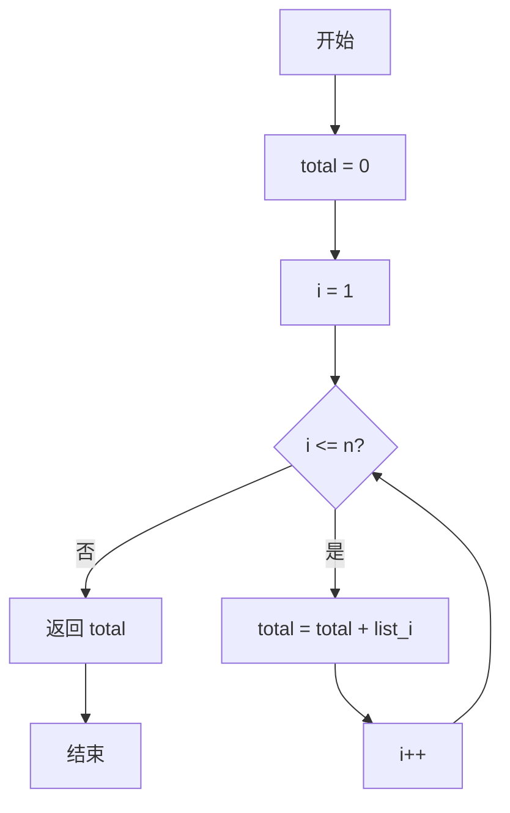
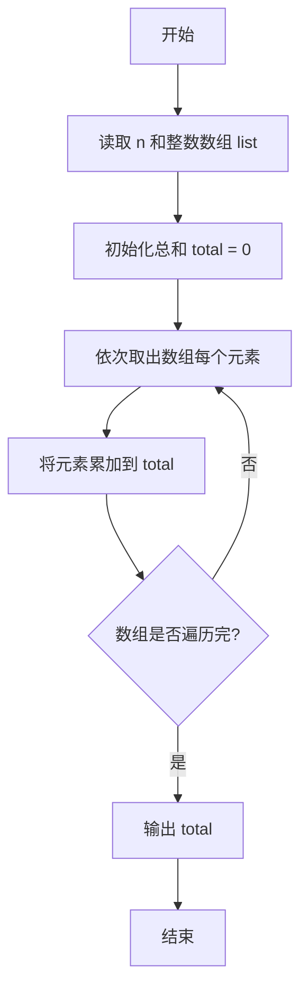

# PTA基础编程题目集 6-3简单求和（Lua语言实现）

## 题目描述

本题要求实现一个函数，求给定的`N`个整数的和。

### 函数接口定义

```lua
function Sum(list, n)  -- 返回 list 中前 n 个元素的和
end
```

其中给定整数存放在数组`List[]`中，正整数`N`是数组元素个数。该函数须返回`N`个`List[]`元素的和。

### 裁判测试程序样例

```lua
function Sum(list, n)
    -- 你的代码将被嵌在这里
end

local N = io.read("*n")
local list = {}
for i = 1, N do list[i] = io.read("*n") end
print(Sum(list, N))
```

### 输入样例

```in
3
12 34 -5
```

### 输出样例

```out
41
```

## 解题思路

这道题的核心是**累加求和**：用变量 total 保存累加结果，遍历数组逐个把元素加入 total，遍历结束后 total 即所有元素的和。

### 核心问题分析

1. **累加变量初始化**：`total = 0` 作为累加的起点。
2. **遍历范围**：数组下标从 1 到 n，覆盖全部元素。
3. **逐元素累加**：每轮执行 `total = total + list[i]`。

### 算法原理说明

求和的核心思路是：用变量 `total` 保存累加结果（初始为 0），遍历数组 `list` 的每个元素，依次把元素值累加到 `total` 中。遍历结束后 `total` 就是所有 `n` 个整数的和。

### 具体计算步骤

1. 初始化 `total = 0`。
2. 循环变量 `i` 从 1 递增到 `n`，覆盖数组的全部下标。
3. 每轮执行 `total = total + list[i]`，把当前元素加入总和。
4. 循环结束后返回 `total`。

## 完整代码

```lua
-- 6-3 简单求和
-- 题目描述：实现函数 Sum，返回 N 个整数的累加和
--[[
 实现原理：线性累加，用 total 作为累加器遍历数组
 参数说明：list - 待求和的整数数组(1基)，n - 元素个数
 时间复杂度：O(n) -- 需遍历 n 个元素
 空间复杂度：O(1) -- 仅用常数辅助变量
]]
function Sum(list, n)
    local total = 0 -- 累加器初始化为 0
    for i = 1, n do
        total = total + list[i] -- 逐个累加
    end
    return total
end

-- 主程序：按裁判样例结构读取输入并调用函数
local N = io.read("*n") -- 读取数组长度 N
local list = {} -- 整数数组
for i = 1, N do list[i] = io.read("*n") end -- 依次读取 N 个整数
print(Sum(list, N))
```

## 代码流程说明

1. 初始化 `total = 0`。
2. 循环变量 `i` 从 1 递增到 `n`，覆盖数组的全部下标。
3. 每轮执行 `total = total + list[i]`，把当前元素加入总和。
4. 循环结束后返回 `total`。

## 代码流程图



## 解题流程图



## 复杂度分析

函数对 `n` 个元素各访问一次，时间复杂度为 `O(n)`；只维护一个累加变量，额外空间复杂度为 `O(1)`。

## 常见易错点

1. 累加器应初始化为 `0`，不能使用未定义变量或首元素以外的值。
2. 循环范围必须覆盖 `list[1]` 到 `list[n]`，否则会漏加元素。
3. 元素可能包含负数，不能把负数当作特殊情况跳过。
