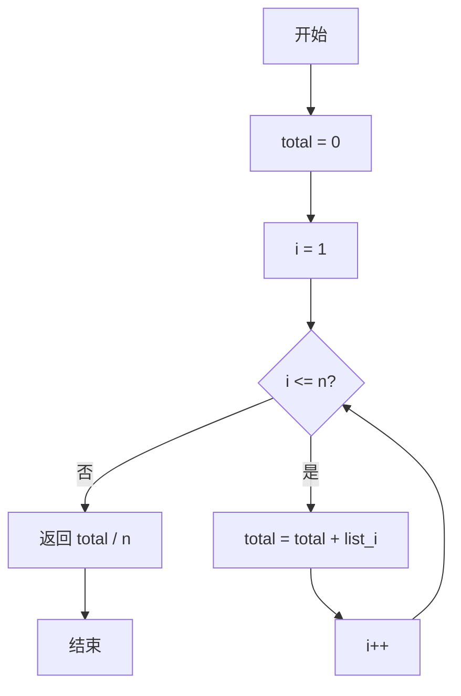
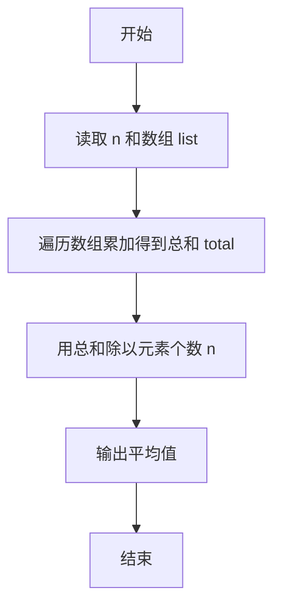

# PTA基础编程题目集 6-4求自定类型元素的平均（Lua语言实现）

## 题目描述

本题要求实现一个函数，求`N`个集合元素`S[]`的平均值，其中集合元素的类型为自定义的`ElementType`。

### 函数接口定义

```lua
function Average(list, n)  -- 返回 list 中前 n 个元素的平均值
end
```

其中给定集合元素存放在数组`S[]`中，正整数`N`是数组元素个数。该函数须返回`N`个`S[]`元素的平均值，其值也必须是`ElementType`类型。

### 裁判测试程序样例

```lua
function Average(list, n)
    -- 你的代码将被嵌在这里
end

local N = io.read("*n")
local list = {}
for i = 1, N do list[i] = io.read("*n") end
print(string.format("%.2f", Average(list, N)))
```

### 输入样例

```in
3
12.3 34 -5
```

### 输出样例

```out
13.77
```

## 解题思路

这道题的核心是**总和除以个数**：先遍历数组累加得到元素总和，再除以元素个数 n 即得平均值，Lua 的 `/` 为浮点除法可直接得到小数结果。

### 核心问题分析

1. **累加总和**：遍历数组 `list` 把全部元素累加得到 `total`。
2. **求平均值**：返回 `total / n`。
3. **浮点除法**：Lua 中 `/` 本身就是浮点除法，无需像 C 那样显式做类型转换。

### 算法原理说明

平均值 = 元素总和 ÷ 元素个数。思路是先遍历数组 `list` 把全部元素累加得到总和 `total`，再返回 `total / n` 即平均值。Lua 中 `/` 本身就是浮点除法，能直接得到小数结果，无需像 C 那样显式做类型转换。

### 具体计算步骤

1. 初始化 `total = 0`。
2. 循环变量 `i` 从 1 递增到 `n`，把每个元素累加到 `total`。
3. 返回 `total / n`，即平均值（Lua 的 `/` 为浮点除法）。

## 完整代码

```lua
-- 6-4 求自定类型元素的平均
-- 题目描述：实现函数 Average，求 N 个集合元素的平均值
--[[
 实现原理：先遍历累加得到总和，再除以个数；Lua 的 / 为浮点除法
 参数说明：list - 元素数组(1基)，n - 元素个数
 时间复杂度：O(n) -- 需遍历 n 个元素
 空间复杂度：O(1) -- 仅用常数辅助变量
]]
function Average(list, n)
    local total = 0 -- 累加器
    for i = 1, n do
        total = total + list[i] -- 逐个累加
    end
    return total / n -- 浮点除法求平均
end

-- 主程序：按裁判样例结构读取输入并调用函数
local N = io.read("*n") -- 读取元素个数
local list = {} -- 集合元素数组
for i = 1, N do list[i] = io.read("*n") end -- 读取 N 个元素
print(string.format("%.2f", Average(list, N)))
```

## 代码流程说明

1. 初始化 `total = 0`。
2. 循环变量 `i` 从 1 递增到 `n`，把每个元素累加到 `total`。
3. 返回 `total / n`，即平均值（Lua 的 `/` 为浮点除法）。

## 代码流程图



## 解题流程图



## 复杂度分析

函数遍历 `n` 个元素并进行一次累加，时间复杂度为 `O(n)`；除输入数组外只使用累加变量，额外空间复杂度为 `O(1)`。

## 常见易错点

1. 总和必须从 `0` 开始，不能遗漏数组中的任意元素。
2. 最后应使用 `total / n`，Lua 的 `/` 才能得到题目要求的实数平均值。
3. `n` 为元素个数且题目保证集合非空时才可直接除以 `n`；不要把最后一个下标误当作数量。
