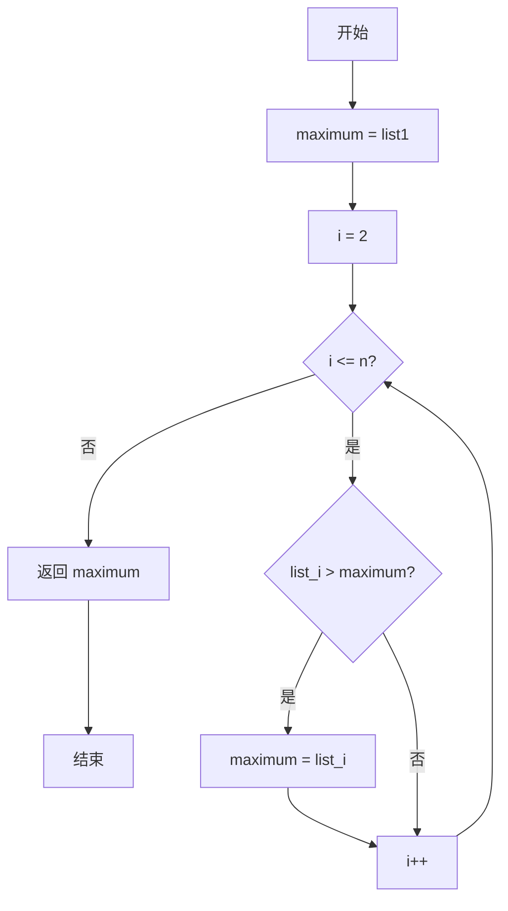
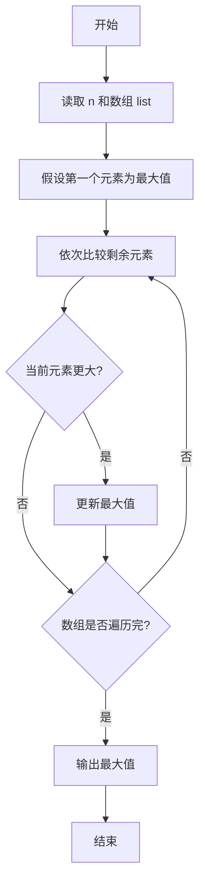

# PTA基础编程题目集 6-5求自定类型元素的最大值（Lua语言实现）

## 题目描述

本题要求实现一个函数，求`N`个集合元素`S[]`中的最大值，其中集合元素的类型为自定义的`ElementType`。

### 函数接口定义

```lua
function Max(list, n)  -- 返回 list 中前 n 个元素的最大值
end
```

其中给定集合元素存放在数组`S[]`中，正整数`N`是数组元素个数。该函数须返回`N`个`S[]`元素中的最大值，其值也必须是`ElementType`类型。

### 裁判测试程序样例

```lua
function Max(list, n)
    -- 你的代码将被嵌在这里
end

local N = io.read("*n")
local list = {}
for i = 1, N do list[i] = io.read("*n") end
print(string.format("%.2f", Max(list, N)))
```

### 输入样例

```in
3
12.3 34 -5
```

### 输出样例

```out
34.00
```

## 解题思路

这道题的核心是**"打擂台"求最大值**：先把首元素当作当前最大值，再依次与剩余元素比较，遇到更大的就更新，遍历结束后即为最大值。

### 核心问题分析

1. **初始最大值**：把第一个元素 `list[1]` 当作当前最大值 `maximum`。
2. **遍历比较**：从第二个元素开始依次与 `maximum` 比较。
3. **更新最大值**：凡是比 `maximum` 大的元素就更新 `maximum`。

### 算法原理说明

求最大值采用"打擂台"思路：先把第一个元素 `list[1]` 当作当前最大值 `maximum`，然后从第二个元素开始依次与 `maximum` 比较，凡是比 `maximum` 大的元素就更新 `maximum`。遍历结束后 `maximum` 即为整个数组的最大值。

### 具体计算步骤

1. 初始化 `maximum = list[1]`，把首元素作为初始最大值。
2. 循环变量 `i` 从 2 递增到 `n`。
3. 判断 `list[i] > maximum`：成立则把 `maximum` 更新为 `list[i]`。
4. 循环结束后返回 `maximum`。

## 完整代码

```lua
-- 6-5 求自定类型元素的最大值
-- 题目描述：实现函数 Max，求 N 个集合元素中的最大值
--[[
 实现原理：打擂台法，首元素为初始最大值，依次比较更新
 参数说明：list - 元素数组(1基)，n - 元素个数
 时间复杂度：O(n) -- 需遍历 n 个元素
 空间复杂度：O(1) -- 仅用常数辅助变量
]]
function Max(list, n)
    local maximum = list[1] -- 以首元素为初始最大值
    for i = 2, n do
        if list[i] > maximum then
            maximum = list[i] -- 遇到更大者更新
        end
    end
    return maximum
end

-- 主程序：按裁判样例结构读取输入并调用函数
local N = io.read("*n") -- 读取元素个数
local list = {} -- 集合元素数组
for i = 1, N do list[i] = io.read("*n") end -- 读取 N 个元素
print(string.format("%.2f", Max(list, N)))
```

## 代码流程说明

1. 初始化 `maximum = list[1]`，把首元素作为初始最大值。
2. 循环变量 `i` 从 2 递增到 `n`。
3. 判断 `list[i] > maximum`：成立则把 `maximum` 更新为 `list[i]`。
4. 循环结束后返回 `maximum`。

## 代码流程图



## 解题流程图


