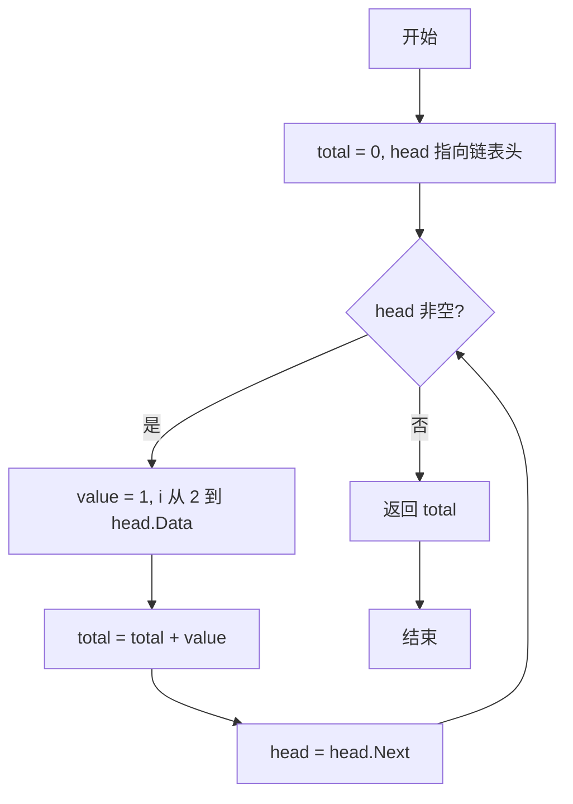
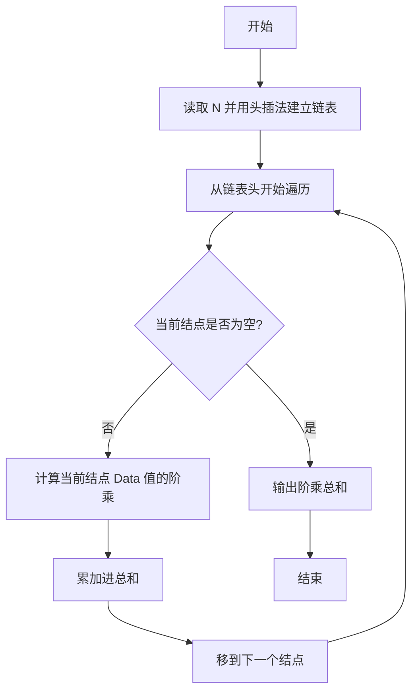

# PTA基础编程题目集 6-6求单链表结点的阶乘和（Lua语言实现）

## 题目描述

本题要求实现一个函数，求单链表`L`结点的阶乘和。这里默认所有结点的值非负，且题目保证结果在`int`范围内。

### 函数接口定义

```lua
function FactorialSum(head)  -- 求单链表 head 所有结点值的阶乘和
end
```

其中单链表`List`的定义如下：

```lua
-- 链表结点用表表示：{ Data = 结点数据, Next = 下一个结点（或 nil） }
-- 链表类型 List 即链表头结点。
```

### 裁判测试程序样例

```lua
-- 链表结点：{ Data = 结点数据, Next = 下一个结点或 nil }
function FactorialSum(head)
    -- 你的代码将被嵌在这里
end

local N = io.read("*n")
local head = nil
for i = 1, N do
    local value = io.read("*n")
    head = { Data = value, Next = head }  -- 头插法建立链表
end
print(FactorialSum(head))
```

### 输入样例

```in
3
5 3 6
```

### 输出样例

```out
846
```

## 解题思路

这道题的核心是**游标遍历链表并逐结点求阶乘累加**：用链表头作为游标遍历，对每个结点的 Data 值计算阶乘并累加到 total，直到链表遍历完毕。

### 核心问题分析

1. **链表表示**：结点用表 `{ Data = value, Next = next_node }` 表示，`nil` 表示链表结束。
2. **遍历方式**：用 `head` 作为游标，`while head do` 循环访问每个结点，结束后移 `head = head.Next`。
3. **阶乘计算**：对当前结点的 `Data` 值，用 `value` 从 1 开始依次乘以 2 到 `Data` 得到阶乘。

### 算法原理说明

题目要求求单链表中所有结点值的阶乘之和。思路：用链表头 `head` 作为游标遍历链表，只要结点不为空，就对当前结点的 `Data` 值计算阶乘并累加到 `total`，然后让 `head` 指向下一个结点（`head.Next`），直到链表遍历完毕，返回总和。

### 具体计算步骤

1. 初始化 `total = 0`，游标 `head` 指向链表头。
2. `while head do` 循环遍历链表：结点非空则进入循环体。
3. 对当前结点值计算阶乘：`value` 从 1 开始，循环变量 `i` 从 2 递增到 `head.Data`，每轮执行 `value = value * i`。
4. 将阶乘累加到 `total`，并让 `head` 后移到下一个结点 `head.Next`。
5. 链表遍历完后返回 `total`。

## 完整代码

```lua
-- 6-6 求单链表结点的阶乘和
-- 题目描述：实现函数 FactorialSum，求单链表所有结点值的阶乘和
--[[
 实现原理：游标遍历链表，对每个结点的 Data 求阶乘后累加
 参数说明：head - 链表头结点(表 {Data, Next})
 时间复杂度：O(n*m) -- n 结点数，m 平均 Data 大小
 空间复杂度：O(1) -- 仅用常数辅助变量
]]
function FactorialSum(head)
    local total = 0 -- 累加器
    local p = head -- 游标指向头结点
    while p do
        local v = p.Data -- 当前结点数据
        local fact = 1 -- 阶乘结果，0! =1
        for i = 2, v do
            fact = fact * i -- 连乘求阶乘
        end
        total = total + fact -- 累加
        p = p.Next -- 后移
    end
    return total
end

-- 主程序：按裁判样例结构头插法建链表并调用函数
local N = io.read("*n") -- 读取结点数
local head = nil -- 链表头
for i = 1, N do
    local value = io.read("*n") -- 读取结点值
    head = { Data = value, Next = head } -- 头插法
end
print(FactorialSum(head))
```

## 代码流程说明

1. 初始化 `total = 0`，游标 `head` 指向链表头。
2. `while head do` 循环遍历链表：结点非空则进入循环体。
3. 对当前结点值计算阶乘：`value` 从 1 开始，循环变量 `i` 从 2 递增到 `head.Data`，每轮执行 `value = value * i`。
4. 将阶乘累加到 `total`，并让 `head` 后移到下一个结点 `head.Next`。
5. 链表遍历完后返回 `total`。

## 代码流程图



## 解题流程图


