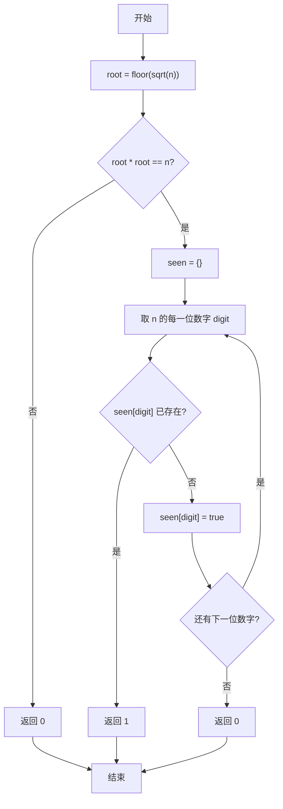
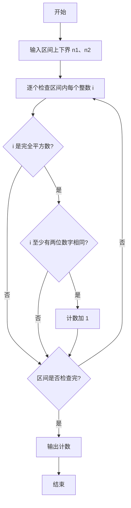

# PTA基础编程题目集 6-7统计某类完全平方数（Lua语言实现）

## 题目描述

本题要求实现一个函数，判断任一给定整数`N`是否满足条件：它是完全平方数，又至少有两位数字相同，如144、676等。

### 函数接口定义

```lua
function IsTheNumber(n)  -- 完全平方数且至少两位数字相同返回 1，否则返回 0
end
```

其中`N`是用户传入的参数。如果`N`满足条件，则该函数必须返回1，否则返回0。

### 裁判测试程序样例

```lua
function IsTheNumber(n)
    -- 你的代码将被嵌在这里
end

local n1, n2 = io.read("*n", "*n")
local cnt = 0
for i = n1, n2 do
    if IsTheNumber(i) == 1 then cnt = cnt + 1 end
end
print(string.format("cnt = %d", cnt))
```

### 输入样例

```in
105 500
```

### 输出样例

```out
cnt = 6
```

## 解题思路

这道题的核心是**双重条件判定**：先判断是否为完全平方数，再判断是否至少两位数字相同，两个条件同时满足才返回 1。

### 核心问题分析

1. **完全平方数判断**：对 `n` 开平方取整得到 `root`，判断 `root * root == n` 是否成立。
2. **重复数字检测**：用 `tostring(n):gmatch("%d")` 逐位取出数字，用表 `seen` 记录已出现的数字，遇到重复即满足条件。
3. **短路返回**：不是完全平方数直接返回 0，避免多余计算。

### 算法原理说明

题目要求同时满足两个条件：① 完全平方数；② 至少有两位数字相同。思路分两步：先对 `n` 用 `math.floor(math.sqrt(n))` 开平方取整得到 `root`，判断 `root * root == n` 是否成立来验证完全平方数；再把 `n` 通过 `tostring(n):gmatch("%d")` 逐个取出每一位数字，并用表 `seen` 记录已经出现过的数字，一旦发现某个数字重复出现即满足条件。

### 具体计算步骤

1. 计算 `root = math.floor(math.sqrt(n))` 并取整，判断 `root * root ~= n`：成立则说明不是完全平方数，返回 0。
2. 初始化空表 `seen` 用于记录已出现过的数字。
3. 用 `tostring(n):gmatch("%d")` 遍历 `n` 的每一位数字。
4. 若当前数字已在 `seen` 中（`seen[digit]` 为真），说明至少两位相同，返回 1。
5. 否则把该数字记入 `seen`（`seen[digit] = true`），继续检查下一位。
6. 遍历结束后没有重复数字，返回 0。

## 完整代码

```lua
-- 6-7 统计某类完全平方数
-- 题目描述：判断整数 N 是否为完全平方数且至少有两位数字相同
--[[
 实现原理：先开方验证完全平方，再逐位检查重复数字
 参数说明：n - 待判断的整数
 时间复杂度：O(k) -- k 为数字位数
 空间复杂度：O(1) -- 仅用常数辅助变量
]]
function IsTheNumber(n)
    local root = math.floor(math.sqrt(n)) -- 开方取整
    if root * root ~= n then
        return 0 -- 非完全平方数
    end
    local seen = {} -- 记录已出现数字
    for d in tostring(n):gmatch("%d") do -- 逐位取出数字
        if seen[d] then
            return 1 -- 发现重复数字
        end
        seen[d] = true
    end
    return 0 -- 无重复数字
end

-- 主程序：按裁判样例结构读取区间并统计
local n1, n2 = io.read("*n", "*n") -- 读取区间 [n1, n2]
local cnt = 0 -- 计数器
for i = n1, n2 do
    if IsTheNumber(i) == 1 then cnt = cnt + 1 end
end
print(string.format("cnt = %d", cnt))
```

## 代码流程说明

1. 计算 `root = math.floor(math.sqrt(n))` 并取整，判断 `root * root ~= n`：成立则说明不是完全平方数，返回 0。
2. 初始化空表 `seen` 用于记录已出现过的数字。
3. 用 `tostring(n):gmatch("%d")` 遍历 `n` 的每一位数字。
4. 若当前数字已在 `seen` 中（`seen[digit]` 为真），说明至少两位相同，返回 1。
5. 否则把该数字记入 `seen`（`seen[digit] = true`），继续检查下一位。
6. 遍历结束后没有重复数字，返回 0。

## 代码流程图



## 解题流程图



## 复杂度分析

设 `n` 的十进制位数为 `d`。一次 `IsTheNumber` 调用的时间复杂度为 `O(d)`，空间复杂度为 `O(d)`，主要用于保存已出现的数字；若连同裁判程序对区间 `[n1,n2]` 进行统计，总时间复杂度为 `O((n2-n1+1)·d)`。

## 常见易错点

1. 必须同时满足“完全平方数”和“至少两位数字相同”两个条件，不能只判断其中一个。
2. 开平方后应验证 `root * root == n`，不能仅依赖 `sqrt(n)` 是否为整数的字符串表现。
3. 重复数字判断要使用集合记录已出现的数字，发现重复后即可返回 `1`。
4. 统计区间时应包含两个端点，并且函数返回值是 `1` 或 `0`，不是直接返回计数。
