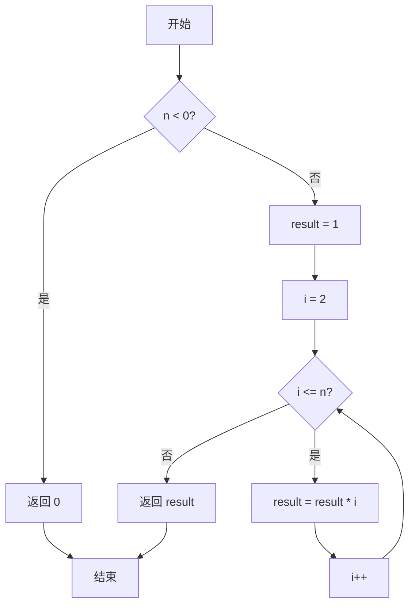
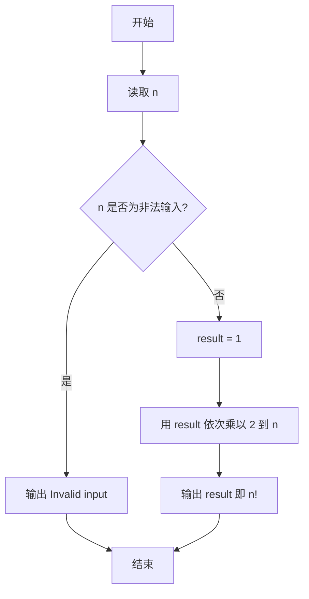

# PTA基础编程题目集 6-8简单阶乘计算（Lua语言实现）

## 题目描述

本题要求实现一个计算非负整数阶乘的简单函数。

### 函数接口定义

```lua
function Factorial(n)  -- n 为非负整数时返回其阶乘，否则返回 0
end
```

其中`N`是用户传入的参数，其值不超过12。如果`N`是非负整数，则该函数必须返回`N`的阶乘，否则返回0。

### 裁判测试程序样例

```lua
function Factorial(n)
    -- 你的代码将被嵌在这里
end

local N = io.read("*n")
local nf = Factorial(N)
if nf ~= 0 then
    print(string.format("%d! = %d", N, nf))
else
    print("Invalid input")
end
```

### 输入样例

```in
5
```

### 输出样例

```out
5! = 120
```

## 解题思路

这道题的核心是**连乘求阶乘并处理非法输入**：n 为负数时返回 0，否则用 result 从 1 开始依次乘以 2 到 n 的每个整数得到阶乘。

### 核心问题分析

1. **非法输入处理**：`n < 0` 时直接返回 0（题目约定非法输入返回 0）。
2. **阶乘定义**：`n! = 1 × 2 × ... × n`，且 `0! = 1`。
3. **连乘实现**：用 `result` 从 1 开始，循环乘以 2 到 `n`。

### 算法原理说明

阶乘 `n! = 1 × 2 × ... × n`，且 `0! = 1`。思路：先判断 `n < 0` 的非法输入，直接返回 0；否则用变量 `result` 从 1 开始，依次乘以 2 到 `n` 的每个整数，最终得到 `n` 的阶乘。

### 具体计算步骤

1. 判断 `n < 0`：成立则返回 0（题目约定非法输入返回 0）。
2. 初始化 `result = 1`，对应 `0!` 和 `1!` 的情况。
3. 循环变量 `i` 从 2 递增到 `n`，每轮执行 `result = result * i`。
4. 循环结束后返回 `result`，即为 `n!`。

## 完整代码

```lua
-- 6-8 简单阶乘计算
-- 题目描述：实现函数 Factorial，计算非负整数阶乘，非法返回 0
--[[
 实现原理：连乘 1×2×...×n，负数直接返回 0
 参数说明：n - 非负整数，不超过 12
 时间复杂度：O(n) -- 需连乘 n 次
 空间复杂度：O(1) -- 仅用常数辅助变量
]]
function Factorial(n)
    if n < 0 then
        return 0 -- 非法输入返回 0
    end
    local result = 1 -- 0! =1
    for i = 2, n do
        result = result * i -- 连乘
    end
    return result
end

-- 主程序：按裁判样例结构读取输入并调用函数
local N = io.read("*n") -- 读取 N
local nf = Factorial(N) -- 计算阶乘
if nf ~= 0 then
    print(string.format("%d! = %d", N, nf))
else
    print("Invalid input")
end
```

## 代码流程说明

1. 判断 `n < 0`：成立则返回 0（题目约定非法输入返回 0）。
2. 初始化 `result = 1`，对应 `0!` 和 `1!` 的情况。
3. 循环变量 `i` 从 2 递增到 `n`，每轮执行 `result = result * i`。
4. 循环结束后返回 `result`，即为 `n!`。

## 代码流程图



## 解题流程图



## 复杂度分析

函数最多执行 `n-1` 次乘法，时间复杂度为 `O(n)`；只使用阶乘结果和循环变量，空间复杂度为 `O(1)`。

## 常见易错点

1. 负数是非法输入，应按题意返回 `0`，不能进入连乘循环。
2. 阶乘结果应从 `1` 开始，因为 `0! = 1`，输入 `0` 时循环也应得到 `1`。
3. 循环从 `2` 开始即可，重复乘以 `1` 虽不影响结果但容易掩盖边界逻辑。
