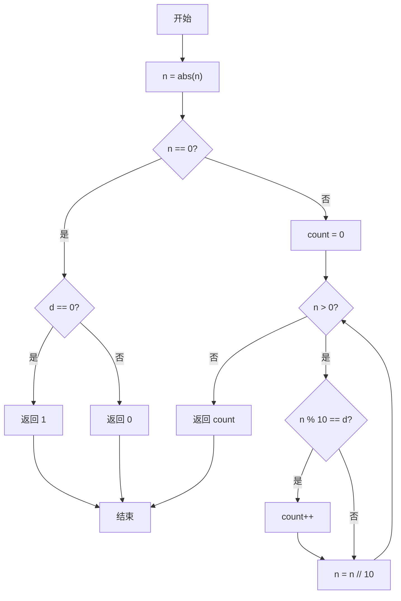
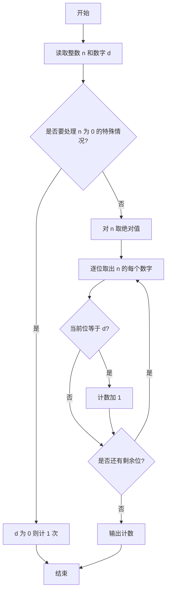

# PTA基础编程题目集 6-9统计个位数字（Lua语言实现）

## 题目描述

本题要求实现一个函数，可统计任一整数中某个位数出现的次数。例如-21252中，2出现了3次，则该函数应该返回3。

### 函数接口定义

```lua
function Count_Digit(n, d)  -- 返回整数 n 中数字 d 出现的次数
end
```

其中`N`和`D`都是用户传入的参数。`N`的值不超过`int`的范围；`D`是[0, 9]区间内的个位数。函数须返回`N`中`D`出现的次数。

### 裁判测试程序样例

```lua
function Count_Digit(n, d)
    -- 你的代码将被嵌在这里
end

local N, D = io.read("*n", "*n")
print(Count_Digit(N, D))
```

### 输入样例

```in
-21252 2
```

### 输出样例

```out
3
```

## 解题思路

这道题的核心是**逐位取模统计**：先对 n 取绝对值处理负数，每次用 `n % 10` 取出最低位与 d 比较，再用 `n // 10` 去掉该位，直到 n 变为 0。

### 核心问题分析

1. **负数处理**：用 `math.abs(n)` 对 `n` 取绝对值，避免负号干扰逐位判断。
2. **逐位取出**：`n % 10` 取出当前最低位，`n // 10`（整数除法）去掉该位。
3. **零的特殊情况**：`n == 0` 时循环不会执行，需单独判断 `d == 0` 时返回 1。

### 算法原理说明

统计数字 `d` 在整数 `n` 中出现的次数，核心是逐位检查：先用 `math.abs(n)` 对 `n` 取绝对值处理负数，每次用 `n % 10` 取出当前最低位与 `d` 比较，再用 `n = n // 10`（整数除法）去掉该位，直到 `n` 变为 0。注意 `n = 0` 时循环不会执行，需单独判断 `d == 0` 时返回 1。

### 具体计算步骤

1. 用 `math.abs(n)` 对 `n` 取绝对值，用于处理负数。
2. 处理特例：`n == 0` 时，若 `d == 0` 返回 1，否则返回 0。
3. 初始化计数 `count = 0`。
4. `while n > 0` 循环：`n % 10` 得到最低位，与 `d` 比较相等则 `count = count + 1`。
5. `n = n // 10` 去掉已检查的最低位，继续循环。
6. 循环结束返回 `count`。

## 完整代码

```lua
-- 6-9 统计个位数字
-- 题目描述：实现函数 Count_Digit，统计整数 n 中数字 d 出现的次数
--[[
 实现原理：取绝对值后逐位取模比较，特殊处理 n==0
 参数说明：n - 待统计的整数，d - 0~9 的数字
 时间复杂度：O(k) -- k 为整数位数
 空间复杂度：O(1) -- 仅用常数辅助变量
]]
function Count_Digit(n, d)
    n = math.abs(n) -- 绝对值处理负数
    if n == 0 then
        if d == 0 then return 1 else return 0 end -- 零的特殊情况
    end
    local count = 0 -- 计数器
    while n > 0 do
        if n % 10 == d then count = count + 1 end -- 最低位比较
        n = n // 10 -- 去掉最低位
    end
    return count
end

-- 主程序：按裁判样例结构读取输入并调用函数
local N, D = io.read("*n", "*n") -- 读取整数 N 和数字 D
print(Count_Digit(N, D))
```

## 代码流程说明

1. 用 `math.abs(n)` 对 `n` 取绝对值，用于处理负数。
2. 处理特例：`n == 0` 时，若 `d == 0` 返回 1，否则返回 0。
3. 初始化计数 `count = 0`。
4. `while n > 0` 循环：`n % 10` 得到最低位，与 `d` 比较相等则 `count = count + 1`。
5. `n = n // 10` 去掉已检查的最低位，继续循环。
6. 循环结束返回 `count`。

## 代码流程图



## 解题流程图


