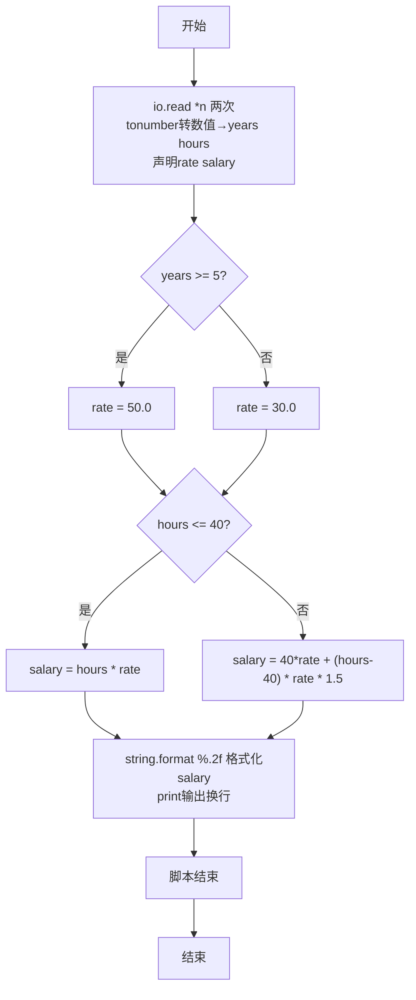
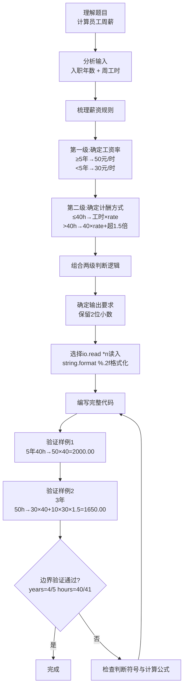

# 7-10 计算工资（Lua语言实现）

## 前言

本题（7-10 计算工资）的主要考点是：准确理解题意、规范处理输入输出格式，并正确处理边界与精度。下面先给出题目描述与格式要求，再通过清晰的思路与可直接运行的lua代码进行讲解。

## 题目描述

某公司员工的工资计算方法如下：一周内工作时间不超过40小时，按正常工作时间计酬；超出40小时的工作时间部分，按正常工作时间报酬的1.5倍计酬。员工按进公司时间分为新职工和老职工，进公司不少于5年的员工为老职工，5年以下的为新职工。新职工的正常工资为30元/小时，老职工的正常工资为50元/小时。请按该计酬方式计算员工的工资。

## 输入格式

输入在一行中给出2个正整数，分别为某员工入职年数和周工作时间，其间以空格分隔。

## 输出格式

在一行输出该员工的周薪，精确到小数点后2位。

## 输入样例1

```in
5 40
```

## 输入样例2

```in
3 50
```

## 输出样例1

```out
2000.00
```

## 输出样例2

```out
1650.00
```

## 解题思路

### 1. 核心问题分析

本题属于两级条件判断 + 分段计算的组合问题。需要先根据入职年数确定小时工资率（新/老职工），再根据周工时是否超过40小时选择不同的薪资计算公式（正常工时或正常+加班1.5倍），最后将结果按保留2位小数输出。

### 2. 算法原理说明

1. **第一级判断（确定工资率rate）：
   - 入职年数 `years >= 5` → 老职工 → `rate = 50.0` 元/小时
   - 否则 → 新职工 → `rate = 30.0` 元/小时
2. **第二级判断（分段计算薪资salary）：
   - 工时 `hours <= 40` → 全部按正常计酬：`salary = hours × rate`
   - 工时 `hours > 40` → 前40小时正常 + 超出部分按1.5倍：`salary = 40×rate + (hours-40)×rate×1.5`
3. **格式化输出**：使用`string.format("%.2f", salary)`保证输出精确到小数点后2位。

### 3. 具体计算步骤

1. 使用两次`io.read("*n")`分别读入入职年数years、周工时hours。
2. 判断years是否≥5，设置对应rate（50或30）。
3. 判断hours是否≤40，按对应公式计算salary。
4. 通过`string.format("%.2f")`格式化输出salary，保留2位小数。

## 完整代码

```lua
-- 7-10 计算工资
local years = tonumber(io.read("*n"))
local hours = tonumber(io.read("*n"))
local rate, salary

if years >= 5 then
    rate = 50.0
else
    rate = 30.0
end

if hours <= 40 then
    salary = hours * rate
else
    salary = 40 * rate + (hours - 40) * rate * 1.5
end

print(string.format("%.2f", salary))
```

## 代码流程说明

1. **声明局部变量并读取输入**：依次通过两次`io.read("*n")`配合`tonumber()`读取两个数字并转为数值，存入局部变量`years`（入职年数）和`hours`（周工时）。同时声明`rate`（工资率）和`salary`（周薪）两个局部变量供后续赋值。
2. **第一级判断（确定工资率）：
   - `years >= 5`为真 → 老职工，`rate = 50.0`
   - 否则 → 新职工，`rate = 30.0`
3. **第二级判断（计算薪资）：
   - `hours <= 40`为真 → 无加班，`salary = hours × rate`
   - 否则 → 有加班，`salary = 40×rate + (hours-40)×rate×1.5`
4. **格式化输出**：`string.format("%.2f", salary)`以固定小数位2位格式化周薪，由`print()`输出并换行。
5. **脚本结束**：Lua脚本执行完毕。

## 代码流程图



## 解题流程图



## 代码解析

```lua
-- 7-10 计算工资
local years = tonumber(io.read("*n"))
local hours = tonumber(io.read("*n"))
local rate, salary

if years >= 5 then
    rate = 50.0
else
    rate = 30.0
end

if hours <= 40 then
    salary = hours * rate
else
    salary = 40 * rate + (hours - 40) * rate * 1.5
end

print(string.format("%.2f", salary))
```

声明局部变量并读取输入

## 复杂度分析

程序只进行两级条件判断和常数次算术运算，时间复杂度为 O(1)，额外空间复杂度为 O(1).

## 常见易错点

- 入职年数不少于 5 年才使用老职工工资率 50 元，5 年整是边界。
- 加班工资只对超过 40 小时的部分按 1.5 倍计算，不能把全部工时乘以 1.5。

## 更多测试

边界测试：输入 5 40，预期输出 2000.00，验证老职工且无加班。

特殊测试：输入 4 41，预期输出 1245.00，验证新职工的加班计算。

## 总结

本题的核心在于理清「计算工资」的输入输出关系与边界处理：先按格式读取输入，再依据规则逐步计算或遍历，最后按规范输出。该思路可迁移到同类格式化输入输出与模拟计算的题目。
