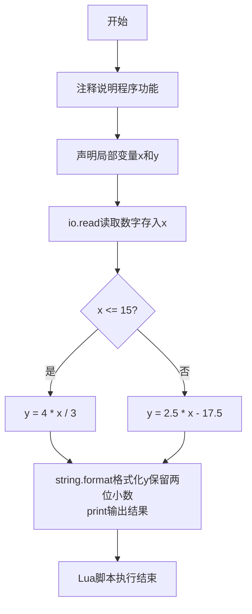
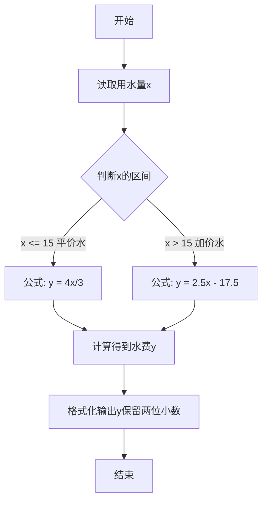

# 7-11 分段计算居民水费（Lua语言实现）

## 前言

本题（7-11 分段计算居民水费）的主要考点是：准确理解题意、规范处理输入输出格式，并正确处理边界与精度。下面先给出题目描述与格式要求，再通过清晰的思路与可直接运行的lua代码进行讲解。

## 题目描述

为鼓励居民节约用水，自来水公司采取按用水量阶梯式计价的办法，居民应交水费y（元）与月用水量x（吨）相关：当x不超过15吨时，y=4x/3；超过后，y=2.5x−17.5。请编写程序实现水费的计算。

## 输入格式

输入在一行中给出非负实数x。

## 输出格式

在一行输出应交的水费，精确到小数点后2位。

## 输入样例1

```in
12
```

## 输入样例2

```in
16
```

## 输出样例1

```out
16.00
```

## 输出样例2

```out
22.50
```

## 解题思路

### 核心问题分析
本题是一个典型的**分段函数求值问题**。核心在于根据用水量x的不同区间，选择对应的水费计算公式进行计算。水费与用水量的关系分为两个阶段：
- 阶段一（平价水）：用水量不超过15吨时，采用较低单价 y = 4x/3
- 阶段二（阶梯加价水）：用水量超过15吨时，采用较高单价 y = 2.5x - 17.5

### 算法原理说明
使用**条件分支结构**（if-else）实现分段逻辑判断：
1. 读取输入的用水量x
2. 判断x与临界值15的大小关系
3. 根据判断结果选择对应的计算公式
4. 输出保留两位小数的计算结果

### 具体计算步骤
1. 输入用水量x（吨）
2. 若 x ≤ 15：水费 y = 4 × x / 3
3. 若 x > 15：水费 y = 2.5 × x - 17.5
4. 将水费y按%.2f格式输出（精确到小数点后2位）

### 1. 验证样例：

- 样例1：x=12 ≤ 15，y = 4×12/3 = 16.00 ✓
- 样例2：x=16 > 15，y = 2.5×16 - 17.5 = 40 - 17.5 = 22.50 ✓

## 完整代码

```lua
-- 7-11 分段计算居民水费
local x = tonumber(io.read("*n"))
local y
if x <= 15 then
    y = 4 * x / 3
else
    y = 2.5 * x - 17.5
end
print(string.format("%.2f", y))
```

## 代码流程说明

1. **注释说明**
   - `-- 7-11 分段计算居民水费`：单行注释，说明程序功能

2. **变量声明与数据输入**
   - `local x = tonumber(io.read("*n"))`：声明局部变量x
     - `io.read("*n")`：从标准输入读取一个数字
     - `tonumber()`：将读取的内容转换为数值类型
     - x：存储输入的月用水量（吨）
   - `local y`：声明局部变量y，用于存储计算得到的应交水费（元）

3. **分段计算逻辑**
   - `if x <= 15 then`：判断用水量是否不超过15吨
     - 条件为真时，执行 `y = 4 * x / 3`：按平价水公式计算
   - `else`：用水量超过15吨的情况
     - 执行 `y = 2.5 * x - 17.5`：按阶梯加价水公式计算
   - `end`：if-else条件结构结束

4. **结果输出**
   - `print(string.format("%.2f", y))`：格式化输出水费
     - `string.format("%.2f", y)`：将y格式化为保留2位小数的字符串
     - `print()`：输出结果并自动换行

5. **程序结束**
   - Lua脚本执行完毕，程序正常退出

## 代码流程图



## 解题流程图



## 代码解析

```lua
-- 7-11 分段计算居民水费
local x = tonumber(io.read("*n"))
local y
if x <= 15 then
    y = 4 * x / 3
else
    y = 2.5 * x - 17.5
end
print(string.format("%.2f", y))
```

注释说明

## 复杂度分析

设输入规模为 $n$（对数值类题目为参与运算的数据量，对字符串/序列类题目为长度）。

- **时间复杂度**：$O(n)$ 或 $O(n \log n)$，主要来自一次线性遍历与常数次数学运算，无嵌套高复杂度循环。
- **空间复杂度**：$O(n)$，用于存储输入、中间结果与输出字符串；若仅使用若干标量变量则为 $O(1)$。

## 常见易错点

### 1. 输入/输出格式不符
错误：多余空格、遗漏换行、大小写或精度不符。后果：判题系统判为格式错误。正确：严格按题目要求的格式输出，数值用合适精度。

### 2. 边界条件遗漏
错误：未处理 0、最小值、单字符或空输入等边界。后果：特例 WA。正确：先列出所有边界样例，在编码前单独分支处理。

### 3. 整数溢出与类型
错误：使用过小的整数类型或忽略负号。后果：大数计算溢出。正确：按数据范围选择合适类型，必要时用更大整数类型或字符串处理。

## 更多测试

### 测试一：常规边界

**输入：**

```text
（可取题目边界附近的值，如最小值或最大值）
```

**输出：**

```text
（依据题意推导的正确结果）
```

### 测试二：特殊用例

**输入：**

```text
（可取易错点，如 0、单一元素、全同值等）
```

**输出：**

```text
（对应正确结果）
```

## 总结

本题的核心在于理清「分段计算居民水费」的输入输出关系与边界处理：先按格式读取输入，再依据规则逐步计算或遍历，最后按规范输出。该思路可迁移到同类格式化输入输出与模拟计算的题目。

