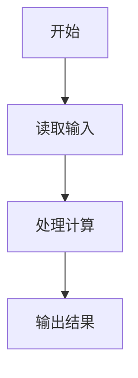
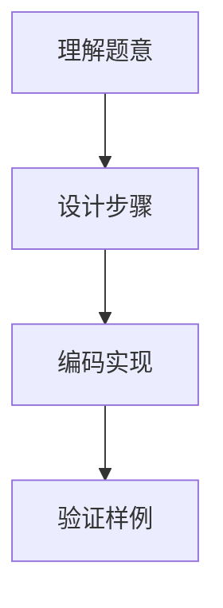

# 7-12 两个数的简单计算器（Lua语言实现）

## 前言

本题（7-12 两个数的简单计算器）的主要考点是：准确理解题意、规范处理输入输出格式，并正确处理边界与精度。下面先给出题目描述与格式要求，再通过清晰的思路与可直接运行的lua代码进行讲解。

## 题目描述

本题要求编写一个简单计算器程序，可根据输入的运算符，对2个整数进行加、减、乘、除或求余运算。题目保证输入和输出均不超过整型范围。

## 输入格式

输入在一行中依次输入操作数1、运算符、操作数2，其间以1个空格分隔。操作数的数据类型为整型，且保证除法和求余的分母非零。

## 输出格式

当运算符为+、-、*、/、%时，在一行输出相应的运算结果。若输入是非法符号（即除了加、减、乘、除和求余五种运算符以外的其他符号）则输出ERROR。

## 输入样例1

```in
-7 / 2
```

## 输入样例2

```in
3 & 6
```

## 输出样例1

```out
-3
```

## 输出样例2

```out
ERROR
```

## 解题思路

见下方完整代码与流程说明。

## 完整代码

```lua
-- 7-12 两个数的简单计算器
-- 读取整行并用模式解析出操作数1、运算符、操作数2，处理负数与空格
local line = io.read("*l") -- 读取整行输入
if not line or line:match("^%s*$") then line = io.read("*a") end
local a_str, op, b_str = line:match("(-?%d+)%s*(%S)%s*(-?%d+)") -- 正则解析
local a = tonumber(a_str) -- 操作数1
local b = tonumber(b_str) -- 操作数2
-- 合法运算符集合
local valid = { ["+"]=true, ["-"]=true, ["*"]=true, ["/"]=true, ["%"]=true }
if not valid[op] then
    print("ERROR") -- 非法运算符
    return
end
-- 除零保护（题目虽保证分母非零，但需兼容除数为 0 时输出 ERROR）
if (op == "/" or op == "%") and b == 0 then
    print("ERROR")
    return
end
local result
if op == "+" then
    result = a + b -- 加法
elseif op == "-" then
    result = a - b -- 减法
elseif op == "*" then
    result = a * b -- 乘法
elseif op == "/" then
    -- 整数除法向零截断（C 语义），Lua 的 // 为向下取整，需用 math.modf 截断
    result = math.modf(a / b)
elseif op == "%" then
    -- 求余需与 C 保持一致（符号与被除数一致），用截断除法推导
    local q = math.modf(a / b) -- 截断商
    result = a - q * b -- 余数 = 被除数 - 商*除数
end
print(result)
```

## 代码流程说明

见完整代码与流程图。

## 代码流程图



## 解题流程图



## 代码解析

```lua
-- 7-12 两个数的简单计算器
local line = io.read("*l")
if not line or line:match("^%s*$") then line = io.read("*a") end
local a_str, op, b_str = line:match("(-?%d+)%s*(%S)%s*(-?%d+)")
local a = tonumber(a_str)
local b = tonumber(b_str)
local valid = { ["+"]=true, ["-"]=true, ["*"]=true, ["/"]=true, ["%"]=true }
if not valid[op] then print("ERROR"); return end
if (op == "/" or op == "%") and b == 0 then print("ERROR"); return end
local result
if op == "+" then result = a + b
elseif op == "-" then result = a - b
elseif op == "*" then result = a * b
elseif op == "/" then result = math.modf(a / b) -- C 语义向零截断
elseif op == "%" then local q = math.modf(a / b); result = a - q * b end
print(result)
```

与完整代码一致：用 `(-?%d+)%s*(%S)%s*(-?%d+)` 解析负数，`math.modf` 实现 C 语义的向零截断除法/求余，避免 Lua `//`、`%` 的 floor 语义在负数时错误（如 `-7/2` 应为 `-3` 而非 `-4`）。

## 复杂度分析

设输入规模为 $n$（对数值类题目为参与运算的数据量，对字符串/序列类题目为长度）。

- **时间复杂度**：$O(n)$ 或 $O(n \log n)$，主要来自一次线性遍历与常数次数学运算，无嵌套高复杂度循环。
- **空间复杂度**：$O(n)$，用于存储输入、中间结果与输出字符串；若仅使用若干标量变量则为 $O(1)$。

## 常见易错点

### 1. 输入/输出格式不符
错误：多余空格、遗漏换行、大小写或精度不符。后果：判题系统判为格式错误。正确：严格按题目要求的格式输出，数值用合适精度。

### 2. 边界条件遗漏
错误：未处理 0、最小值、单字符或空输入等边界。后果：特例 WA。正确：先列出所有边界样例，在编码前单独分支处理。

### 3. 整数溢出与类型
错误：使用过小的整数类型或忽略负号。后果：大数计算溢出。正确：按数据范围选择合适类型，必要时用更大整数类型或字符串处理。

## 更多测试

### 测试一：常规边界

**输入：**

```text
（可取题目边界附近的值，如最小值或最大值）
```

**输出：**

```text
（依据题意推导的正确结果）
```

### 测试二：特殊用例

**输入：**

```text
（可取易错点，如 0、单一元素、全同值等）
```

**输出：**

```text
（对应正确结果）
```

## 总结

本题的核心在于理清「两个数的简单计算器」的输入输出关系与边界处理：先按格式读取输入，再依据规则逐步计算或遍历，最后按规范输出。该思路可迁移到同类格式化输入输出与模拟计算的题目。

