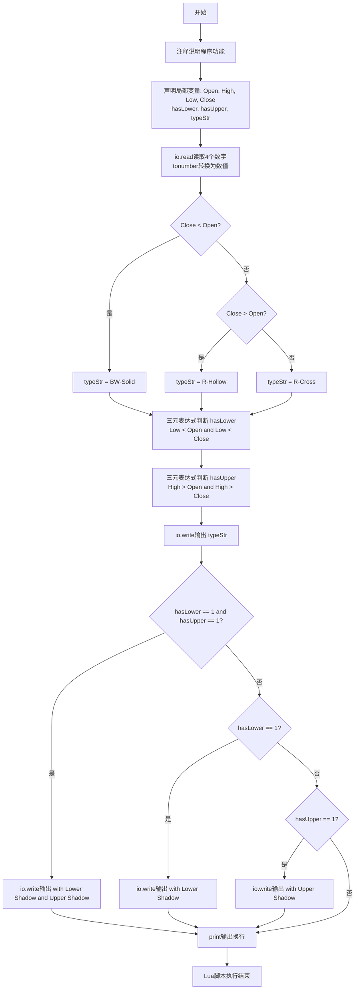
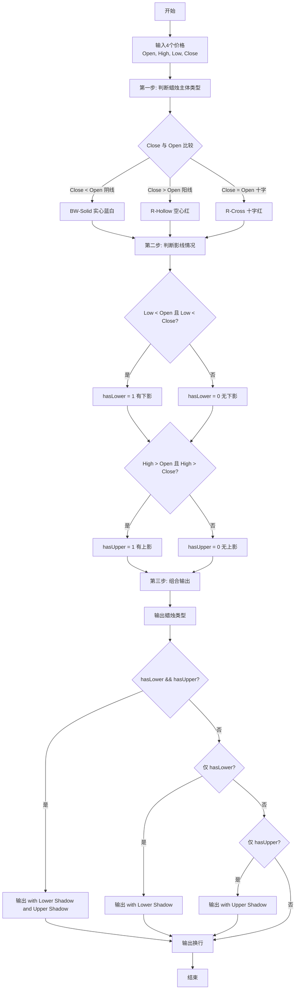

# 7-13 日K蜡烛图（Lua语言实现）

## 前言

本题（7-13 日K蜡烛图）的主要考点是：准确理解题意、规范处理输入输出格式，并正确处理边界与精度。下面先给出题目描述与格式要求，再通过清晰的思路与可直接运行的lua代码进行讲解。

## 题目描述

股票价格涨跌趋势，常用蜡烛图技术中的K线图来表示，分为按日的日K线、按周的周K线、按月的月K线等。以日K线为例，每天股票价格从开盘到收盘走完一天，对应一根蜡烛小图，要表示四个价格：开盘价格Open（早上刚刚开始开盘买卖成交的第1笔价格）、收盘价格Close（下午收盘时最后一笔成交的价格）、中间的最高价High和最低价Low。

如果Close&lt;Open，表示为“BW-Solid”（即“实心蓝白蜡烛”）；如果Close&gt;Open，表示为“R-Hollow”（即“空心红蜡烛”）；如果Open等于Close，则为“R-Cross”（即“十字红蜡烛”）。如果Low比Open和Close低，称为“Lower Shadow”（即“有下影线”），如果High比Open和Close高，称为“Upper Shadow”（即“有上影线”）。请编程序，根据给定的四个价格组合，判断当日的蜡烛是一根什么样的蜡烛。

## 输入格式

输入在一行中给出4个正实数，分别对应Open、High、Low、Close，其间以空格分隔。

## 输出格式

在一行中输出日K蜡烛的类型。如果有上、下影线，则在类型后加上with 影线类型。如果两种影线都有，则输出with Lower Shadow and Upper Shadow。

## 输入样例1

```in
5.110 5.250 5.100 5.105
```

## 输入样例2

```in
5.110 5.110 5.110 5.110
```

## 输入样例3

```in
5.110 5.125 5.112 5.126
```

## 输出样例1

```out
BW-Solid with Lower Shadow and Upper Shadow
```

## 输出样例2

```out
R-Cross
```

## 输出样例3

```out
R-Hollow
```

## 解题思路

### 核心问题分析
本题是一个典型的**多条件组合判断**问题。核心任务是根据4个价格数据（开盘价Open、最高价High、最低价Low、收盘价Close）判断日K蜡烛图的类型，判断分为两个独立维度：
1. **蜡烛主体类型**（3种）：根据Close与Open的大小关系确定
   - Close < Open → BW-Solid（阴线，实心蓝白）
   - Close > Open → R-Hollow（阳线，空心红）
   - Close = Open → R-Cross（十字星）
2. **影线情况**（4种组合）：根据High、Low与Open、Close的比较确定
   - 无上影、无下影
   - 有下影（Lower Shadow）：Low同时小于Open和Close
   - 有上影（Upper Shadow）：High同时大于Open和Close
   - 双影线：既有上影又有下影

### 算法原理说明
采用**两步判断法**分别确定蜡烛类型和影线情况，再组合输出：
1. 第一步：比较Close与Open，确定蜡烛主体类型
2. 第二步：分别判断High、Low与实体边界（Open和Close的极值）的关系
3. 第三步：按格式要求拼接蜡烛类型和影线信息输出

### 具体计算步骤
1. 输入四个价格：Open、High、Low、Close
2. 判断蜡烛主体类型：
   - 若 Close < Open → 类型为 "BW-Solid"
   - 若 Close > Open → 类型为 "R-Hollow"
   - 若 Close = Open → 类型为 "R-Cross"
3. 判断下影线标志 hasLower：
   - Low < Open 且 Low < Close → 有下影线（设为1），否则无（设为0）
4. 判断上影线标志 hasUpper：
   - High > Open 且 High > Close → 有上影线（设为1），否则无（设为0）
5. 组合输出：
   - 先输出蜡烛类型
   - 若 hasLower && hasUpper → 追加 " with Lower Shadow and Upper Shadow"
   - 若仅 hasLower → 追加 " with Lower Shadow"
   - 若仅 hasUpper → 追加 " with Upper Shadow"
   - 都无则不追加

### 1. 验证样例：

- 样例1：Open=5.110, High=5.250, Low=5.100, Close=5.105
  - Close(5.105) < Open(5.110) → BW-Solid ✓
  - Low(5.100) < 5.110 且 < 5.105 → 有下影 ✓
  - High(5.250) > 5.110 且 > 5.105 → 有上影 ✓
  - 输出：BW-Solid with Lower Shadow and Upper Shadow ✓

- 样例2：全部都是5.110
  - Close = Open → R-Cross ✓
  - Low不小于实体，High不大于实体 → 无影线 ✓
  - 输出：R-Cross ✓

- 样例3：Open=5.110, High=5.125, Low=5.112, Close=5.126
  - Close(5.126) > Open(5.110) → R-Hollow ✓
  - Low(5.112)不小于5.110 → 无下影 ✓
  - High(5.125)不大于5.126 → 无上影 ✓
  - 输出：R-Hollow ✓

## 完整代码

```lua
-- 7-13 日K蜡烛图
local Open = tonumber(io.read("*n"))
local High = tonumber(io.read("*n"))
local Low = tonumber(io.read("*n"))
local Close = tonumber(io.read("*n"))
local typeStr

if Close < Open then
    typeStr = "BW-Solid"
elseif Close > Open then
    typeStr = "R-Hollow"
else
    typeStr = "R-Cross"
end

local hasLower = (Low < Open and Low < Close) and 1 or 0
local hasUpper = (High > Open and High > Close) and 1 or 0

io.write(typeStr)
if hasLower == 1 and hasUpper == 1 then
    io.write(" with Lower Shadow and Upper Shadow")
elseif hasLower == 1 then
    io.write(" with Lower Shadow")
elseif hasUpper == 1 then
    io.write(" with Upper Shadow")
end
print()
```

## 代码流程说明

1. **注释说明**
   - `-- 7-13 日K蜡烛图`：单行注释，说明程序功能

2. **变量声明与数据输入**
   - `local Open = tonumber(io.read("*n"))`：声明局部变量Open，读取开盘价（数字）
   - `local High = tonumber(io.read("*n"))`：声明局部变量High，读取最高价（数字）
   - `local Low = tonumber(io.read("*n"))`：声明局部变量Low，读取最低价（数字）
   - `local Close = tonumber(io.read("*n"))`：声明局部变量Close，读取收盘价（数字）
   - `local typeStr`：声明局部变量typeStr，用于存储蜡烛类型字符串

3. **判断蜡烛主体类型**
   - `if Close < Open then`：收盘价低于开盘价（阴线）
     - `typeStr = "BW-Solid"`：实心蓝白蜡烛
   - `elseif Close > Open then`：收盘价高于开盘价（阳线）
     - `typeStr = "R-Hollow"`：空心红蜡烛
   - `else`：收盘价等于开盘价（十字星）
     - `typeStr = "R-Cross"`：十字红蜡烛
   - `end`：if-elseif条件结构结束

4. **判断影线标志（Lua三元表达式风格）**
   - `local hasLower = (Low < Open and Low < Close) and 1 or 0`：判断下影线
     - 条件：最低价Low同时低于开盘价和收盘价
     - 条件为真 → hasLower = 1（有下影线）
     - 条件为假 → hasLower = 0（无下影线）
   - `local hasUpper = (High > Open and High > Close) and 1 or 0`：判断上影线
     - 条件：最高价High同时高于开盘价和收盘价
     - 条件为真 → hasUpper = 1（有上影线）
     - 条件为假 → hasUpper = 0（无上影线）

5. **组合输出结果**
   - `io.write(typeStr)`：先输出蜡烛主体类型（不换行）
   - `if hasLower == 1 and hasUpper == 1 then`：双影线情况
     - `io.write(" with Lower Shadow and Upper Shadow")`：追加双影线描述
   - `elseif hasLower == 1 then`：仅下影线
     - `io.write(" with Lower Shadow")`：追加上影线描述
   - `elseif hasUpper == 1 then`：仅上影线
     - `io.write(" with Upper Shadow")`：追加上影线描述
   - `end`：if-elseif条件结构结束
   - `print()`：输出换行符，完成整行输出

6. **程序结束**
   - Lua脚本执行完毕，程序正常退出

## 代码流程图



## 解题流程图



## 代码解析

```lua
-- 7-13 日K蜡烛图
local Open = tonumber(io.read("*n"))
local High = tonumber(io.read("*n"))
local Low = tonumber(io.read("*n"))
local Close = tonumber(io.read("*n"))
local typeStr

if Close < Open then
    typeStr = "BW-Solid"
elseif Close > Open then
    typeStr = "R-Hollow"
else
    typeStr = "R-Cross"
end

local hasLower = (Low < Open and Low < Close) and 1 or 0
local hasUpper = (High > Open and High > Close) and 1 or 0

io.write(typeStr)
if hasLower == 1 and hasUpper == 1 then
    io.write(" with Lower Shadow and Upper Shadow")
elseif hasLower == 1 then
    io.write(" with Lower Shadow")
elseif hasUpper == 1 then
    io.write(" with Upper Shadow")
end
print()
```

代码先根据 `Close` 与 `Open` 的大小关系确定蜡烛主体类型：收盘价较低为 `BW-Solid`，较高为 `R-Hollow`，相等为 `R-Cross`。随后分别检查最低价是否低于开、收盘价以及最高价是否高于开、收盘价，并按检查结果追加下影线和上影线描述，最后输出换行。

## 复杂度分析

程序只读取 4 个价格并完成固定次数的比较，时间复杂度为 O(1)，额外空间复杂度为 O(1).

## 常见易错点

- 下影线要求 Low 严格小于 Open 和 Close，上影线要求 High 严格大于二者。
- 收盘价等于开盘价时主体类型是 R-Cross，不能误判为涨或跌。

## 更多测试

边界测试：输入 10 11 10 9，预期输出 BW-Solid with Upper Shadow。

特殊测试：输入 10 11 9 10，预期输出 R-Cross with Lower Shadow and Upper Shadow。

## 总结

本题的核心在于理清「日K蜡烛图」的输入输出关系与边界处理：先按格式读取输入，再依据规则逐步计算或遍历，最后按规范输出。该思路可迁移到同类格式化输入输出与模拟计算的题目。
