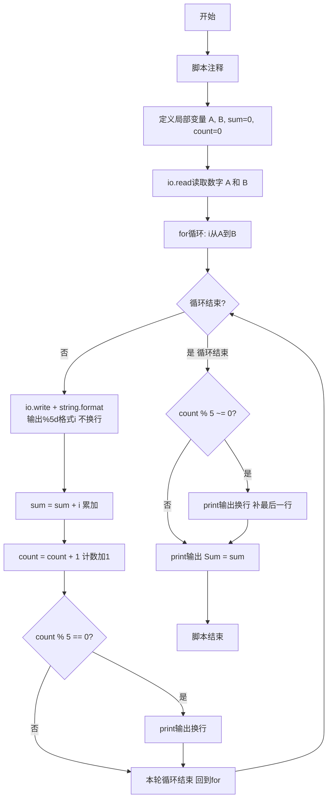
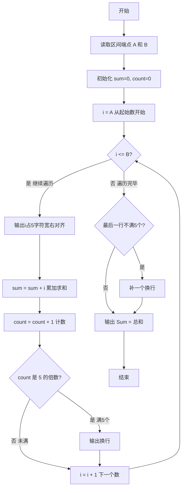

# 7-14 求整数段和（Lua语言实现）

## 前言

本题（7-14 求整数段和）的主要考点是：准确理解题意、规范处理输入输出格式，并正确处理边界与精度。下面先给出题目描述与格式要求，再通过清晰的思路与可直接运行的lua代码进行讲解。

## 题目描述

给定两个整数A和B，输出从A到B的所有整数以及这些数的和。

## 输入格式

输入在一行中给出2个整数A和B，其中−100≤A≤B≤100，其间以空格分隔。

## 输出格式

首先顺序输出从A到B的所有整数，每5个数字占一行，每个数字占5个字符宽度，向右对齐。最后在一行中按Sum = X的格式输出全部数字的和X。

## 输入样例

```in
-3 8
```

## 输出样例

```out
   -3   -2   -1    0    1
    2    3    4    5    6
    7    8
Sum = 30
```

## 解题思路

### 核心问题分析
本题是一个典型的**循环遍历与累加求和**问题。需要完成三个核心任务：
1. 顺序遍历输出：从整数A到整数B（包含A和B）依次输出每个整数
2. 格式化排版：每个数字占5字符宽度、右对齐，每5个数字换一行
3. 累加求和：计算区间内所有整数的总和，按指定格式输出

### 算法原理说明
使用**for循环结构**实现区间遍历，结合计数器与累加器实现格式化和求和：
1. 读取区间端点A和B
2. 使用for循环从i=A遍历到i=B：
   - 使用string.format("%5d", i)设置输出宽度为5个字符，右对齐输出当前i
   - 将当前i累加到sum总和中
   - 计数器count加1，每满5个输出一个换行
3. 循环结束后，若最后一行不足5个数字，补一个换行符
4. 按"Sum = X"格式输出总和

### 具体计算步骤
1. 输入整数A和B（保证A ≤ B）
2. 初始化：sum=0（总和），count=0（计数器）
3. 循环变量i从A到B：
   - 使用io.write(string.format("%5d", i))输出（5字符宽右对齐）
   - sum = sum + i（累加）
   - count = count + 1（计数）
   - 若 count % 5 == 0：输出换行（每行5个）
4. 循环结束后，若 count % 5 != 0：补一个换行（保证最后一行完整）
5. 使用print(string.format("Sum = %d", sum))输出总和

### 1. 验证样例：

- 输入A=-3，B=8
- 遍历序列：-3, -2, -1, 0, 1, 2, 3, 4, 5, 6, 7, 8（共12个数）
- 格式化输出：
  - 第1行（1-5个）：-3 -2 -1 0 1
  - 第2行（6-10个）：2 3 4 5 6
  - 第3行（11-12个）：7 8
- 求和：-3-2-1+0+1+2+3+4+5+6+7+8 = (-6)+(1+2+3+4+5+6+7+8) = -6+36 = 30 ✓

## 完整代码

```lua
-- 7-14 求整数段和
local A = tonumber(io.read("*n"))
local B = tonumber(io.read("*n"))
local sum = 0
local count = 0

for i = A, B do
    io.write(string.format("%5d", i))
    sum = sum + i
    count = count + 1
    if count % 5 == 0 then
        print()
    end
end

if count % 5 ~= 0 then
    print()
end
print(string.format("Sum = %d", sum))
```

## 代码流程说明

1. **脚本注释**
   - `-- 7-14 求整数段和`：单行注释，说明脚本用途

2. **变量定义与数据输入**
   - `local A = tonumber(io.read("*n"))`：读取第一个数字并转换为数值类型，赋值给局部变量A（起始整数）
   - `local B = tonumber(io.read("*n"))`：读取第二个数字并转换为数值类型，赋值给局部变量B（结束整数）
   - `local sum = 0`：定义累加器sum，存储所有整数的总和，初始值为0
   - `local count = 0`：定义计数器count，统计已输出的整数个数，初始值为0

3. **for循环遍历与处理**
   - `for i = A, B do`：for循环，i从A开始到B结束（包含两端），每次自动递增1
   - 循环体内操作：
     - `io.write(string.format("%5d", i))`：格式化输出当前整数i，右对齐占5个字符宽度，不换行
       - string.format("%5d", i) 使用%5d格式控制符实现右对齐占5位
       - io.write() 输出内容但不自动换行
     - `sum = sum + i`：将当前i累加到sum中
     - `count = count + 1`：计数器count加1
     - `if count % 5 == 0 then`：判断是否已输出5个整数
       - `print()`：每满5个输出换行符（print自动换行）

4. **补充最后一行换行**
   - `if count % 5 ~= 0 then`：如果最后一行不足5个数字（即总数不是5的倍数）
     - `print()`：补一个换行符，确保最后一行结束后换行

5. **输出总和**
   - `print(string.format("Sum = %d", sum))`：按"Sum = X"格式输出所有整数的总和并换行

6. **程序结束**
   - Lua脚本执行完毕：程序正常退出

## 代码流程图



## 解题流程图



## 代码解析

```lua
-- 7-14 求整数段和
local A = tonumber(io.read("*n"))
local B = tonumber(io.read("*n"))
local sum = 0
local count = 0

for i = A, B do
    io.write(string.format("%5d", i))
    sum = sum + i
    count = count + 1
    if count % 5 == 0 then
        print()
    end
end

if count % 5 ~= 0 then
    print()
end
print(string.format("Sum = %d", sum))
```

脚本注释

## 复杂度分析

设区间内共有 n = B-A+1 个整数，程序需遍历并输出每个整数，时间复杂度为 O(n)，额外空间复杂度为 O(1).

## 常见易错点

- 每个整数必须占 5 个字符并右对齐，每输出 5 个数换行。
- 最后一行不足 5 个数时仍要换行，再输出 Sum = X。

## 更多测试

边界测试：输入 5 5，验证单个数字的宽度为 5 且输出 Sum = 5。

特殊测试：输入 -2 2，验证负数、零和正数混合时的排版与求和。

## 总结

本题的核心在于理清「求整数段和」的输入输出关系与边界处理：先按格式读取输入，再依据规则逐步计算或遍历，最后按规范输出。该思路可迁移到同类格式化输入输出与模拟计算的题目。
