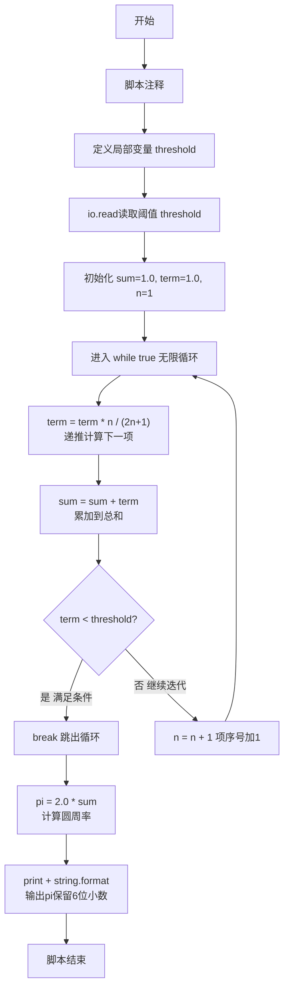
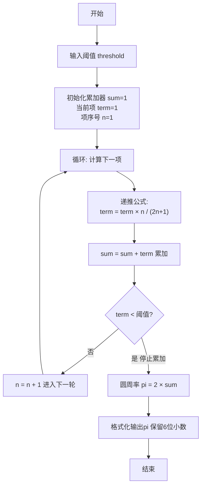

# 7-15 计算圆周率（Lua语言实现）

## 前言

本题（7-15 计算圆周率）的主要考点是：准确理解题意、规范处理输入输出格式，并正确处理边界与精度。下面先给出题目描述与格式要求，再通过清晰的思路与可直接运行的lua代码进行讲解。

## 题目描述

根据下面关系式，求圆周率的值，直到最后一项的值小于给定阈值。

关系式：
```
π/2 = 1 + 1/3 + 2!/(3×5) + 3!/(3×5×7) + ... + n!/(3×5×7×...×(2n+1)) + ...
```

## 输入格式

输入在一行中给出小于1的阈值。

## 输出格式

在一行中输出满足阈值条件的近似圆周率，输出到小数点后6位。

## 输入样例

```in
0.01
```

## 输出样例

```out
3.132157
```

## 解题思路

### 核心问题分析
本题是一个典型的**无穷级数求和**问题。核心任务是根据给定的无穷级数公式计算π/2的近似值，当某一项的值小于给定阈值时停止累加，最后乘以2得到圆周率π。关键在于：
1. 理解级数通项的递推关系，避免重复计算阶乘和乘积
2. 控制循环终止条件：最后一项的值 < 阈值时停止

### 算法原理说明
观察级数通项的规律，使用**递推迭代法**高效计算每一项：

设第n项为 aₙ，则：
- a₀ = 1（第0项，对应 n=0）
- a₁ = 1/3（第1项，对应 n=1）
- a₂ = 2!/(3×5) = (1×2)/(3×5)（第2项，对应 n=2）
- a₃ = 3!/(3×5×7) = (1×2×3)/(3×5×7)（第3项，对应 n=3）

### 1. 递推关系推导：

aₙ / aₙ₋₁ = [n!/(3×5×...×(2n+1))] / [(n-1)!/(3×5×...×(2n-1))]
          = n / (2n + 1)

因此：**aₙ = aₙ₋₁ × n / (2n + 1)**

这样每一项可以由前一项递推得到，无需每次重新计算阶乘和连乘，时间复杂度O(k)，k为迭代次数。

### 具体计算步骤
1. 输入阈值 threshold（小于1的正数）
2. 初始化：
   - sum = 1.0（累加和，已加入第0项 a₀ = 1）
   - term = 1.0（当前项，初始为 a₀）
   - n = 1（下一项的序号）
3. 循环迭代：
   - 计算新项：term = term × n / (2n + 1)（即 aₙ = aₙ₋₁ × n/(2n+1)）
   - 累加到总和：sum = sum + term
   - 判断：若 term < threshold → 跳出循环（停止累加）
   - 否则：n = n + 1，继续迭代
4. 计算圆周率：pi = 2.0 × sum
5. 输出pi，保留6位小数

### 2. 验证样例（threshold = 0.01）：

- a₀ = 1，sum = 1
- n=1: a₁ = 1 × 1/3 = 0.33333，sum = 1.33333，0.33333 > 0.01 → 继续
- n=2: a₂ = 0.33333 × 2/5 = 0.13333，sum = 1.46666，0.13333 > 0.01 → 继续
- n=3: a₃ = 0.13333 × 3/7 ≈ 0.05714，sum ≈ 1.52381，0.05714 > 0.01 → 继续
- n=4: a₄ = 0.05714 × 4/9 ≈ 0.02540，sum ≈ 1.54921，0.02540 > 0.01 → 继续
- n=5: a₅ = 0.02540 × 5/11 ≈ 0.01155，sum ≈ 1.56076，0.01155 > 0.01 → 继续
- n=6: a₆ = 0.01155 × 6/13 ≈ 0.00533，sum ≈ 1.56609，0.00533 < 0.01 → 停止
- pi = 2 × 1.56609 ≈ 3.13218 → 接近样例输出3.132157 ✓

## 完整代码

```lua
-- 7-15 计算圆周率
local threshold = tonumber(io.read("*n"))
local sum = 1.0
local term = 1.0
local n = 1

while true do
    term = term * n / (2 * n + 1)
    sum = sum + term
    if term < threshold then
        break
    end
    n = n + 1
end

local pi = 2.0 * sum
print(string.format("%.6f", pi))
```

## 代码流程说明

1. **脚本注释**
   - `-- 7-15 计算圆周率`：单行注释，说明脚本用途

2. **数据输入**
   - `local threshold = tonumber(io.read("*n"))`：读取阈值数字并转换为数值类型，赋值给局部变量threshold

3. **变量初始化**
   - `local sum = 1.0`：累加和初始化，已包含第0项 a₀ = 1
   - `local term = 1.0`：当前项初始化，初始值为第0项 a₀ = 1
   - `local n = 1`：下一项的序号，从1开始（因为a₀已处理）

4. **while循环递推累加**
   - `while true do`：无限循环，由内部条件break控制退出
   - 循环体内：
     - `term = term * n / (2 * n + 1)`
       - 递推计算下一项：term_new = term_old × n / (2n + 1)
       - Lua自动进行数值类型处理，确保浮点除法
     - `sum = sum + term`：将新计算的项累加到总和sum中
     - `if term < threshold then`：判断当前项是否小于阈值
       - 条件为真 → `break` 跳出循环，停止累加
     - `n = n + 1`：项序号n加1，准备计算下一项

5. **计算圆周率并输出**
   - `local pi = 2.0 * sum`：由关系式 π/2 = sum，得 π = 2 × sum
   - `print(string.format("%.6f", pi))`：格式化输出pi并换行
     - %.6f：浮点数保留6位小数

6. **程序结束**
   - Lua脚本执行完毕：程序正常退出

## 代码流程图



## 解题流程图



## 代码解析

```lua
-- 7-15 计算圆周率
local threshold = tonumber(io.read("*n"))
local sum = 1.0
local term = 1.0
local n = 1

while true do
    term = term * n / (2 * n + 1)
    sum = sum + term
    if term < threshold then
        break
    end
    n = n + 1
end

local pi = 2.0 * sum
print(string.format("%.6f", pi))
```

脚本注释

## 复杂度分析

设输入规模为 $n$（对数值类题目为参与运算的数据量，对字符串/序列类题目为长度）。

- **时间复杂度**：$O(n)$ 或 $O(n \log n)$，主要来自一次线性遍历与常数次数学运算，无嵌套高复杂度循环。
- **空间复杂度**：$O(n)$，用于存储输入、中间结果与输出字符串；若仅使用若干标量变量则为 $O(1)$。

## 常见易错点

### 1. 输入/输出格式不符
错误：多余空格、遗漏换行、大小写或精度不符。后果：判题系统判为格式错误。正确：严格按题目要求的格式输出，数值用合适精度。

### 2. 边界条件遗漏
错误：未处理 0、最小值、单字符或空输入等边界。后果：特例 WA。正确：先列出所有边界样例，在编码前单独分支处理。

### 3. 整数溢出与类型
错误：使用过小的整数类型或忽略负号。后果：大数计算溢出。正确：按数据范围选择合适类型，必要时用更大整数类型或字符串处理。

## 更多测试

### 测试一：常规边界

**输入：**

```text
（可取题目边界附近的值，如最小值或最大值）
```

**输出：**

```text
（依据题意推导的正确结果）
```

### 测试二：特殊用例

**输入：**

```text
（可取易错点，如 0、单一元素、全同值等）
```

**输出：**

```text
（对应正确结果）
```

## 总结

本题的核心在于理清「计算圆周率」的输入输出关系与边界处理：先按格式读取输入，再依据规则逐步计算或遍历，最后按规范输出。该思路可迁移到同类格式化输入输出与模拟计算的题目。

