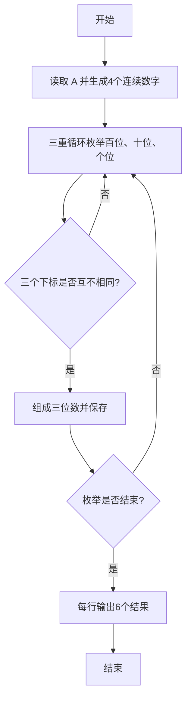
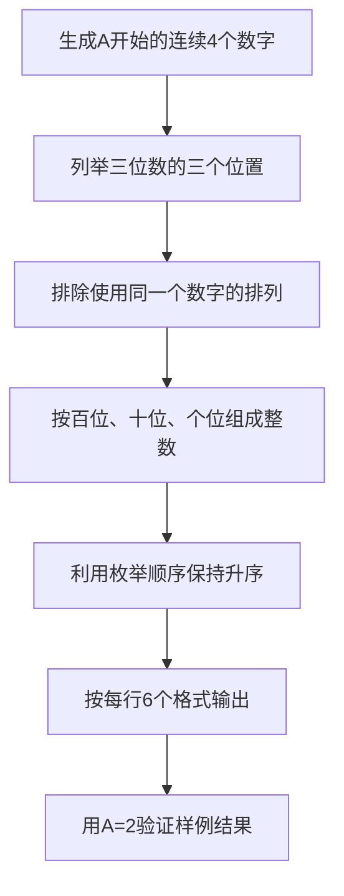

# 7-16 求符合给定条件的整数集（Lua语言实现）

## 前言

本题（7-16 求符合给定条件的整数集）的主要考点是：准确理解题意、规范处理输入输出格式，并正确处理边界与精度。下面先给出题目描述与格式要求，再通过清晰的思路与可直接运行的lua代码进行讲解。

## 题目描述

给定不超过6的正整数A，考虑从A开始的连续4个数字。请输出所有由它们组成的无重复数字的3位数。

## 输入格式

输入在一行中给出A。

## 输出格式

输出满足条件的的3位数，要求从小到大，每行6个整数。整数间以空格分隔，但行末不能有多余空格。

## 输入样例

```in
2
```

## 输出样例

```out
234 235 243 245 253 254
324 325 342 345 352 354
423 425 432 435 452 453
523 524 532 534 542 543
```

## 解题思路

先把从 `A` 开始的4个连续数字保存到数组 `values` 中。随后用三重循环分别枚举百位、十位和个位的候选下标，并要求三个下标两两不同，以保证组成的三位数没有重复数字。

每得到一个合法三位数，就按照 `百位 × 100 + 十位 × 10 + 个位` 计算并保存。由于候选数字按升序排列，枚举顺序会自然生成升序结果；最后按每行6个数输出，并单独处理行首空格和最后一个数后的换行。

## 完整代码

```lua
-- 7-16 求符合给定条件的整数集
local a, values, result = io.read("*n"), {}, {}
-- 把从 a 开始的 4 个连续数字存入 values（下标从 1 开始）
for i = 0, 3 do values[i + 1] = a + i end
-- 三重循环枚举三个位置的下标，要求互不相同，组合成三位数存入 result
for i = 1, 4 do for j = 1, 4 do for k = 1, 4 do
    if i ~= j and i ~= k and j ~= k then result[#result + 1] = values[i] * 100 + values[j] * 10 + values[k] end
end end end
-- 遍历 result 输出：行首数前不加空格，其余数前加一个空格；每满 6 个或到末尾换行
for i, value in ipairs(result) do
    io.write((i % 6 == 1 and "" or " ") .. value)
    if i % 6 == 0 or i == #result then io.write("\n") end
end
```

## 代码流程说明

1. 读取正整数 `a`，构造数组 `[a, a+1, a+2, a+3]`。
2. 通过三重循环枚举三个位置的候选数字。
3. 使用 `i ~= j`、`i ~= k`、`j ~= k` 排除重复数字。
4. 将每个合法排列转换为三位数并加入 `result`。
5. 遍历结果数组输出，每输出6个数换行，行首不输出多余空格。

## 代码流程图



## 解题流程图



## 代码解析

```lua
-- 7-16 求符合给定条件的整数集
local a, values, result = io.read("*n"), {}, {}
-- 把从 a 开始的 4 个连续数字存入 values（下标从 1 开始）
for i = 0, 3 do values[i + 1] = a + i end
-- 三重循环枚举三个位置的下标，要求互不相同，组合成三位数存入 result
for i = 1, 4 do for j = 1, 4 do for k = 1, 4 do
    if i ~= j and i ~= k and j ~= k then result[#result + 1] = values[i] * 100 + values[j] * 10 + values[k] end
end end end
-- 遍历 result 输出：行首数前不加空格，其余数前加一个空格；每满 6 个或到末尾换行
for i, value in ipairs(result) do
    io.write((i % 6 == 1 and "" or " ") .. value)
    if i % 6 == 0 or i == #result then io.write("\n") end
end
```

三重循环负责生成全部排列，条件判断保证三个位置使用不同的数字。结果先存入 `result`，再统一控制每行6个数字的输出格式，因此不会在行首或行末产生多余空格。

## 复杂度分析

候选数字固定为 4 个，三重循环最多检查 4×4×4 种组合，时间复杂度和额外空间复杂度均为 O(1).

## 常见易错点

- 三个位置必须使用三个不同的候选下标，不能只判断数值是否不同。
- 输出每行 6 个数，行内用单个空格分隔，行末不能多余空格。

## 更多测试

边界测试：输入 3，预期输出 345 354 435 453 534 543。

特殊测试：输入 6，验证候选数字包含 6 时仍按升序输出。

## 总结

本题的核心在于理清「求符合给定条件的整数集」的输入输出关系与边界处理：先按格式读取输入，再依据规则逐步计算或遍历，最后按规范输出。该思路可迁移到同类格式化输入输出与模拟计算的题目。
