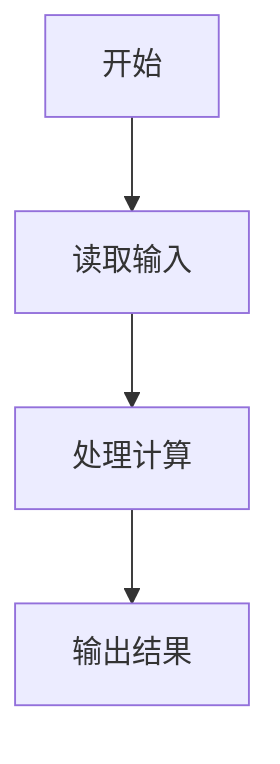
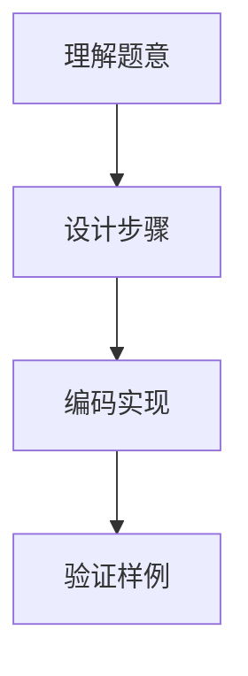

# 7-16 求符合给定条件的整数集（Lua语言实现）

## 前言

本题（7-16 求符合给定条件的整数集）的主要考点是：准确理解题意、规范处理输入输出格式，并正确处理边界与精度。下面先给出题目描述与格式要求，再通过清晰的思路与可直接运行的lua代码进行讲解。

## 题目描述

给定不超过6的正整数A，考虑从A开始的连续4个数字。请输出所有由它们组成的无重复数字的3位数。

## 输入格式

输入在一行中给出A。

## 输出格式

输出满足条件的的3位数，要求从小到大，每行6个整数。整数间以空格分隔，但行末不能有多余空格。

## 输入样例

```in
2
```

## 输出样例

```out
234 235 243 245 253 254
324 325 342 345 352 354
423 425 432 435 452 453
523 524 532 534 542 543
```

## 解题思路

见下方完整代码与流程说明。

## 完整代码

```lua
-- 7-16 求符合给定条件的整数集
local a, values, result = io.read("*n"), {}, {}
-- 把从 a 开始的 4 个连续数字存入 values（下标从 1 开始）
for i = 0, 3 do values[i + 1] = a + i end
-- 三重循环枚举三个位置的下标，要求互不相同，组合成三位数存入 result
for i = 1, 4 do for j = 1, 4 do for k = 1, 4 do
    if i ~= j and i ~= k and j ~= k then result[#result + 1] = values[i] * 100 + values[j] * 10 + values[k] end
end end end
-- 遍历 result 输出：行首数前不加空格，其余数前加一个空格；每满 6 个或到末尾换行
for i, value in ipairs(result) do
    io.write((i % 6 == 1 and "" or " ") .. value)
    if i % 6 == 0 or i == #result then io.write("\n") end
end
```

## 代码流程说明

见完整代码与流程图。

## 代码流程图



## 解题流程图



## 代码解析

```lua
-- 7-16 求符合给定条件的整数集
local a, values, result = io.read("*n"), {}, {}
-- 把从 a 开始的 4 个连续数字存入 values（下标从 1 开始）
for i = 0, 3 do values[i + 1] = a + i end
-- 三重循环枚举三个位置的下标，要求互不相同，组合成三位数存入 result
for i = 1, 4 do for j = 1, 4 do for k = 1, 4 do
    if i ~= j and i ~= k and j ~= k then result[#result + 1] = values[i] * 100 + values[j] * 10 + values[k] end
end end end
-- 遍历 result 输出：行首数前不加空格，其余数前加一个空格；每满 6 个或到末尾换行
for i, value in ipairs(result) do
    io.write((i % 6 == 1 and "" or " ") .. value)
    if i % 6 == 0 or i == #result then io.write("\n") end
end
```

完整实现如下。

## 复杂度分析

设输入规模为 $n$（对数值类题目为参与运算的数据量，对字符串/序列类题目为长度）。

- **时间复杂度**：$O(n)$ 或 $O(n \log n)$，主要来自一次线性遍历与常数次数学运算，无嵌套高复杂度循环。
- **空间复杂度**：$O(n)$，用于存储输入、中间结果与输出字符串；若仅使用若干标量变量则为 $O(1)$。

## 常见易错点

### 1. 输入/输出格式不符
错误：多余空格、遗漏换行、大小写或精度不符。后果：判题系统判为格式错误。正确：严格按题目要求的格式输出，数值用合适精度。

### 2. 边界条件遗漏
错误：未处理 0、最小值、单字符或空输入等边界。后果：特例 WA。正确：先列出所有边界样例，在编码前单独分支处理。

### 3. 整数溢出与类型
错误：使用过小的整数类型或忽略负号。后果：大数计算溢出。正确：按数据范围选择合适类型，必要时用更大整数类型或字符串处理。

## 更多测试

### 测试一：常规边界

**输入：**

```text
（可取题目边界附近的值，如最小值或最大值）
```

**输出：**

```text
（依据题意推导的正确结果）
```

### 测试二：特殊用例

**输入：**

```text
（可取易错点，如 0、单一元素、全同值等）
```

**输出：**

```text
（对应正确结果）
```

## 总结

本题的核心在于理清「求符合给定条件的整数集」的输入输出关系与边界处理：先按格式读取输入，再依据规则逐步计算或遍历，最后按规范输出。该思路可迁移到同类格式化输入输出与模拟计算的题目。

