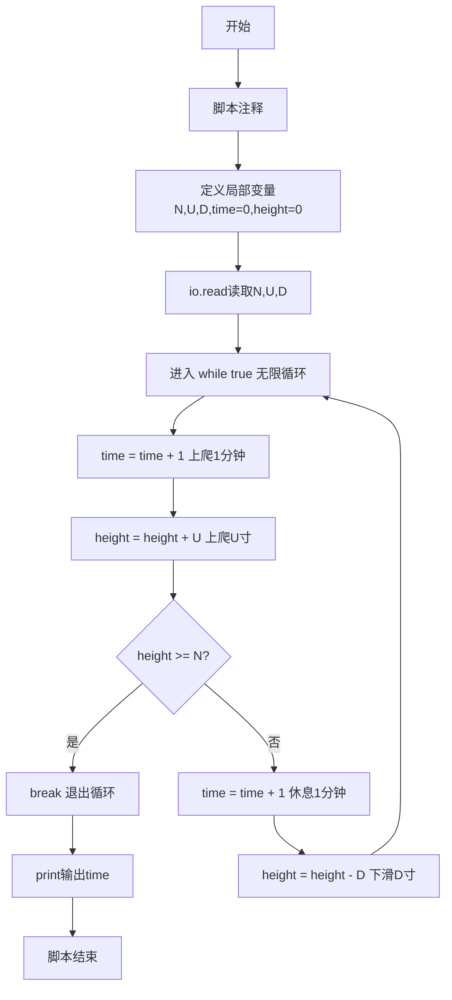
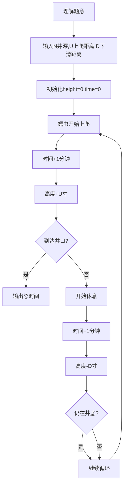

# 7-17 爬动的蠕虫（Lua语言实现）

## 前言

本题（7-17 爬动的蠕虫）的主要考点是：准确理解题意、规范处理输入输出格式，并正确处理边界与精度。下面先给出题目描述与格式要求，再通过清晰的思路与可直接运行的lua代码进行讲解。

## 题目描述

一条蠕虫长1寸，在一口深为N寸的井的底部。已知蠕虫每1分钟可以向上爬U寸，但必须休息1分钟才能接着往上爬。在休息的过程中，蠕虫又下滑了D寸。就这样，上爬和下滑重复进行。请问，蠕虫需要多长时间才能爬出井？

这里要求不足1分钟按1分钟计，并且假定只要在某次上爬过程中蠕虫的头部到达了井的顶部，那么蠕虫就完成任务了。初始时，蠕虫是趴在井底的（即高度为0）。

## 输入格式

输入在一行中顺序给出3个正整数N、U、D，其中D<U，N不超过100。

## 输出格式

在一行中输出蠕虫爬出井的时间，以分钟为单位。

## 输入样例

```in
12 3 1
```

## 输出样例

```out
11
```

## 解题思路

- **核心问题分析**：蠕虫交替进行上爬（1分钟上升U寸）和休息（1分钟下滑D寸），需要计算爬出井所需的总时间。关键在于：上爬过程中若到达或超过井口即完成，不需要再下滑。
- **算法原理说明**：使用模拟法，通过无限循环交替执行上爬和休息两个阶段。每次上爬后立即检查是否爬出，若已爬出则退出循环；否则进入休息阶段下滑。时间在每个阶段分别累加。
- **具体计算步骤**：
  1. 初始化高度height=0，时间time=0
  2. 进入循环：
     - 上爬阶段：time+1，height+U，若height≥N则结束
     - 休息阶段：time+1，height-D
  3. 重复步骤2直到爬出井
  4. 输出总时间time

## 完整代码

```lua
-- 7-17 爬动的蠕虫
local N = tonumber(io.read("*n"))
local U = tonumber(io.read("*n"))
local D = tonumber(io.read("*n"))
local time = 0
local height = 0

while true do
    time = time + 1
    height = height + U
    if height >= N then
        break
    end
    time = time + 1
    height = height - D
end

print(time)
```

## 代码流程说明

1. **脚本注释**（第1行）：`-- 7-17 爬动的蠕虫` 单行注释说明脚本用途。
2. **变量声明与输入**（第2-6行）：
   - `local N = tonumber(io.read("*n"))`：读取井深N并转换为数值类型
   - `local U = tonumber(io.read("*n"))`：读取上爬距离U并转换为数值类型
   - `local D = tonumber(io.read("*n"))`：读取下滑距离D并转换为数值类型
   - `local time = 0`：定义时间计数器time，初始值为0（分钟）
   - `local height = 0`：定义当前高度height，初始值为0（井底）
3. **模拟循环**（第8-17行）：
   - `while true do`进入无限循环，由内部break控制退出
   - 上爬阶段：`time = time + 1`时间自增1分钟，`height = height + U`高度增加U寸
   - 判断`if height >= N then`：若高度达到或超过井深则`break`退出循环（已爬出）
   - 休息阶段：`time = time + 1`时间自增1分钟，`height = height - D`高度减少D寸（下滑）
4. **输出与结束**（第19行）：`print(time)`输出总时间，脚本执行完毕。

## 代码流程图



## 解题流程图



## 代码解析

```lua
-- 7-17 爬动的蠕虫
local N = tonumber(io.read("*n"))
local U = tonumber(io.read("*n"))
local D = tonumber(io.read("*n"))
local time = 0
local height = 0

while true do
    time = time + 1
    height = height + U
    if height >= N then
        break
    end
    time = time + 1
    height = height - D
end

print(time)
```

脚本注释

## 复杂度分析

设输入规模为 $n$（对数值类题目为参与运算的数据量，对字符串/序列类题目为长度）。

- **时间复杂度**：$O(n)$ 或 $O(n \log n)$，主要来自一次线性遍历与常数次数学运算，无嵌套高复杂度循环。
- **空间复杂度**：$O(n)$，用于存储输入、中间结果与输出字符串；若仅使用若干标量变量则为 $O(1)$。

## 常见易错点

### 1. 输入/输出格式不符
错误：多余空格、遗漏换行、大小写或精度不符。后果：判题系统判为格式错误。正确：严格按题目要求的格式输出，数值用合适精度。

### 2. 边界条件遗漏
错误：未处理 0、最小值、单字符或空输入等边界。后果：特例 WA。正确：先列出所有边界样例，在编码前单独分支处理。

### 3. 整数溢出与类型
错误：使用过小的整数类型或忽略负号。后果：大数计算溢出。正确：按数据范围选择合适类型，必要时用更大整数类型或字符串处理。

## 更多测试

### 测试一：常规边界

**输入：**

```text
（可取题目边界附近的值，如最小值或最大值）
```

**输出：**

```text
（依据题意推导的正确结果）
```

### 测试二：特殊用例

**输入：**

```text
（可取易错点，如 0、单一元素、全同值等）
```

**输出：**

```text
（对应正确结果）
```

## 总结

本题的核心在于理清「爬动的蠕虫」的输入输出关系与边界处理：先按格式读取输入，再依据规则逐步计算或遍历，最后按规范输出。该思路可迁移到同类格式化输入输出与模拟计算的题目。

