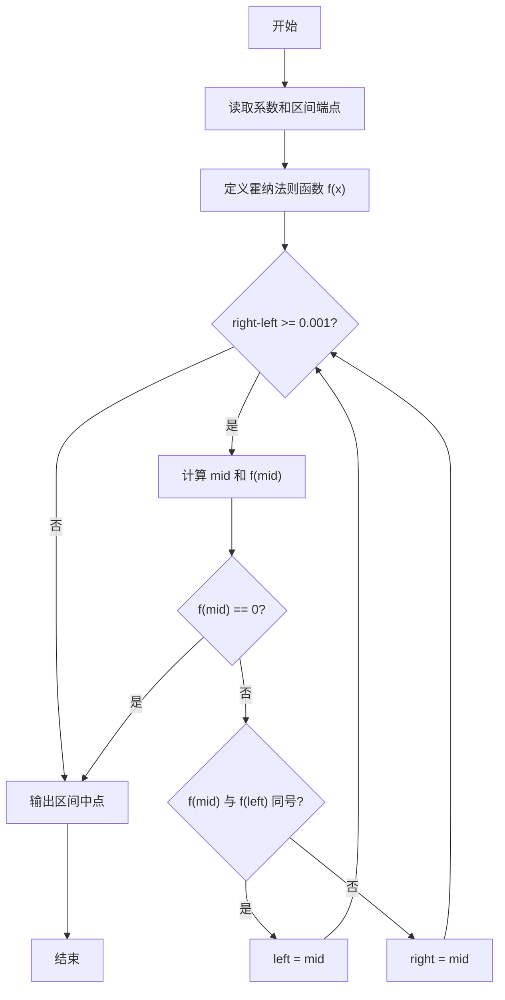
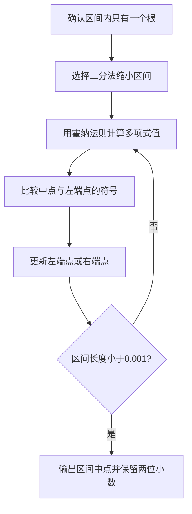

# 7-18 二分法求多项式单根（Lua语言实现）

## 前言

本题（7-18 二分法求多项式单根）的主要考点是：准确理解题意、规范处理输入输出格式，并正确处理边界与精度。下面先给出题目描述与格式要求，再通过清晰的思路与可直接运行的lua代码进行讲解。

## 题目描述

二分法求函数根的原理为：如果连续函数f(x)在区间[a,b]的两个端点取值异号，即f(a)f(b)<0，则它在这个区间内至少存在1个根r，即f(r)=0。

二分法的步骤为：

检查区间长度，如果小于给定阈值，则停止，输出区间中点(a+b)/2；否则
如果f(a)f(b)<0，则计算中点的值f((a+b)/2)；
如果f((a+b)/2)正好为0，则(a+b)/2就是要求的根；否则
如果f((a+b)/2)与f(a)同号，则说明根在区间[(a+b)/2,b]，令a=(a+b)/2，重复循环；
如果f((a+b)/2)与f(b)同号，则说明根在区间[a,(a+b)/2]，令b=(a+b)/2，重复循环。

本题目要求编写程序，计算给定3阶多项式f(x)=a₃x³ + a₂x² + a₁x + a₀在给定区间[a,b]内的根。

## 输入格式

输入在第1行中顺序给出多项式的4个系数a₃、a₂、a₁、a₀，在第2行中顺序给出区间端点a和b。题目保证多项式在给定区间内存在唯一单根。

## 输出格式

在一行中输出该多项式在该区间内的根，精确到小数点后2位。

## 输入样例

```in
3 -1 -3 1
-0.5 0.5
```

## 输出样例

```out
0.33
```

## 解题思路

使用二分法不断缩小包含唯一根的区间。先用霍纳法则实现多项式 `f(x)` 的计算，避免重复展开三次多项式；每轮取区间中点 `mid`，根据 `f(mid)` 与 `f(left)` 的符号关系保留包含根的半区间。

当区间长度小于 `0.001` 时停止，并输出最终区间中点；如果某次中点恰好使多项式值为0，则直接将该点作为根。最后使用 `%.2f` 保留两位小数。

## 完整代码

```lua
-- 7-18 二分法求多项式单根
local a3, a2, a1, a0 = io.read("*n", "*n", "*n", "*n") -- 读取多项式的4个系数
local left, right = io.read("*n", "*n") -- 读取区间端点
-- 秦九韶算法（霍纳法则）计算多项式值：f(x) = ((a3*x + a2)*x + a1)*x + a0
local function f(x)
    return ((a3 * x + a2) * x + a1) * x + a0
end
-- 区间长度不小于阈值 0.001 时继续二分
while right - left >= 0.001 do
    local mid = (left + right) / 2 -- 计算区间中点
    if f(mid) == 0 then
        left, right = mid, mid -- 中点正好是根
        break
    elseif f(mid) * f(left) > 0 then
        left = mid -- 中点与左端点同号，根在右半区间
    else
        right = mid -- 根在左半区间
    end
end
print(string.format("%.2f", (left + right) / 2)) -- 输出区间中点，保留2位小数
```

## 代码流程说明

1. 读取多项式系数 `a3、a2、a1、a0` 以及区间端点 `left、right`。
2. 通过霍纳法则计算任意 `x` 对应的多项式值。
3. 当区间长度仍不小于 `0.001` 时，计算中点 `mid`。
4. 若 `f(mid) == 0`，立即结束；否则根据中点与左端点是否同号，保留右半区间或左半区间。
5. 输出最终区间的中点，并格式化为两位小数。

## 代码流程图



## 解题流程图



## 代码解析

```lua
-- 7-18 二分法求多项式单根
local a3, a2, a1, a0 = io.read("*n", "*n", "*n", "*n") -- 读取多项式的4个系数
local left, right = io.read("*n", "*n") -- 读取区间端点
-- 秦九韶算法（霍纳法则）计算多项式值：f(x) = ((a3*x + a2)*x + a1)*x + a0
local function f(x)
    return ((a3 * x + a2) * x + a1) * x + a0
end
-- 区间长度不小于阈值 0.001 时继续二分
while right - left >= 0.001 do
    local mid = (left + right) / 2 -- 计算区间中点
    if f(mid) == 0 then
        left, right = mid, mid -- 中点正好是根
        break
    elseif f(mid) * f(left) > 0 then
        left = mid -- 中点与左端点同号，根在右半区间
    else
        right = mid -- 根在左半区间
    end
end
print(string.format("%.2f", (left + right) / 2)) -- 输出区间中点，保留2位小数
```

代码用 `f(x)` 封装三阶多项式求值，循环只维护当前根区间。每次更新端点后区间长度都会缩短，达到阈值后输出中点即可满足题目的精度要求。

## 复杂度分析

设初始区间长度为 L、停止精度为 ε，二分迭代次数为 O(log(L/ε))，额外空间复杂度为 O(1).

## 常见易错点

- 二分区间更新必须保留根所在的一侧，并使用中点与左端点的符号关系判断。
- 循环停止条件是区间长度小于 0.001，最终输出区间中点并保留两位小数。

## 更多测试

边界测试：输入系数 1 0 0 -1、区间 0 2，预期输出 1.00。

特殊测试：输入系数 1 0 0 0、区间 -1 1，验证根位于区间中点时可立即结束。

## 总结

本题的核心在于理清「二分法求多项式单根」的输入输出关系与边界处理：先按格式读取输入，再依据规则逐步计算或遍历，最后按规范输出。该思路可迁移到同类格式化输入输出与模拟计算的题目。
