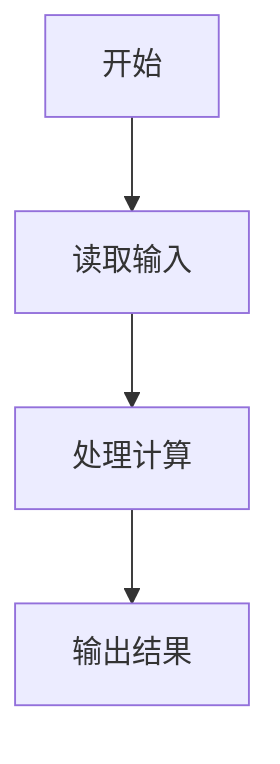
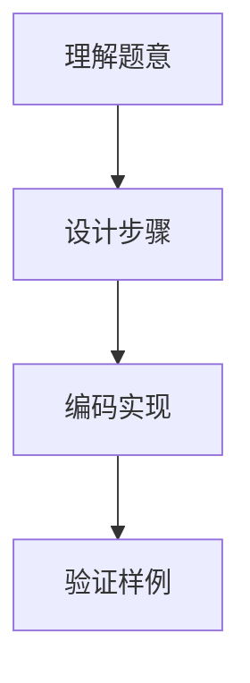

# 7-18 二分法求多项式单根（Lua语言实现）

## 前言

本题（7-18 二分法求多项式单根）的主要考点是：准确理解题意、规范处理输入输出格式，并正确处理边界与精度。下面先给出题目描述与格式要求，再通过清晰的思路与可直接运行的lua代码进行讲解。

## 题目描述

二分法求函数根的原理为：如果连续函数f(x)在区间[a,b]的两个端点取值异号，即f(a)f(b)<0，则它在这个区间内至少存在1个根r，即f(r)=0。

二分法的步骤为：

检查区间长度，如果小于给定阈值，则停止，输出区间中点(a+b)/2；否则
如果f(a)f(b)<0，则计算中点的值f((a+b)/2)；
如果f((a+b)/2)正好为0，则(a+b)/2就是要求的根；否则
如果f((a+b)/2)与f(a)同号，则说明根在区间[(a+b)/2,b]，令a=(a+b)/2，重复循环；
如果f((a+b)/2)与f(b)同号，则说明根在区间[a,(a+b)/2]，令b=(a+b)/2，重复循环。

本题目要求编写程序，计算给定3阶多项式f(x)=a₃x³ + a₂x² + a₁x + a₀在给定区间[a,b]内的根。

## 输入格式

输入在第1行中顺序给出多项式的4个系数a₃、a₂、a₁、a₀，在第2行中顺序给出区间端点a和b。题目保证多项式在给定区间内存在唯一单根。

## 输出格式

在一行中输出该多项式在该区间内的根，精确到小数点后2位。

## 输入样例

```in
3 -1 -3 1
-0.5 0.5
```

## 输出样例

```out
0.33
```

## 解题思路

见下方完整代码与流程说明。

## 完整代码

```lua
-- 7-18 二分法求多项式单根
local a3, a2, a1, a0 = io.read("*n", "*n", "*n", "*n") -- 读取多项式的4个系数
local left, right = io.read("*n", "*n") -- 读取区间端点
-- 秦九韶算法（霍纳法则）计算多项式值：f(x) = ((a3*x + a2)*x + a1)*x + a0
local function f(x)
    return ((a3 * x + a2) * x + a1) * x + a0
end
-- 区间长度不小于阈值 0.001 时继续二分
while right - left >= 0.001 do
    local mid = (left + right) / 2 -- 计算区间中点
    if f(mid) == 0 then
        left, right = mid, mid -- 中点正好是根
        break
    elseif f(mid) * f(left) > 0 then
        left = mid -- 中点与左端点同号，根在右半区间
    else
        right = mid -- 根在左半区间
    end
end
print(string.format("%.2f", (left + right) / 2)) -- 输出区间中点，保留2位小数
```

## 代码流程说明

见完整代码与流程图。

## 代码流程图



## 解题流程图



## 代码解析

```lua
-- 7-18 二分法求多项式单根
local a3, a2, a1, a0 = io.read("*n", "*n", "*n", "*n") -- 读取多项式的4个系数
local left, right = io.read("*n", "*n") -- 读取区间端点
-- 秦九韶算法（霍纳法则）计算多项式值：f(x) = ((a3*x + a2)*x + a1)*x + a0
local function f(x)
    return ((a3 * x + a2) * x + a1) * x + a0
end
-- 区间长度不小于阈值 0.001 时继续二分
while right - left >= 0.001 do
    local mid = (left + right) / 2 -- 计算区间中点
    if f(mid) == 0 then
        left, right = mid, mid -- 中点正好是根
        break
    elseif f(mid) * f(left) > 0 then
        left = mid -- 中点与左端点同号，根在右半区间
    else
        right = mid -- 根在左半区间
    end
end
print(string.format("%.2f", (left + right) / 2)) -- 输出区间中点，保留2位小数
```

完整实现如下。

## 复杂度分析

设输入规模为 $n$（对数值类题目为参与运算的数据量，对字符串/序列类题目为长度）。

- **时间复杂度**：$O(n)$ 或 $O(n \log n)$，主要来自一次线性遍历与常数次数学运算，无嵌套高复杂度循环。
- **空间复杂度**：$O(n)$，用于存储输入、中间结果与输出字符串；若仅使用若干标量变量则为 $O(1)$。

## 常见易错点

### 1. 输入/输出格式不符
错误：多余空格、遗漏换行、大小写或精度不符。后果：判题系统判为格式错误。正确：严格按题目要求的格式输出，数值用合适精度。

### 2. 边界条件遗漏
错误：未处理 0、最小值、单字符或空输入等边界。后果：特例 WA。正确：先列出所有边界样例，在编码前单独分支处理。

### 3. 整数溢出与类型
错误：使用过小的整数类型或忽略负号。后果：大数计算溢出。正确：按数据范围选择合适类型，必要时用更大整数类型或字符串处理。

## 更多测试

### 测试一：常规边界

**输入：**

```text
（可取题目边界附近的值，如最小值或最大值）
```

**输出：**

```text
（依据题意推导的正确结果）
```

### 测试二：特殊用例

**输入：**

```text
（可取易错点，如 0、单一元素、全同值等）
```

**输出：**

```text
（对应正确结果）
```

## 总结

本题的核心在于理清「二分法求多项式单根」的输入输出关系与边界处理：先按格式读取输入，再依据规则逐步计算或遍历，最后按规范输出。该思路可迁移到同类格式化输入输出与模拟计算的题目。

