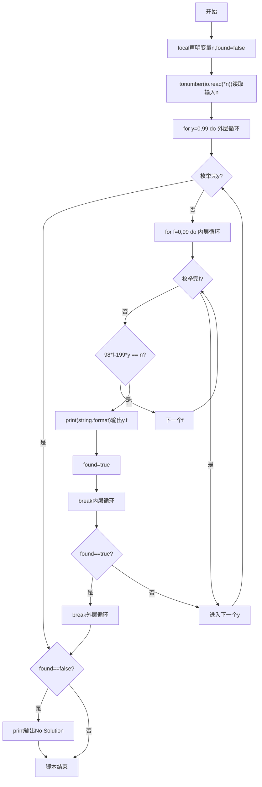
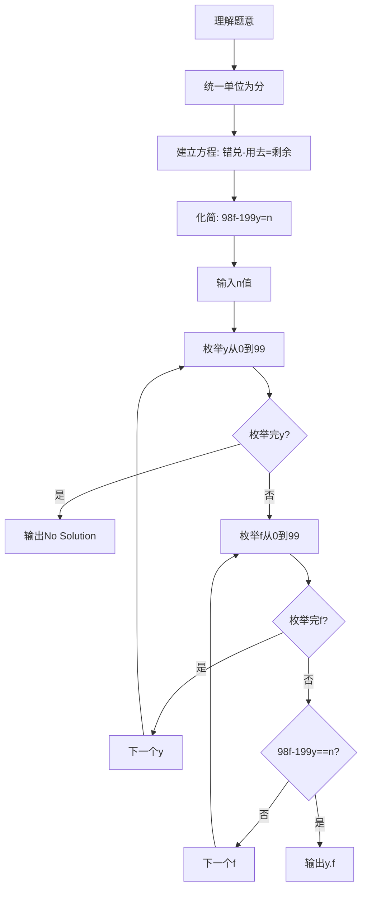

# 7-19 支票面额（Lua语言实现）

## 前言

本题（7-19 支票面额）的主要考点是：准确理解题意、规范处理输入输出格式，并正确处理边界与精度。下面先给出题目描述与格式要求，再通过清晰的思路与可直接运行的lua代码进行讲解。

## 题目描述

一个采购员去银行兑换一张y元f分的支票，结果出纳员错给了f元y分。采购员用去了n分之后才发觉有错，于是清点了余额尚有2y元2f分，问该支票面额是多少？

## 输入格式

输入在一行中给出小于100的正整数n。

## 输出格式

在一行中按格式y.f输出该支票的原始面额。如果无解，则输出No Solution。

## 输入样例1

```in
23
```

## 输入样例2

```in
22
```

## 输出样例1

```out
25.51
```

## 输出样例2

```out
No Solution
```

## 解题思路

- **核心问题分析**：根据题意建立数学方程，求解原始支票面额y（元）和f（分）。关键在于将金额单位统一为分后，根据错兑、用去、剩余的关系建立不定方程。
- **算法原理说明**：将所有金额转换为分单位：原始支票为100y+f分，错兑后为100f+y分，用去n分后剩余200y+2f分。根据题意列方程：100f+y-n = 200y+2f，化简得98f-199y = n。由于y和f均为0~99的整数（元与分的范围），使用双重循环枚举所有可能的y和f，验证是否满足方程即可。
- **具体计算步骤**：
  1. 读取用去的分数n
  2. 外层循环枚举y从0到99（元数）
  3. 内层循环枚举f从0到99（分数）
  4. 验证方程98f-199y==n是否成立
  5. 若成立则输出y.f，标记找到解，退出循环
  6. 枚举结束未找到解则输出No Solution

## 完整代码

```lua
-- 7-19 支票面额
local n = tonumber(io.read("*n"))
local found = false

for y = 0, 99 do
    for f = 0, 99 do
        if 98*f - 199*y == n then
            print(string.format("%d.%d", y, f))
            found = true
            break
        end
    end
    if found then
        break
    end
end

if not found then
    print("No Solution")
end
```

## 代码流程说明

1. **变量声明与输入**（第2-3行）：使用local声明用去的分数n和找到解标记found（初始false）；使用tonumber(io.read("*n"))读取输入n。
2. **双重循环枚举求解**（第5-16行）：
   - 外层for循环y从0到99（for y = 0, 99 do），枚举所有可能的元数
   - 内层for循环f从0到99（for f = 0, 99 do），枚举所有可能的分数
   - 条件判断98*f - 199*y == n：验证是否满足不定方程
   - 若满足：使用print配合string.format输出y.f格式结果，found置true，break内层循环
   - 外层循环判断found是否为true，若找到则break外层循环
3. **无解处理与结束**（第18-20行）：若found仍为false则输出No Solution；脚本自然结束。

## 代码流程图



## 解题流程图



## 代码解析

```lua
-- 7-19 支票面额
local n = tonumber(io.read("*n"))
local found = false

for y = 0, 99 do
    for f = 0, 99 do
        if 98*f - 199*y == n then
            print(string.format("%d.%d", y, f))
            found = true
            break
        end
    end
    if found then
        break
    end
end

if not found then
    print("No Solution")
end
```

变量声明与输入

## 复杂度分析

y 和 f 的取值范围均为 0 到 99，双重循环最多检查 10000 种组合，因此时间复杂度和额外空间复杂度均为 O(1).

## 常见易错点

- y 表示元、f 表示分，兑换后的金额应按 100f+y 分换算，不能交换方程中的系数。
- y 和 f 都应限制在 0 到 99，并在无解时输出 No Solution。

## 更多测试

边界测试：输入 1，预期输出 No Solution。

特殊测试：输入 23，预期输出 25.51，验证存在解时的格式。

## 总结

本题的核心在于理清「支票面额」的输入输出关系与边界处理：先按格式读取输入，再依据规则逐步计算或遍历，最后按规范输出。该思路可迁移到同类格式化输入输出与模拟计算的题目。
