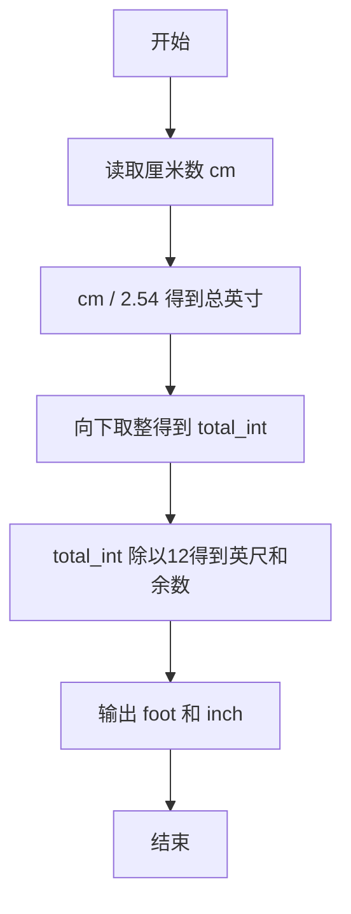
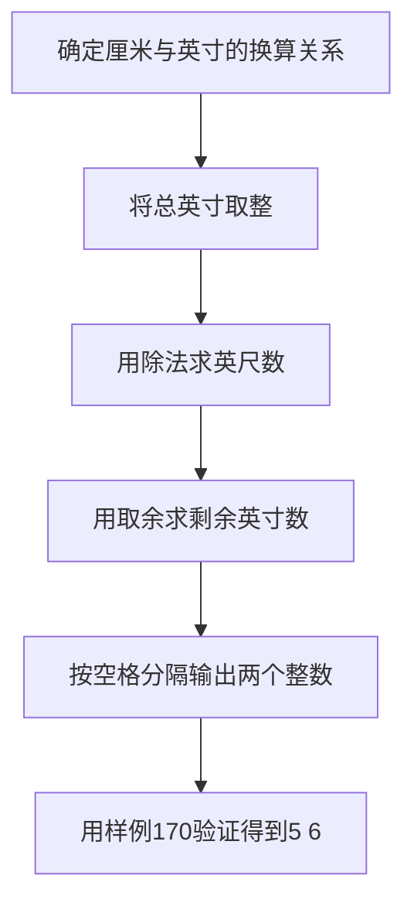

# 7-1 厘米换算英尺英寸（Lua语言实现）

## 前言

本题（7-1 厘米换算英尺英寸）的主要考点是：准确理解题意、规范处理输入输出格式，并正确处理边界与精度。下面先给出题目描述与格式要求，再通过清晰的思路与可直接运行的lua代码进行讲解。

## 题目描述

如果已知英制长度的英尺*f**oo**t*和英寸*in**c**h*的值，那么对应的米是(*f**oo**t*+*in**c**h*/12)×0.3048。现在，如果用户输入的是厘米数，那么对应英制长度的英尺和英寸是多少呢？别忘了1英尺等于12英寸。

## 输入格式

输入在一行中给出1个正整数，单位是厘米。

## 输出格式

在一行中输出这个厘米数对应英制长度的英尺和英寸的整数值，中间用空格分开。英寸的值应小于12。

## 输入样例

```in
170
```

## 输出样例

```out
5 6
```

## 解题思路

先将厘米换算为英寸。由于题目要求输出英尺和整数英寸，先对总英寸数向下取整，再利用整数除法和取余分别得到英尺数与剩余英寸数。计算总英寸时加入很小的误差修正值，避免本应为整数的结果因浮点数表示误差而被错误向下取整。

设换算后的整数总英寸数为 `total_int`，则：

- 英尺数为 `math.floor(total_int / 12)`；
- 英寸数为 `total_int % 12`。

这样得到的英寸数始终小于12，且输出格式为两个整数，中间用一个空格分隔。

## 完整代码

```lua
local cm = tonumber(io.read()) -- 从标准输入读取一行并转为数字，存储厘米数
local total_inches = cm / 2.54 + 1e-9 -- 厘米除以2.54得到总英寸，加1e-9避免浮点精度问题
local total_int = math.floor(total_inches) -- 对总英寸数向下取整得到整数
local foot = math.floor(total_int / 12) -- 计算英尺数：总英寸整数除以12后取整
local inch = total_int % 12 -- 计算剩余英寸数：总英寸整数对12取余
print(string.format("%d %d", foot, inch)) -- 格式化输出英尺和英寸，中间用空格分隔
```

## 代码流程说明

1. 使用 `io.read()` 读取厘米数，并通过 `tonumber()` 转换为数值。
2. 用 `cm / 2.54` 将厘米换算为英寸，再加上 `1e-9` 进行浮点误差修正。
3. 对总英寸数向下取整，得到应输出的整数英寸总数 `total_int`。
4. 用除以12的整数商得到英尺数，用对12取余得到剩余英寸数。
5. 使用 `string.format("%d %d", foot, inch)` 按题目要求输出结果。

## 代码流程图



## 解题流程图



## 代码解析

```lua
local cm = tonumber(io.read()) -- 从标准输入读取一行并转为数字，存储厘米数
local total_inches = cm / 2.54 + 1e-9 -- 厘米除以2.54得到总英寸，加1e-9避免浮点精度问题
local total_int = math.floor(total_inches) -- 对总英寸数向下取整得到整数
local foot = math.floor(total_int / 12) -- 计算英尺数：总英寸整数除以12后取整
local inch = total_int % 12 -- 计算剩余英寸数：总英寸整数对12取余
print(string.format("%d %d", foot, inch)) -- 格式化输出英尺和英寸，中间用空格分隔
```

代码先完成单位换算和取整，再通过商与余数拆分英制长度。`1e-9` 只用于抵消浮点表示误差，不改变题目要求的取整规则；最后使用整数格式输出，保证不会出现小数。

## 复杂度分析

该程序只进行一次换算、取整和取余运算，时间复杂度为 O(1)，额外空间复杂度为 O(1).

## 常见易错点

- 不要把总英寸直接四舍五入；应按题意取整数部分后再换算英尺和英寸。
- 计算时保留厘米到英寸的精度，避免 2.54 等边界值因浮点误差被错误取整。

## 更多测试

边界测试：输入 254，预期输出 8 4（恰好为 100 英寸）。

特殊测试：输入 2.54，预期输出 0 1，验证小数换算和取整。

## 总结

本题的核心在于理清「厘米换算英尺英寸」的输入输出关系与边界处理：先按格式读取输入，再依据规则逐步计算或遍历，最后按规范输出。该思路可迁移到同类格式化输入输出与模拟计算的题目。
