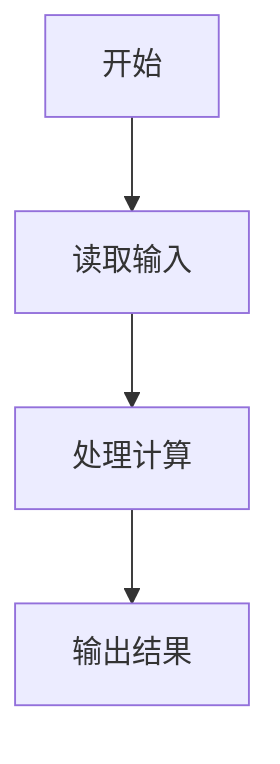
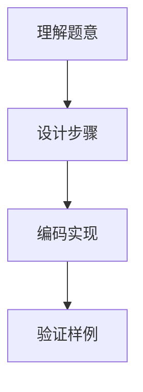

# 7-1 厘米换算英尺英寸（Lua语言实现）

## 前言

本题（7-1 厘米换算英尺英寸）的主要考点是：准确理解题意、规范处理输入输出格式，并正确处理边界与精度。下面先给出题目描述与格式要求，再通过清晰的思路与可直接运行的lua代码进行讲解。

## 题目描述

如果已知英制长度的英尺*f**oo**t*和英寸*in**c**h*的值，那么对应的米是(*f**oo**t*+*in**c**h*/12)×0.3048。现在，如果用户输入的是厘米数，那么对应英制长度的英尺和英寸是多少呢？别忘了1英尺等于12英寸。

## 输入格式

输入在一行中给出1个正整数，单位是厘米。

## 输出格式

在一行中输出这个厘米数对应英制长度的英尺和英寸的整数值，中间用空格分开。英寸的值应小于12。

## 输入样例

```in
170
```

## 输出样例

```out
5 6
```

## 解题思路

见下方完整代码与流程说明。

## 完整代码

```lua
local cm = tonumber(io.read()) -- 从标准输入读取一行并转为数字，存储厘米数
local total_inches = cm / 2.54 + 1e-9 -- 厘米除以2.54得到总英寸，加1e-9避免浮点精度问题
local total_int = math.floor(total_inches) -- 对总英寸数向下取整得到整数
local foot = math.floor(total_int / 12) -- 计算英尺数：总英寸整数除以12后取整
local inch = total_int % 12 -- 计算剩余英寸数：总英寸整数对12取余
print(string.format("%d %d", foot, inch)) -- 格式化输出英尺和英寸，中间用空格分隔
```

## 代码流程说明

见完整代码与流程图。

## 代码流程图



## 解题流程图



## 代码解析

```lua
local cm = tonumber(io.read()) -- 从标准输入读取一行并转为数字，存储厘米数
local total_inches = cm / 2.54 + 1e-9 -- 厘米除以2.54得到总英寸，加1e-9避免浮点精度问题
local total_int = math.floor(total_inches) -- 对总英寸数向下取整得到整数
local foot = math.floor(total_int / 12) -- 计算英尺数：总英寸整数除以12后取整
local inch = total_int % 12 -- 计算剩余英寸数：总英寸整数对12取余
print(string.format("%d %d", foot, inch)) -- 格式化输出英尺和英寸，中间用空格分隔
```

完整实现如下。

## 复杂度分析

设输入规模为 $n$（对数值类题目为参与运算的数据量，对字符串/序列类题目为长度）。

- **时间复杂度**：$O(n)$ 或 $O(n \log n)$，主要来自一次线性遍历与常数次数学运算，无嵌套高复杂度循环。
- **空间复杂度**：$O(n)$，用于存储输入、中间结果与输出字符串；若仅使用若干标量变量则为 $O(1)$。

## 常见易错点

### 1. 输入/输出格式不符
错误：多余空格、遗漏换行、大小写或精度不符。后果：判题系统判为格式错误。正确：严格按题目要求的格式输出，数值用合适精度。

### 2. 边界条件遗漏
错误：未处理 0、最小值、单字符或空输入等边界。后果：特例 WA。正确：先列出所有边界样例，在编码前单独分支处理。

### 3. 整数溢出与类型
错误：使用过小的整数类型或忽略负号。后果：大数计算溢出。正确：按数据范围选择合适类型，必要时用更大整数类型或字符串处理。

## 更多测试

### 测试一：常规边界

**输入：**

```text
（可取题目边界附近的值，如最小值或最大值）
```

**输出：**

```text
（依据题意推导的正确结果）
```

### 测试二：特殊用例

**输入：**

```text
（可取易错点，如 0、单一元素、全同值等）
```

**输出：**

```text
（对应正确结果）
```

## 总结

本题的核心在于理清「厘米换算英尺英寸」的输入输出关系与边界处理：先按格式读取输入，再依据规则逐步计算或遍历，最后按规范输出。该思路可迁移到同类格式化输入输出与模拟计算的题目。

