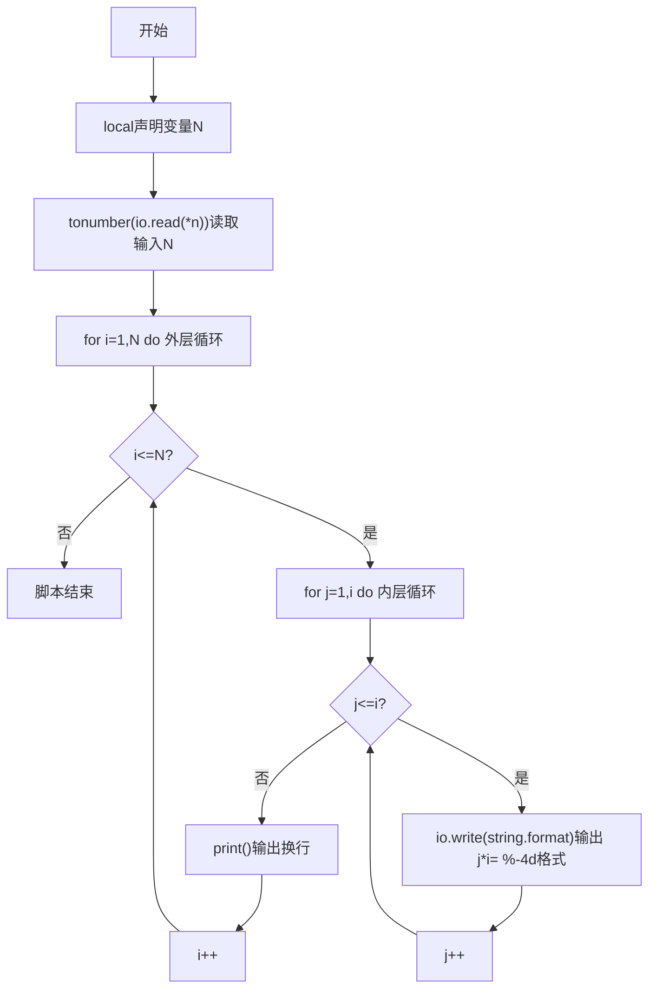
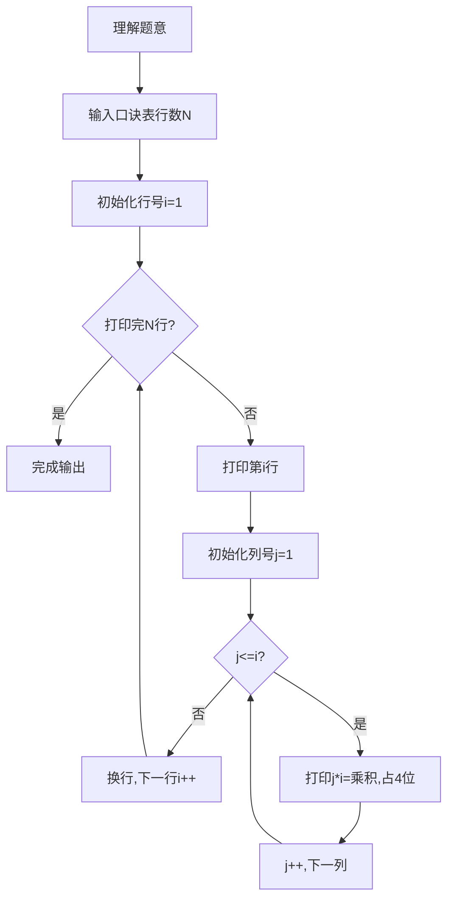

# 7-20 打印九九口诀表（Lua语言实现）

## 前言

本题（7-20 打印九九口诀表）的主要考点是：准确理解题意、规范处理输入输出格式，并正确处理边界与精度。下面先给出题目描述与格式要求，再通过清晰的思路与可直接运行的lua代码进行讲解。

## 题目描述

下面是一个完整的下三角九九口诀表：

1*1=1   
1*2=2   2*2=4   
1*3=3   2*3=6   3*3=9   
1*4=4   2*4=8   3*4=12  4*4=16  
1*5=5   2*5=10  3*5=15  4*5=20  5*5=25  
1*6=6   2*6=12  3*6=18  4*6=24  5*6=30  6*6=36  
1*7=7   2*7=14  3*7=21  4*7=28  5*7=35  6*7=42  7*7=49  
1*8=8   2*8=16  3*8=24  4*8=32  5*8=40  6*8=48  7*8=56  8*8=64  
1*9=9   2*9=18  3*9=27  4*9=36  5*9=45  6*9=54  7*9=63  8*9=72  9*9=81  

本题要求对任意给定的一位正整数N，输出从1*1到N*N的部分口诀表。

## 输入格式
输入在一行中给出一个正整数N（1≤N≤9）。

## 输出格式
输出下三角N*N部分口诀表，其中等号右边数字占4位、左对齐。

## 输入样例
```in
4
```
## 输出样例
```out
1*1=1   
1*2=2   2*2=4   
1*3=3   2*3=6   3*3=9   
1*4=4   2*4=8   3*4=12  4*4=16  
```
## 解题思路

- **核心问题分析**：打印N行N列的下三角九九乘法表，格式要求为：第i行有i个乘法项（i从1到N），每个乘法项格式为j*i=乘积（j从1到i），乘积部分占4位左对齐。
- **算法原理说明**：使用双重循环结构。外层循环控制行数i（1到N），内层循环控制每行的乘法项数j（1到i）。利用Lua的string.format("%-4d")格式控制符设置输出宽度，%-4d实现乘积数字占4位且左对齐的格式要求。
- **具体计算步骤**：
  1. 读取正整数N（1≤N≤9）
  2. 外层循环i从1到N（控制当前行数/第二个乘数）
     3. 内层循环j从1到i（控制该行的项数/第一个乘数）
        - 输出格式：io.write(string.format("%d*%d=%-4d", j, i, j*i))
     4. 每行输出完毕后换行
  3. 结束程序

## 完整代码

```lua
-- 7-20 打印九九口诀表
local N = tonumber(io.read("*n"))

for i = 1, N do
    for j = 1, i do
        io.write(string.format("%d*%d=%-4d", j, i, j*i))
    end
    print()
end
```

## 代码流程说明

1. **变量声明与输入**（第2行）：使用local声明口诀表行数N；使用tonumber(io.read("*n"))读取输入N。
2. **双重循环打印口诀表**（第4-9行）：
   - 外层for循环i从1到N（for i = 1, N do）：控制输出N行，i同时作为乘法的第二个操作数
   - 内层for循环j从1到i（for j = 1, i do）：第i行输出i个乘法项，j作为乘法的第一个操作数
   - 输出格式：io.write(string.format("%d*%d=%-4d", j, i, j*i))；%-4d确保乘积部分占4位宽度且左对齐，io.write不自动换行
   - 内层循环结束后print()换行，进入下一行
3. **脚本自然结束**：程序正常退出。

## 代码流程图



## 解题流程图



## 代码解析

```lua
-- 7-20 打印九九口诀表
local N = tonumber(io.read("*n"))

for i = 1, N do
    for j = 1, i do
        io.write(string.format("%d*%d=%-4d", j, i, j*i))
    end
    print()
end
```

变量声明与输入

## 复杂度分析

外层循环输出 N 行，第 i 行输出 i 项，共输出 N(N+1)/2 项，时间复杂度为 O(N²)，额外空间复杂度为 O(1).

## 常见易错点

- 第 i 行只输出 j 从 1 到 i 的乘法式，不能输出完整矩形表。
- 乘积右侧使用左对齐的 4 位宽度，空格也是判题格式的一部分。

## 更多测试

边界测试：输入 1，验证只输出一行 1*1=1。

特殊测试：输入 9，验证完整下三角口诀表和乘积左对齐格式。

## 总结

本题的核心在于理清「打印九九口诀表」的输入输出关系与边界处理：先按格式读取输入，再依据规则逐步计算或遍历，最后按规范输出。该思路可迁移到同类格式化输入输出与模拟计算的题目。
