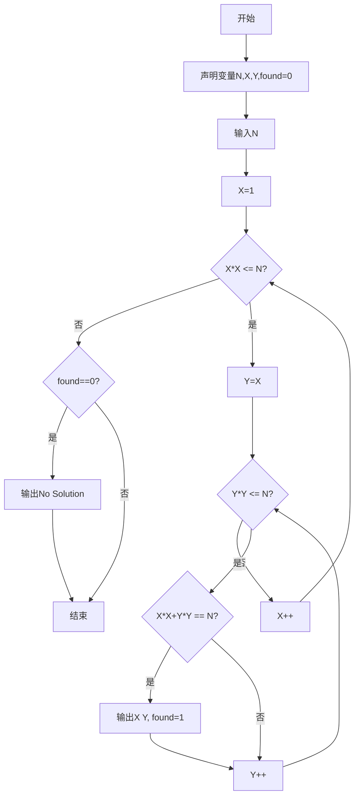
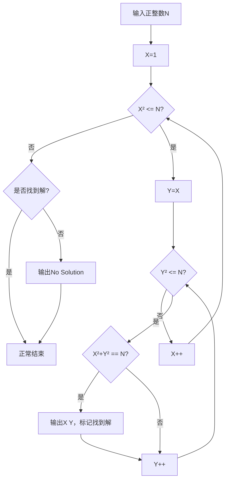

# 7-21 求特殊方程的正整数解（Lua语言实现）

## 前言

本题（7-21 求特殊方程的正整数解）的主要考点是：准确理解题意、规范处理输入输出格式，并正确处理边界与精度。下面先给出题目描述与格式要求，再通过清晰的思路与可直接运行的lua代码进行讲解。

## 题目描述

本题要求对任意给定的正整数N，求方程X² + Y² = N的全部正整数解。

## 输入格式
输入在一行中给出正整数N（≤10000）。

## 输出格式
输出方程X² + Y² = N的全部正整数解，其中X≤Y。每组解占1行，两数字间以1空格分隔，按X的递增顺序输出。如果没有解，则输出No Solution。

## 输入样例
```in
884
```


### 输入样例2：
```in
11
```
## 输出样例
```out
10 28
20 22
```


### 输出样例2：
```out
No Solution
```
## 解题思路

### 1. 核心问题分析

给定正整数N，找出所有满足X² + Y² = N且X≤Y的正整数对(X, Y)。由于N最大为10000，X和Y的最大值都不超过100，暴力枚举完全可行。

### 2. 算法原理

采用双重循环枚举法。外层循环枚举X（从1到√N），内层循环枚举Y（从X到√N），对每对(X, Y)判断是否满足方程X² + Y² = N。Y从X开始枚举保证了X≤Y的约束条件。

### 3. 具体计算步骤

1. 读取正整数N
2. 初始化标记found=0表示未找到解
3. X从1开始递增，直到X² > N为止
4. 对每个X，Y从X开始递增，直到Y² > N为止
5. 若X² + Y² = N，输出该组解并标记found=1
6. 遍历结束后若found仍为0，输出"No Solution"

## 完整代码

```lua
-- 7-21 求特殊方程的正整数解
local N = tonumber(io.read("*n"))
local found = 0

for X = 1, math.floor(math.sqrt(N)) do
    for Y = X, math.floor(math.sqrt(N)) do
        if X*X + Y*Y == N then
            print(X .. " " .. Y)
            found = 1
        end
    end
end

if found == 0 then
    print("No Solution")
end
```

## 代码流程说明

1. **变量声明**：使用local关键字声明N存储输入值，found标记是否找到解（初始为0）
2. **输入读取**：使用tonumber(io.read("*n"))读取正整数N
3. **外层循环（X枚举）**：for X = 1, math.floor(math.sqrt(N)) do，枚举X从1到√N
4. **内层循环（Y枚举）**：for Y = X, math.floor(math.sqrt(N)) do，枚举Y从X到√N
5. **方程判断**：若X*X + Y*Y == N，则使用print(X .. " " .. Y)输出解，设置found=1
6. **无解判断**：双重循环结束后，若found == 0，输出"No Solution"
7. **程序结束**：脚本执行完毕

## 代码流程图



## 解题流程图



## 代码解析

```lua
-- 7-21 求特殊方程的正整数解
local N = tonumber(io.read("*n"))
local found = 0

for X = 1, math.floor(math.sqrt(N)) do
    for Y = X, math.floor(math.sqrt(N)) do
        if X*X + Y*Y == N then
            print(X .. " " .. Y)
            found = 1
        end
    end
end

if found == 0 then
    print("No Solution")
end
```

变量声明

## 复杂度分析

设输入规模为 $n$（对数值类题目为参与运算的数据量，对字符串/序列类题目为长度）。

- **时间复杂度**：$O(n)$ 或 $O(n \log n)$，主要来自一次线性遍历与常数次数学运算，无嵌套高复杂度循环。
- **空间复杂度**：$O(n)$，用于存储输入、中间结果与输出字符串；若仅使用若干标量变量则为 $O(1)$。

## 常见易错点

### 1. 输入/输出格式不符
错误：多余空格、遗漏换行、大小写或精度不符。后果：判题系统判为格式错误。正确：严格按题目要求的格式输出，数值用合适精度。

### 2. 边界条件遗漏
错误：未处理 0、最小值、单字符或空输入等边界。后果：特例 WA。正确：先列出所有边界样例，在编码前单独分支处理。

### 3. 整数溢出与类型
错误：使用过小的整数类型或忽略负号。后果：大数计算溢出。正确：按数据范围选择合适类型，必要时用更大整数类型或字符串处理。

## 更多测试

### 测试一：常规边界

**输入：**

```text
（可取题目边界附近的值，如最小值或最大值）
```

**输出：**

```text
（依据题意推导的正确结果）
```

### 测试二：特殊用例

**输入：**

```text
（可取易错点，如 0、单一元素、全同值等）
```

**输出：**

```text
（对应正确结果）
```

## 总结

本题的核心在于理清「求特殊方程的正整数解」的输入输出关系与边界处理：先按格式读取输入，再依据规则逐步计算或遍历，最后按规范输出。该思路可迁移到同类格式化输入输出与模拟计算的题目。

