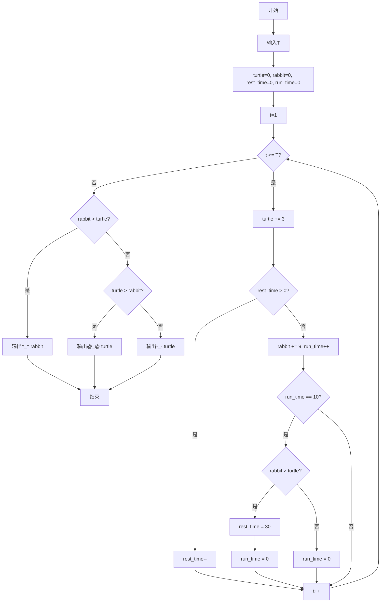
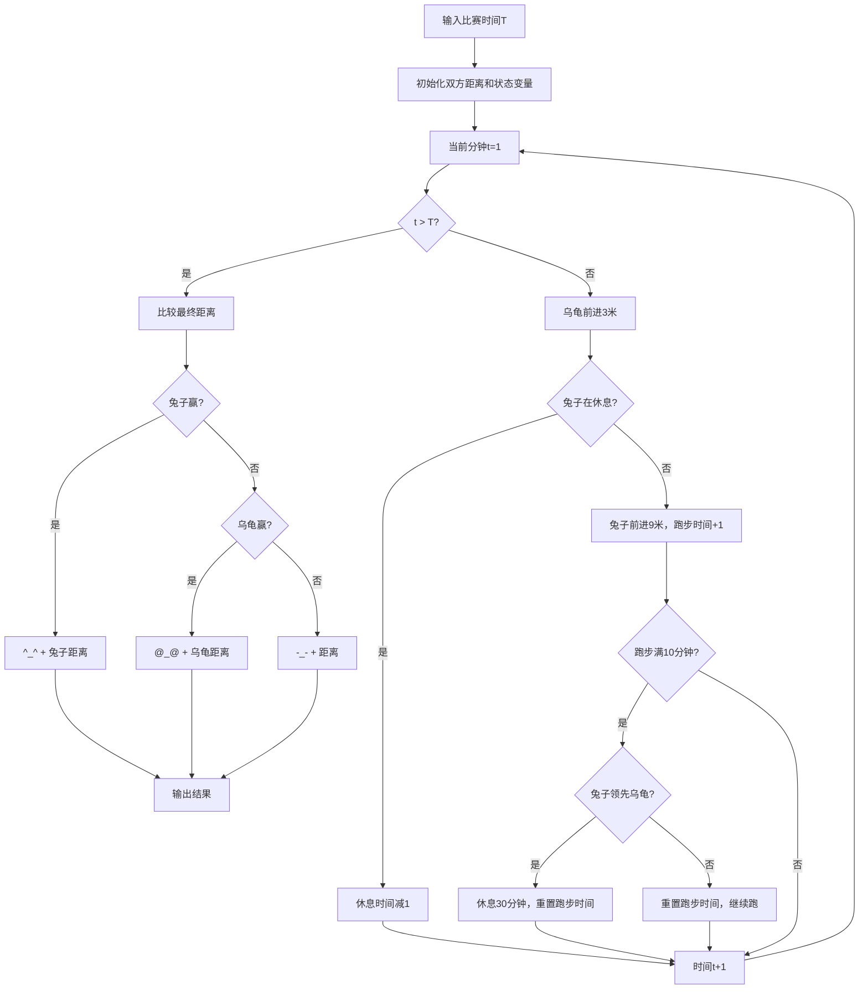

# 7-22 龟兔赛跑（Lua语言实现）

## 前言

本题（7-22 龟兔赛跑）的主要考点是：准确理解题意、规范处理输入输出格式，并正确处理边界与精度。下面先给出题目描述与格式要求，再通过清晰的思路与可直接运行的lua代码进行讲解。

## 题目描述

乌龟与兔子进行赛跑，跑场是一个矩型跑道，跑道边可以随地进行休息。乌龟每分钟可以前进3米，兔子每分钟前进9米；兔子嫌乌龟跑得慢，觉得肯定能跑赢乌龟，于是，每跑10分钟回头看一下乌龟，若发现自己超过乌龟，就在路边休息，每次休息30分钟，否则继续跑10分钟；而乌龟非常努力，一直跑，不休息。假定乌龟与兔子在同一起点同一时刻开始起跑，请问T分钟后乌龟和兔子谁跑得快？

## 输入格式
输入在一行中给出比赛时间T（分钟）。

## 输出格式
在一行中输出比赛的结果：乌龟赢输出@_@，兔子赢输出^_^，平局则输出-_-；后跟1空格，再输出胜利者跑完的距离（平局输出乌龟或兔子跑完的距离均可）。

## 输入样例
```in
242
```
## 输出样例
```out
@_@ 726
```
## 解题思路

### 1. 核心问题分析

本题需要模拟龟兔赛跑的全过程。关键点在于兔子的行为规则：每跑10分钟检查一次位置，如果领先就休息30分钟，否则继续跑10分钟。乌龟始终匀速前进。

### 2. 算法原理

采用逐分钟模拟法。用循环逐分钟推进时间t，每分钟更新乌龟和兔子的位置。使用两个状态变量：rest_time记录兔子剩余休息时间，run_time记录兔子当前已跑时间。每分钟判断兔子是在休息还是在跑步，兔子每跑满10分钟触发一次检查逻辑。

### 3. 具体计算步骤

1. 读取比赛时间T
2. 初始化乌龟距离turtle=0、兔子距离rabbit=0、休息时间rest_time=0、已跑时间run_time=0
3. 从第1分钟到第T分钟逐分钟循环：
   - 乌龟距离 += 3
   - 若兔子rest_time > 0，rest_time--（兔子休息）
   - 否则（兔子跑步）：rabbit += 9，run_time++
   - 若run_time == 10：若rabbit > turtle则rest_time=30，run_time重置为0
4. 比较最终距离，输出胜利者和距离

## 完整代码

```lua
-- 7-22 龟兔赛跑
local T = tonumber(io.read("*n"))
local turtle = 0
local rabbit = 0
local restTime = 0
local runTime = 0

for t = 1, T do
    turtle = turtle + 3
    if restTime > 0 then
        restTime = restTime - 1
    else
        rabbit = rabbit + 9
        runTime = runTime + 1
        if runTime == 10 then
            if rabbit > turtle then
                restTime = 30
            end
            runTime = 0
        end
    end
end

if rabbit > turtle then
    print("^_^ " .. rabbit)
elseif turtle > rabbit then
    print("@_@ " .. turtle)
else
    print("-_- " .. turtle)
end
```

## 代码流程说明

1. **输入阶段**：使用tonumber(io.read("*n"))读取比赛时间T
2. **变量初始化**：使用local声明turtle/rabbit记录双方距离（初始0），restTime记录兔子剩余休息时间（初始0），runTime记录兔子连续跑步时间（初始0）
3. **逐分钟模拟循环**：for t = 1, T do
   - 乌龟始终前进3米：turtle = turtle + 3
   - 判断兔子状态：若restTime > 0则restTime = restTime - 1（休息中），否则rabbit = rabbit + 9，runTime = runTime + 1（跑步中）
   - 兔子跑满10分钟时（runTime == 10）：若rabbit > turtle则restTime = 30，无论是否休息runTime都重置为0
4. **结果比较**：比较rabbit和turtle的最终值
5. **输出结果**：使用print()结合..连接符按格式输出表情符号和胜利者距离

## 代码流程图



## 解题流程图



## 代码解析

```lua
-- 7-22 龟兔赛跑
local T = tonumber(io.read("*n"))
local turtle = 0
local rabbit = 0
local restTime = 0
local runTime = 0

for t = 1, T do
    turtle = turtle + 3
    if restTime > 0 then
        restTime = restTime - 1
    else
        rabbit = rabbit + 9
        runTime = runTime + 1
        if runTime == 10 then
            if rabbit > turtle then
                restTime = 30
            end
            runTime = 0
        end
    end
end

if rabbit > turtle then
    print("^_^ " .. rabbit)
elseif turtle > rabbit then
    print("@_@ " .. turtle)
else
    print("-_- " .. turtle)
end
```

输入阶段

## 复杂度分析

设输入规模为 $n$（对数值类题目为参与运算的数据量，对字符串/序列类题目为长度）。

- **时间复杂度**：$O(n)$ 或 $O(n \log n)$，主要来自一次线性遍历与常数次数学运算，无嵌套高复杂度循环。
- **空间复杂度**：$O(n)$，用于存储输入、中间结果与输出字符串；若仅使用若干标量变量则为 $O(1)$。

## 常见易错点

### 1. 输入/输出格式不符
错误：多余空格、遗漏换行、大小写或精度不符。后果：判题系统判为格式错误。正确：严格按题目要求的格式输出，数值用合适精度。

### 2. 边界条件遗漏
错误：未处理 0、最小值、单字符或空输入等边界。后果：特例 WA。正确：先列出所有边界样例，在编码前单独分支处理。

### 3. 整数溢出与类型
错误：使用过小的整数类型或忽略负号。后果：大数计算溢出。正确：按数据范围选择合适类型，必要时用更大整数类型或字符串处理。

## 更多测试

### 测试一：常规边界

**输入：**

```text
（可取题目边界附近的值，如最小值或最大值）
```

**输出：**

```text
（依据题意推导的正确结果）
```

### 测试二：特殊用例

**输入：**

```text
（可取易错点，如 0、单一元素、全同值等）
```

**输出：**

```text
（对应正确结果）
```

## 总结

本题的核心在于理清「龟兔赛跑」的输入输出关系与边界处理：先按格式读取输入，再依据规则逐步计算或遍历，最后按规范输出。该思路可迁移到同类格式化输入输出与模拟计算的题目。

