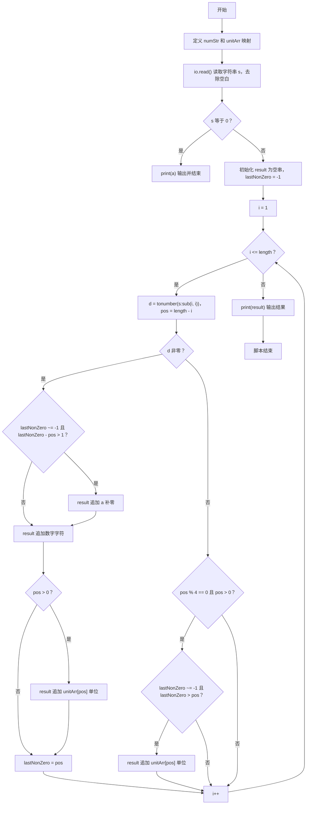
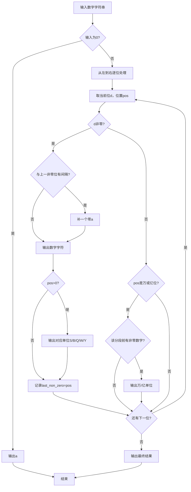

# 7-23 币值转换（Lua语言实现）

## 前言

本题（7-23 币值转换）的主要考点是：准确理解题意、规范处理输入输出格式，并正确处理边界与精度。下面先给出题目描述与格式要求，再通过清晰的思路与可直接运行的lua代码进行讲解。

## 题目描述

输入一个整数（位数不超过9位）代表一个人民币值（单位为元），请转换成财务要求的大写中文格式。如23108元，转换后变成“贰万叁仟壹百零捌”元。为了简化输出，用小写英文字母a-j顺序代表大写数字0-9，用S、B、Q、W、Y分别代表拾、百、仟、万、亿。于是23108元应被转换输出为“cWdQbBai”元。

## 输入格式

输入在一行中给出一个不超过9位的非负整数。

## 输出格式

在一行中输出转换后的结果。注意“零”的用法必须符合中文习惯。

## 输入样例1

```in
813227345
```

## 输入样例2

```in
6900
```

## 输出样例1

```out
iYbQdBcScWhQdBeSf
```

## 输出样例2

```out
gQjB
```

## 解题思路

### 1. 核心问题分析

将数字金额转换为中文财务大写格式，难点在于"零"的处理规则：
1. 连续的多个零只需输出一个"零"(a)
2. 每段末尾（万位、亿位等大单位前）的零可以省略
3. 万位(W)和亿位(Y)作为分段单位，即使该段全零有时也需保留单位

### 2. 算法原理

按中文财务分段规则处理：以万(4位)和亿为分段单位，四位一段独立读音。段内连续零合并为一个零，段末零省略；段间若低段数值 <1000 且高段非零，则在段间补一个零。万/亿单位仅当对应段非零时输出，避免如“1亿万”错误。

定义辅助函数 readFour(s) 处理1-4位段内读音：遍历段内字符，非零则先补零(若有待补零)再输出数字+单位(S/B/Q)，零则仅标记待补零（若后继仍有非零）。

### 3. 具体计算步骤

1. 输入字符串 s，特判 s=="0" 输出"a"；去除前导零。
2. 按长度分三档：len≤4 直接 readFour；5≤len≤8 分为万段+个段；len==9 分为亿位+万段+个段。
3. 万段/个段仅当数值非零时输出读段+单位W，段间若低段<1000则补"a"。
4. 9位时：先输出亿位Y，若万段非零则(必要时补"a")+读万段+W，个段同理；若万段为零而个段非零则亿后补"a"再读个段。
5. 输出结果字符串

## 完整代码

```lua
-- 7-23 币值转换
local numStr = "abcdefghij"
local unitPos = {[0]='', [1]='S', [2]='B', [3]='Q'}

local function readFour(s)
    if s == "" or s == "0" then return "" end
    local len = #s
    local res = ""
    local zeroPending = false
    for i = 1, len do
        local ch = s:sub(i, i)
        local pos = len - i
        if ch ~= '0' then
            if zeroPending then res = res .. 'a'; zeroPending = false end
            res = res .. numStr:sub(tonumber(ch)+1, tonumber(ch)+1)
            if pos > 0 then res = res .. unitPos[pos] end
        else
            local hasLater = false
            for j = i+1, len do
                if s:sub(j,j) ~= '0' then hasLater = true; break end
            end
            if hasLater then zeroPending = true end
        end
    end
    return res
end

local s = io.read("*l") or io.read() or ""
s = s:gsub("%s+", "")
if s == "" then return end
if s == "0" then print("a"); return end
s = s:gsub("^0+", "")
if s == "" then s = "0" end
if s == "0" then print("a"); return end

local len = #s
local result = ""
if len <= 4 then
    result = readFour(s)
elseif len <= 8 then
    local wanLen = len - 4
    local wanStr = s:sub(1, wanLen)
    local geStr = s:sub(wanLen+1)
    local wanVal = tonumber(wanStr)
    local geVal = tonumber(geStr)
    if wanVal and wanVal ~= 0 then
        result = readFour(wanStr) .. "W"
    end
    if geVal and geVal ~= 0 then
        if wanVal and wanVal ~= 0 and geVal < 1000 then
            result = result .. "a"
        end
        result = result .. readFour(tostring(geVal))
    end
else -- 9位
    local yChar = s:sub(1,1)
    local wanStr = s:sub(2,5)
    local geStr = s:sub(6,9)
    local wanVal = tonumber(wanStr)
    local geVal = tonumber(geStr)
    result = numStr:sub(tonumber(yChar)+1, tonumber(yChar)+1) .. "Y"
    if wanVal == 0 and geVal == 0 then
        -- 仅亿位
    elseif wanVal ~= 0 then
        if wanVal < 1000 then result = result .. "a" end
        result = result .. readFour(tostring(wanVal)) .. "W"
        if geVal ~= 0 then
            if geVal < 1000 then result = result .. "a" end
            result = result .. readFour(tostring(geVal))
        end
    else -- wanVal==0
        if geVal ~= 0 then
            result = result .. "a" .. readFour(tostring(geVal))
        end
    end
end

print(result)
```

## 代码流程说明

1. **字符映射与读段函数**：numStr映射0-9到a-j，unitPos映射段内位权到S/B/Q；readFour(s)按段内规则输出，连续零合并为单个a。
2. **输入与特判**：用io.read("*l")读取字符串s，去除空白与前导零；若s=="0"直接print("a")并return。
3. **分段处理**：按长度分三档（≤4 / 5-8 / 9位）分别处理：万段非零则输出readFour+W，个段非零则(必要时补a)+readFour；9位时先输出亿位Y，再按万段/个段是否非零及是否<1000决定补零。
4. **结果输出**：使用print(result)输出最终字符串

## 代码流程图



## 解题流程图



## 代码解析

```lua
-- 7-23 币值转换
local numStr = "abcdefghij"
local unitPos = {[0]='', [1]='S', [2]='B', [3]='Q'}

local function readFour(s)
    if s == "" or s == "0" then return "" end
    local len = #s
    local res = ""
    local zeroPending = false
    for i = 1, len do
        local ch = s:sub(i, i)
        local pos = len - i
        if ch ~= '0' then
            if zeroPending then res = res .. 'a'; zeroPending = false end
            res = res .. numStr:sub(tonumber(ch)+1, tonumber(ch)+1)
            if pos > 0 then res = res .. unitPos[pos] end
        else
            local hasLater = false
            for j = i+1, len do
                if s:sub(j,j) ~= '0' then hasLater = true; break end
            end
            if hasLater then zeroPending = true end
        end
    end
    return res
end

local s = io.read("*l") or io.read() or ""
s = s:gsub("%s+", "")
if s == "" then return end
if s == "0" then print("a"); return end
s = s:gsub("^0+", "")
if s == "" then s = "0" end
if s == "0" then print("a"); return end

local len = #s
local result = ""
if len <= 4 then
    result = readFour(s)
elseif len <= 8 then
    local wanLen = len - 4
    local wanStr = s:sub(1, wanLen)
    local geStr = s:sub(wanLen+1)
    local wanVal = tonumber(wanStr)
    local geVal = tonumber(geStr)
    if wanVal and wanVal ~= 0 then
        result = readFour(wanStr) .. "W"
    end
    if geVal and geVal ~= 0 then
        if wanVal and wanVal ~= 0 and geVal < 1000 then
            result = result .. "a"
        end
        result = result .. readFour(tostring(geVal))
    end
else -- 9位
    local yChar = s:sub(1,1)
    local wanStr = s:sub(2,5)
    local geStr = s:sub(6,9)
    local wanVal = tonumber(wanStr)
    local geVal = tonumber(geStr)
    result = numStr:sub(tonumber(yChar)+1, tonumber(yChar)+1) .. "Y"
    if wanVal == 0 and geVal == 0 then
        -- 仅亿位
    elseif wanVal ~= 0 then
        if wanVal < 1000 then result = result .. "a" end
        result = result .. readFour(tostring(wanVal)) .. "W"
        if geVal ~= 0 then
            if geVal < 1000 then result = result .. "a" end
            result = result .. readFour(tostring(geVal))
        end
    else
        if geVal ~= 0 then
            result = result .. "a" .. readFour(tostring(geVal))
        end
    end
end

print(result)
```

字符映射初始化

## 复杂度分析

设输入金额有 d 位数字，readFour 中还会扫描后续数字判断零位，时间复杂度最坏为 O(d²)，字符串结果和输入处理的额外空间复杂度为 O(d).

## 常见易错点

- 四位分组之间只有在后续组非零且需要连接时才补零音，不能简单地逐位输出所有零。
- 0 应单独读作 a，亿、万和千百十个位的单位不能混淆。

## 更多测试

边界测试：输入 0，预期输出 a。

特殊测试：输入 10000，预期输出 bW，验证整万单位的输出。

## 总结

本题的核心在于理清「币值转换」的输入输出关系与边界处理：先按格式读取输入，再依据规则逐步计算或遍历，最后按规范输出。该思路可迁移到同类格式化输入输出与模拟计算的题目。
