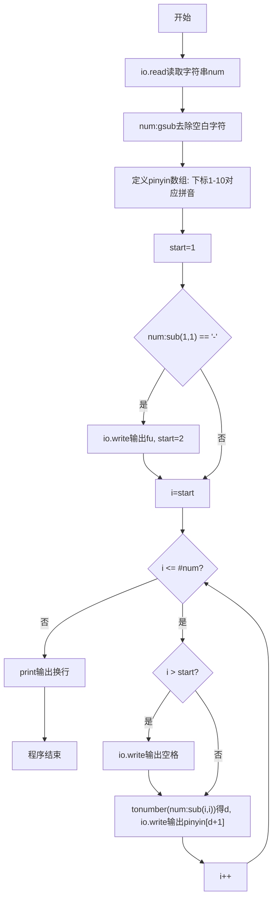
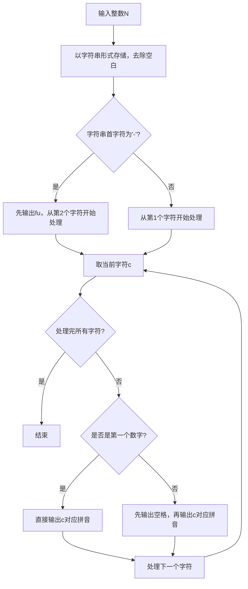

# 7-25 念数字（Lua语言实现）

## 前言

本题（7-25 念数字）的主要考点是：准确理解题意、规范处理输入输出格式，并正确处理边界与精度。下面先给出题目描述与格式要求，再通过清晰的思路与可直接运行的lua代码进行讲解。

## 题目描述

输入一个整数，输出每个数字对应的拼音。当整数为负数时，先输出fu字。十个数字对应的拼音如下：
```in
0: ling
1: yi
2: er
3: san
4: si
5: wu
6: liu
7: qi
8: ba
9: jiu
```

## 输入格式

输入在一行中给出一个整数，如：1234。

提示：整数包括负数、零和正数。

## 输出格式

在一行中输出这个整数对应的拼音，每个数字的拼音之间用空格分开，行末没有最后的空格。如
yi er san si。

## 输入样例

```in
-600
```

## 输出样例

```out
fu liu ling ling
```

## 解题思路

### 1. 核心问题分析

将输入整数的每一位数字转换为对应的拼音输出，负数先输出"fu"。关键是符号处理、逐位转换和空格分隔（行末无空格）。

### 2. 算法原理

将输入读为字符串而非整数，便于逐位处理和直接判断负号。使用Lua数组pinyin存储0-9对应的拼音（Lua数组下标从1开始，所以数字d对应pinyin[d+1]）。使用string.gsub去除可能的空白字符，start变量标记数字起始位置（负数跳过负号），通过判断i>start来决定是否前置空格，保证行末无多余空格。使用io.write()不换行输出拼音，最后用print()输出换行符。

### 3. 具体计算步骤

1. 以字符串形式读取输入整数，用string.gsub去除空白
2. 初始化pinyin数组映射0-9到对应拼音（Lua下标1-10）
3. 若首字符为'-'，先io.write输出"fu"，数字从索引2开始
4. 遍历每个数字字符（for i = start, #num do）：
   - 若非第一个数字（i>start），先io.write输出空格
   - 用tonumber(num:sub(i,i))将字符转为数字d，输出对应pinyin[d+1]
5. 最后print()输出换行符结束

## 完整代码

```lua
-- 7-25 念数字
local s = io.read("*a") -- 读取全部输入（兼容换行）
if not s then return end
s = s:gsub("%s+", "") -- 去除所有空白
if s == "" then return end
local pinyin = {"ling", "yi", "er", "san", "si", "wu", "liu", "qi", "ba", "jiu"} -- 0~9 拼音映射
local isNeg = s:sub(1,1) == "-" -- 判断负号
local start = isNeg and 2 or 1 -- 数字起始位置
local out = {} -- 收集输出片段
if isNeg then table.insert(out, "fu") end -- 负数先输出 fu
for i = start, #s do
    local d = tonumber(s:sub(i,i)) -- 当前数字字符转数值
    table.insert(out, pinyin[d+1]) -- 映射拼音加入表
end
print(table.concat(out, " ")) -- 空格连接输出，行末无多余空格
```

## 代码流程说明

1. **输入读取**：使用io.read()读取整行字符串num，用num:gsub("%s+", "")去除所有空白字符
2. **拼音映射表**：定义Lua数组pinyin，下标1-10对应"ling"到"jiu"（因为Lua数组从1开始）
3. **负号判断**：若num:sub(1,1)=='-'，用io.write("fu")输出fu且不换行，设置start=2；否则start=1
4. **逐位输出循环**：使用for i = start, #num do从start开始遍历到字符串结束
   - 非首位字符（i>start）先用io.write(" ")输出空格分隔
   - 通过num:sub(i,i)提取单个字符，tonumber转为数字d，索引pinyin[d+1]输出对应拼音
5. **结束处理**：循环结束后print()输出换行符

## 代码流程图



## 解题流程图



## 代码解析

```lua
-- 7-25 念数字
local s = io.read("*a") -- 读取全部输入（兼容换行）
if not s then return end
s = s:gsub("%s+", "") -- 去除所有空白
if s == "" then return end
local pinyin = {"ling", "yi", "er", "san", "si", "wu", "liu", "qi", "ba", "jiu"} -- 0~9 拼音映射
local isNeg = s:sub(1,1) == "-" -- 判断负号
local start = isNeg and 2 or 1 -- 数字起始位置
local out = {} -- 收集输出片段
if isNeg then table.insert(out, "fu") end -- 负数先输出 fu
for i = start, #s do
    local d = tonumber(s:sub(i,i)) -- 当前数字字符转数值
    table.insert(out, pinyin[d+1]) -- 映射拼音加入表
end
print(table.concat(out, " ")) -- 空格连接输出，行末无多余空格
```

使用 table 收集 fu 与各数字拼音，再用空格连接，避免 fu 后缺少空格

## 复杂度分析

设输入规模为 $n$（对数值类题目为参与运算的数据量，对字符串/序列类题目为长度）。

- **时间复杂度**：$O(n)$ 或 $O(n \log n)$，主要来自一次线性遍历与常数次数学运算，无嵌套高复杂度循环。
- **空间复杂度**：$O(n)$，用于存储输入、中间结果与输出字符串；若仅使用若干标量变量则为 $O(1)$。

## 常见易错点

### 1. 输入/输出格式不符
错误：多余空格、遗漏换行、大小写或精度不符。后果：判题系统判为格式错误。正确：严格按题目要求的格式输出，数值用合适精度。

### 2. 边界条件遗漏
错误：未处理 0、最小值、单字符或空输入等边界。后果：特例 WA。正确：先列出所有边界样例，在编码前单独分支处理。

### 3. 整数溢出与类型
错误：使用过小的整数类型或忽略负号。后果：大数计算溢出。正确：按数据范围选择合适类型，必要时用更大整数类型或字符串处理。

## 更多测试

### 测试一：常规边界

**输入：**

```text
（可取题目边界附近的值，如最小值或最大值）
```

**输出：**

```text
（依据题意推导的正确结果）
```

### 测试二：特殊用例

**输入：**

```text
（可取易错点，如 0、单一元素、全同值等）
```

**输出：**

```text
（对应正确结果）
```

## 总结

本题的核心在于理清「念数字」的输入输出关系与边界处理：先按格式读取输入，再依据规则逐步计算或遍历，最后按规范输出。该思路可迁移到同类格式化输入输出与模拟计算的题目。

