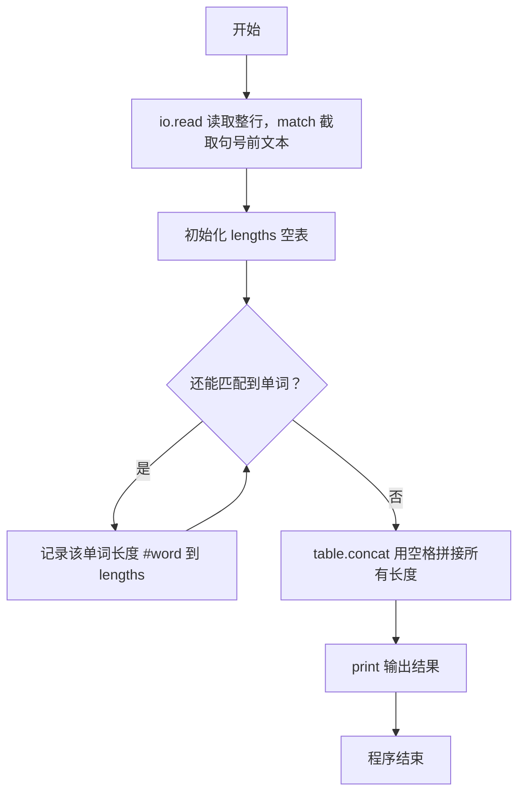
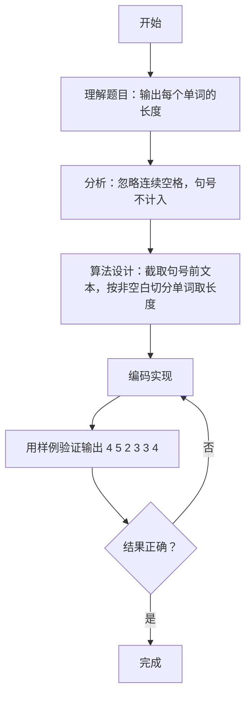

# 7-26 单词长度（Lua语言实现）

## 前言

本题（7-26 单词长度）的主要考点是：准确理解题意、规范处理输入输出格式，并正确处理边界与精度。下面先给出题目描述与格式要求，再通过清晰的思路与可直接运行的lua代码进行讲解。

## 题目描述

你的程序要读入一行文本，其中以空格分隔为若干个单词，以.结束。你要输出每个单词的长度。这里的单词与语言无关，可以包括各种符号，比如it's算一个单词，长度为4。注意，行中可能出现连续的空格；最后的.不计算在内。

## 输入格式

输入在一行中给出一行文本，以.结束

提示：用scanf("%c",...);来读入一个字符，直到读到.为止。

## 输出格式

在一行中输出这行文本对应的单词的长度，每个长度之间以空格隔开，行末没有最后的空格。

## 输入样例

```in
It's great to see you here.
```

## 输出样例

```out
4 5 2 3 3 4
```

## 解题思路

**核心问题分析**：本题需要统计一行文本中每个单词的长度并依次输出。难点在于处理连续空格（不能输出多余的0长度）和行末无多余空格的格式要求。

**算法原理说明**：先用`line:match("^[^.]*")`截取句号之前的部分，把结尾的"."排除在外；再用`gmatch("%S+")`按连续非空白字符切分出所有单词，自动忽略连续空格，符合题意。每个单词用`#word`取得长度并存入`lengths`表，最后用`table.concat(lengths, " ")`以空格拼接输出，天然满足行末没有多余空格的要求。

### 1. 具体计算步骤

1. 用`io.read("*l")`读取整行文本，用`:match("^[^.]*")`截取句号前的部分存入`line`
2. 初始化空表`lengths`保存各单词长度
3. 用`for word in line:gmatch("%S+")`遍历所有单词，把`#word`追加到`lengths`
4. 用`table.concat(lengths, " ")`以空格拼接所有长度并输出

## 完整代码

```lua
-- 7-26 单词长度
local raw = io.read("*l") or io.read("*a") or ""
local line = raw:match("^[^.]*") or ""
local lengths = {}
for word in line:gmatch("%S+") do lengths[#lengths + 1] = #word end
print(table.concat(lengths, " "))
```

## 代码流程说明

1. **输入与截取**：用`io.read("*l")`读取整行文本，通过`:match("^[^.]*")`截取句号之前的文本存入`line`，把结尾的"."排除在外。
2. **初始化结果表**：初始化空表`lengths`，用于保存每个单词的长度。
3. **遍历切分单词**：`for word in line:gmatch("%S+")`按连续非空白字符遍历所有单词（自动忽略连续空格），把每个单词的长度`#word`追加到`lengths`表末尾。
4. **拼接输出**：用`table.concat(lengths, " ")`以空格拼接所有长度并输出，行末没有多余空格。

## 代码流程图



## 解题流程图



## 代码解析

```lua
-- 7-26 单词长度
local raw = io.read("*l") or io.read("*a") or ""
local line = raw:match("^[^.]*") or ""
local lengths = {}
for word in line:gmatch("%S+") do lengths[#lengths + 1] = #word end
print(table.concat(lengths, " "))
```

输入与截取

## 复杂度分析

设输入行长度为 L，程序扫描每个单词一次，时间复杂度为 O(L)，保存单词长度的额外空间复杂度为 O(w)，其中 w 为单词数。

## 常见易错点

- 句末句号不是单词的一部分，统计前要截断句号。
- 使用非空白串统计单词长度，连续空格不能产生长度为 0 的单词。

## 更多测试

边界测试：输入 one two.，预期输出 3 3。

特殊测试：输入 a，预期输出 1，验证只有一个单词的情况。

## 总结

本题的核心在于理清「单词长度」的输入输出关系与边界处理：先按格式读取输入，再依据规则逐步计算或遍历，最后按规范输出。该思路可迁移到同类格式化输入输出与模拟计算的题目。
