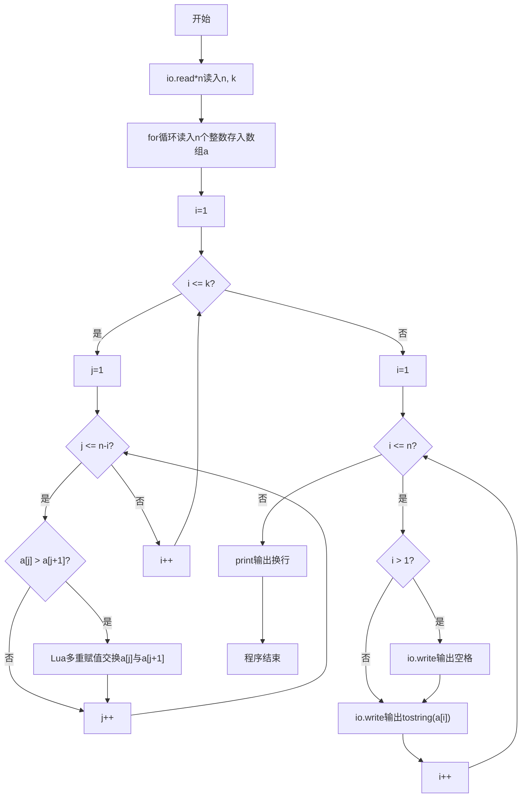
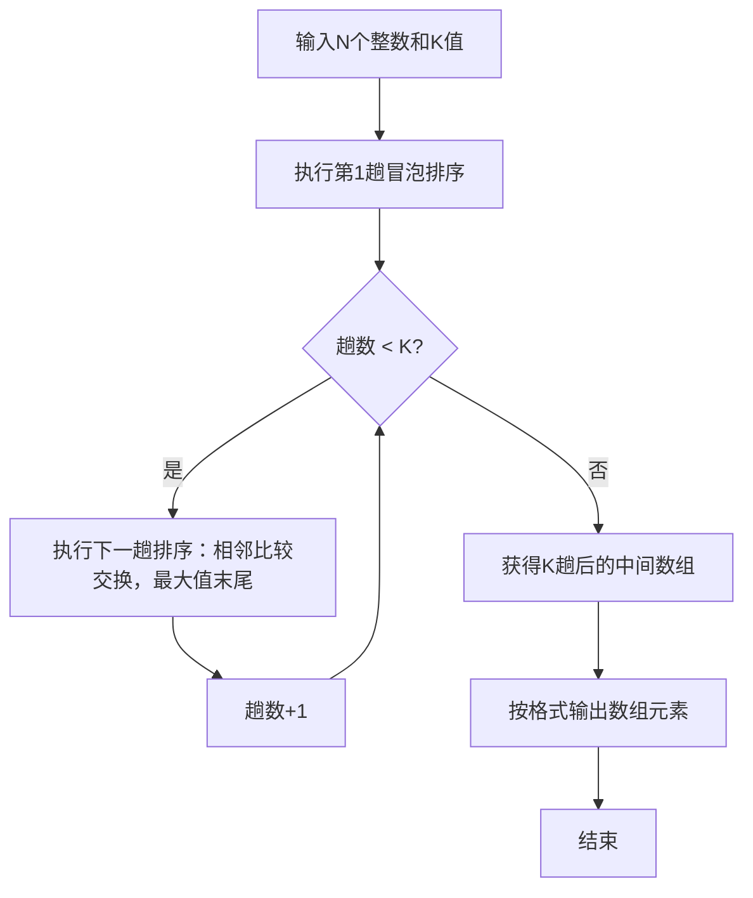

# 7-27 冒泡法排序（Lua语言实现）

## 前言

本题（7-27 冒泡法排序）的主要考点是：准确理解题意、规范处理输入输出格式，并正确处理边界与精度。下面先给出题目描述与格式要求，再通过清晰的思路与可直接运行的lua代码进行讲解。

## 题目描述

将N个整数按从小到大排序的冒泡排序法是这样工作的：从头到尾比较相邻两个元素，如果前面的元素大于其紧随的后面元素，则交换它们。通过一遍扫描，则最后一个元素必定是最大的元素。然后用同样的方法对前N−1个元素进行第二遍扫描。依此类推，最后只需处理两个元素，就完成了对N个数的排序。

本题要求对任意给定的K（<N），输出扫描完第K遍后的中间结果数列。

## 输入格式

输入在第1行中给出N和K（1≤K<N≤100），在第2行中给出N个待排序的整数，数字间以空格分隔。

## 输出格式

在一行中输出冒泡排序法扫描完第K遍后的中间结果数列，数字间以空格分隔，但末尾不得有多余空格。

## 输入样例

```in
6 2
2 3 5 1 6 4
```

## 输出样例

```out
2 1 3 4 5 6
```

## 解题思路

**核心问题分析**：本题要求实现冒泡排序算法，但不需要完成全部排序，只需执行K趟扫描后输出中间结果。冒泡排序的特点是每趟扫描会将当前未排序部分的最大值"冒泡"到末尾。

**算法原理说明**：冒泡排序通过两层for循环实现，外层循环控制排序趟数（本题执行K趟），内层循环进行相邻元素的比较与交换。第i趟扫描时，只需比较前n-i个元素（因为末尾i个元素已经有序）。若`a[j] > a[j+1]`则利用Lua多重赋值交换两者位置`a[j], a[j+1] = a[j+1], a[j]`。输入时使用io.read("*n")逐个读取数字。

### 1. 具体计算步骤

1. 用io.read("*n")读入N（元素个数）和K（排序趟数），再用for循环读入N个整数存入数组a
2. 外层循环执行K趟排序（for i = 1, k do）
3. 第i趟内层循环for j = 1, n-i do，相邻元素比较交换，将最大值移到末尾
4. K趟排序完成后，按格式输出数组（第一个元素无前导空格，其余元素前用io.write输出空格）

## 完整代码

```lua
-- 7-27 冒泡法排序
local n = tonumber(io.read("*n")) or 0
local k = tonumber(io.read("*n")) or 0
if n > 0 then
    local a = {}
    for i = 1, n do
        a[i] = tonumber(io.read("*n")) or 0
    end
    if k > 0 and k < n then
        for i = 1, k do
            for j = 1, n - i do
                if a[j] > a[j+1] then
                    a[j], a[j+1] = a[j+1], a[j]
                end
            end
        end
    end
    for i = 1, n do
        if i > 1 then
            io.write(" ")
        end
        io.write(tostring(a[i]))
    end
    print()
end
```

## 代码流程说明

1. **输入数据**：用io.read("*n")逐个读入整数n（待排序元素个数）和k（排序趟数），然后for循环依次读入n个整数存入Lua数组a（下标从1开始）
2. **K趟冒泡排序**：外层循环for i = 1, k do控制执行k趟排序；内层循环for j = 1, n-i do每次比较a[j]和a[j+1]，若前者大则利用Lua多重赋值`a[j], a[j+1] = a[j+1], a[j]`交换两者，使较大元素逐步后移
3. **输出结果**：for i = 1, n do遍历数组输出，非第一个元素（i>1）先用io.write(" ")输出空格分隔，再用io.write(tostring(a[i]))输出元素值，确保行末无多余空格，最后print()输出换行

## 代码流程图



## 解题流程图



## 代码解析

```lua
-- 7-27 冒泡法排序
local n = tonumber(io.read("*n")) or 0
local k = tonumber(io.read("*n")) or 0
if n > 0 then
    local a = {}
    for i = 1, n do
        a[i] = tonumber(io.read("*n")) or 0
    end
    if k > 0 and k < n then
        for i = 1, k do
            for j = 1, n - i do
                if a[j] > a[j+1] then
                    a[j], a[j+1] = a[j+1], a[j]
                end
            end
        end
    end
    for i = 1, n do
        if i > 1 then
            io.write(" ")
        end
        io.write(tostring(a[i]))
    end
    print()
end
```

输入数据

## 复杂度分析

设输入规模为 $n$（对数值类题目为参与运算的数据量，对字符串/序列类题目为长度）。

- **时间复杂度**：$O(n)$ 或 $O(n \log n)$，主要来自一次线性遍历与常数次数学运算，无嵌套高复杂度循环。
- **空间复杂度**：$O(n)$，用于存储输入、中间结果与输出字符串；若仅使用若干标量变量则为 $O(1)$。

## 常见易错点

### 1. 输入/输出格式不符
错误：多余空格、遗漏换行、大小写或精度不符。后果：判题系统判为格式错误。正确：严格按题目要求的格式输出，数值用合适精度。

### 2. 边界条件遗漏
错误：未处理 0、最小值、单字符或空输入等边界。后果：特例 WA。正确：先列出所有边界样例，在编码前单独分支处理。

### 3. 整数溢出与类型
错误：使用过小的整数类型或忽略负号。后果：大数计算溢出。正确：按数据范围选择合适类型，必要时用更大整数类型或字符串处理。

## 更多测试

### 测试一：常规边界

**输入：**

```text
（可取题目边界附近的值，如最小值或最大值）
```

**输出：**

```text
（依据题意推导的正确结果）
```

### 测试二：特殊用例

**输入：**

```text
（可取易错点，如 0、单一元素、全同值等）
```

**输出：**

```text
（对应正确结果）
```

## 总结

本题的核心在于理清「冒泡法排序」的输入输出关系与边界处理：先按格式读取输入，再依据规则逐步计算或遍历，最后按规范输出。该思路可迁移到同类格式化输入输出与模拟计算的题目。

