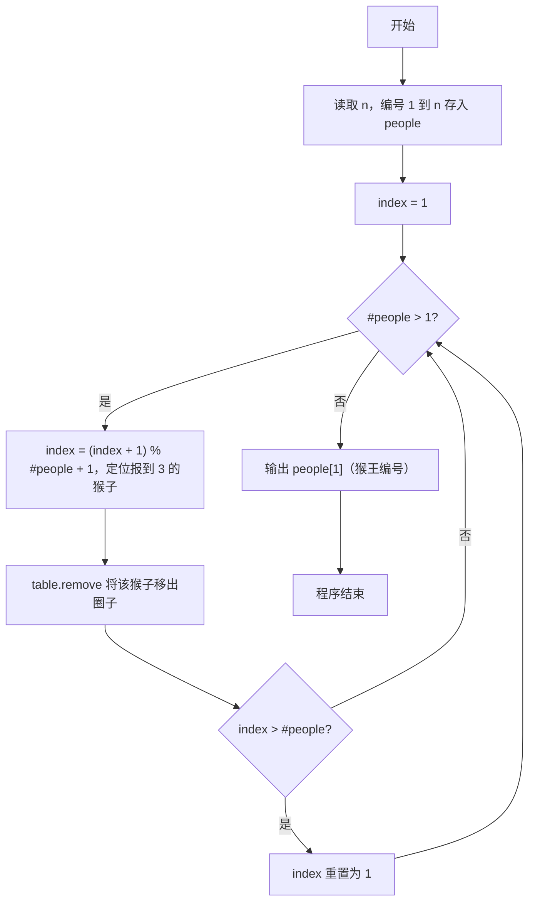
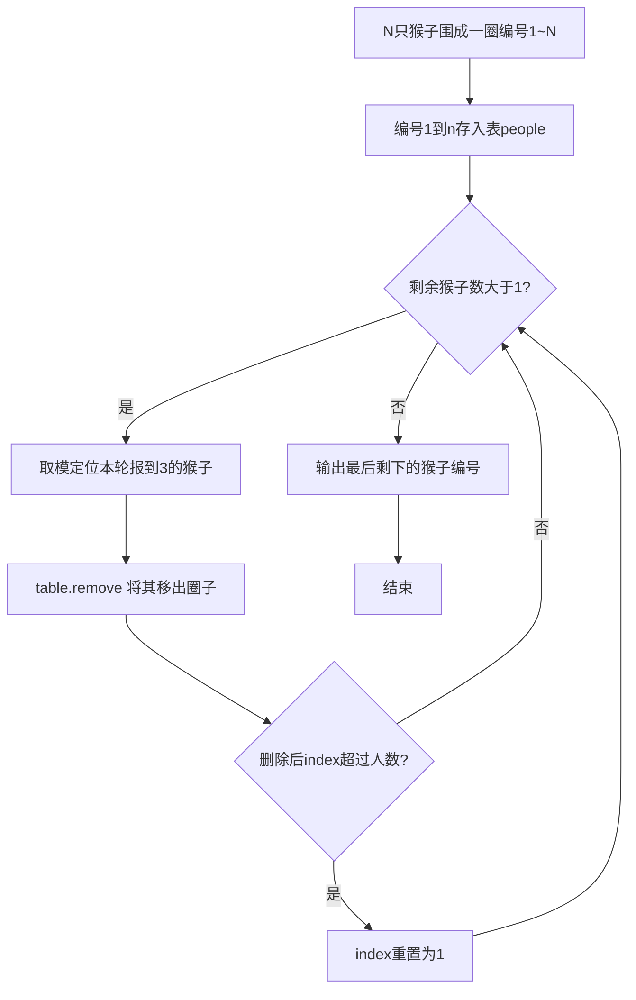

# 7-28 猴子选大王（Lua语言实现）

## 前言

本题（7-28 猴子选大王）的主要考点是：准确理解题意、规范处理输入输出格式，并正确处理边界与精度。下面先给出题目描述与格式要求，再通过清晰的思路与可直接运行的lua代码进行讲解。

## 题目描述

一群猴子要选新猴王。新猴王的选择方法是：让N只候选猴子围成一圈，从某位置起顺序编号为1~N号。从第1号开始报数，每轮从1报到3，凡报到3的猴子即退出圈子，接着又从紧邻的下一只猴子开始同样的报数。如此不断循环，最后剩下的一只猴子就选为猴王。请问是原来第几号猴子当选猴王？

## 输入格式

输入在一行中给一个正整数N（≤1000）。

## 输出格式

在一行中输出当选猴王的编号。

## 输入样例

```in
11
```

## 输出样例

```out
7
```

## 解题思路

**核心问题分析**：本题是经典的约瑟夫环问题，N只猴子围成一圈依次报数1~3，报到3的退出，求最后剩下的猴子编号。用表存储当前仍在圈中的猴子，通过取模运算实现环形计数，定位到每轮报到3的猴子并直接将其从表中移出。

**算法原理说明**：先把编号1到n依次存入表people，用index记录当前报数位置。while #people > 1循环中，每轮执行`index = (index + 1) % #people + 1`，借助取模实现环形计数，定位到本轮报到3的猴子在表中的位置，然后用`table.remove(people, index)`将其移出圈子；删除后若index超过表长度则重置为1（因为被删元素的下一个元素已前移顶替该位置）。循环结束后表里剩下的唯一元素即猴王编号。

### 1. 具体计算步骤

1. 用io.read("*n")读取猴子总数n，初始化people表、index=1
2. 把1到n依次存入people，i号猴子的编号为i
3. 当#people > 1时循环：更新index = (index + 1) % #people + 1定位报到3的猴子
4. 用table.remove(people, index)删除该猴子，若index > #people则把index重置为1
5. 循环结束后输出people[1]，即为猴王编号

## 完整代码

```lua
-- 7-28 猴子选大王
local n = tonumber(io.read("*n")) or 0
if n and n > 0 then
    local people, index = {}, 1
    for i = 1, n do
        people[i] = i
    end
    while #people > 1 do
        index = (index + 1) % #people + 1
        table.remove(people, index)
        if index > #people then
            index = 1
        end
    end
    print(people[1])
end
```

## 代码流程说明

1. **初始化**：用`io.read("*n")`读入猴子总数n，创建people表，index=1，并把1到n依次存入people
2. **报数出圈循环**：当#people > 1时持续执行while循环
   - 更新index = (index + 1) % #people + 1，借助取模实现环形计数，定位本轮报到3的猴子在表中的位置
   - 用table.remove(people, index)将该猴子移出圈子
   - 删除后若index超过表长度（#people）则重置为1，因为被删元素的下一个元素已前移顶替该位置
3. **输出猴王**：循环结束后people表中剩下的唯一元素people[1]即为猴王编号，用print输出

## 代码流程图



## 解题流程图



## 代码解析

```lua
-- 7-28 猴子选大王
local n = tonumber(io.read("*n")) or 0
if n and n > 0 then
    local people, index = {}, 1
    for i = 1, n do
        people[i] = i
    end
    while #people > 1 do
        index = (index + 1) % #people + 1
        table.remove(people, index)
        if index > #people then
            index = 1
        end
    end
    print(people[1])
end
```

初始化

## 复杂度分析

数组初始化需要 O(n) 时间；每次 table.remove 还要移动后续元素，完整淘汰过程最坏为 O(n²)，空间复杂度为 O(n).

## 常见易错点

- 每次报数从当前猴子的下一个位置开始，删除后要正确调整下标。
- 只有剩余一只猴子时才结束，不能把被删除的猴子继续计入报数。

## 更多测试

边界测试：输入 1，预期输出 1。

特殊测试：输入 2，验证只有两只猴子时的淘汰顺序。

## 总结

本题的核心在于理清「猴子选大王」的输入输出关系与边界处理：先按格式读取输入，再依据规则逐步计算或遍历，最后按规范输出。该思路可迁移到同类格式化输入输出与模拟计算的题目。
