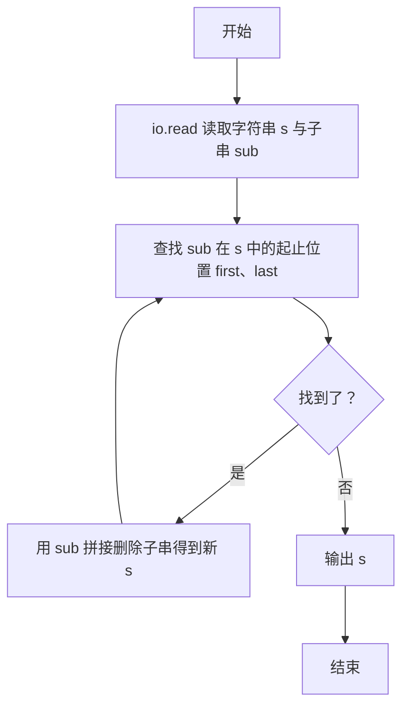
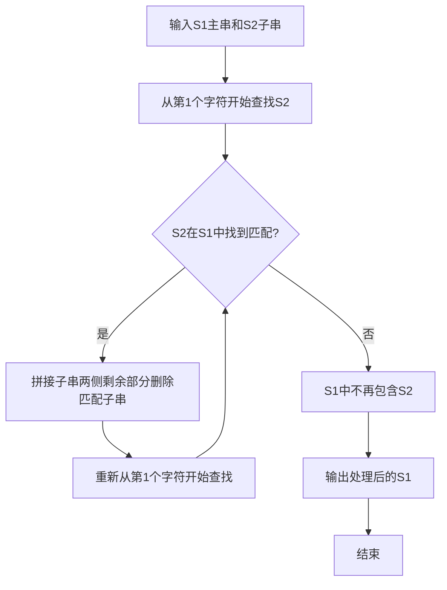

# 7-29 删除字符串中的子串（Lua语言实现）

## 前言

本题（7-29 删除字符串中的子串）的主要考点是：准确理解题意、规范处理输入输出格式，并正确处理边界与精度。下面先给出题目描述与格式要求，再通过清晰的思路与可直接运行的lua代码进行讲解。

## 题目描述

输入2个字符串S1和S2，要求删除字符串S1中出现的所有子串S2，即结果字符串中不能包含S2。

## 输入格式

输入在2行中分别给出不超过80个字符长度的、以回车结束的2个非空字符串，对应S1和S2。

## 输出格式

在一行中输出删除字符串S1中出现的所有子串S2后的结果字符串。

## 输入样例

```in
Tomcat is a male ccatat
cat
```

## 输出样例

```out
Tom is a male 
```

## 解题思路

**核心问题分析**：需要从主串S1中删除所有出现的子串S2，难点在于删除子串后新拼接的字符串可能重新产生S2子串（如样例中删除"ccatat"里的"cat"后，剩余字符拼接再次形成"cat"），因此需要循环查找删除直到S1中不再包含S2。

**算法原理说明**：采用find加字符串拼接的方法。用`s:find(sub, 1, true)`从第1个字符开始查找子串的起止位置（第4个参数true表示纯字符串匹配，不把sub当作模式串），找到后用`s:sub(1, first - 1) .. s:sub(last + 1)`把子串两侧的剩余部分拼接起来得到删除后的新字符串；然后重新从第1位开始查找，循环往复，直到find返回nil跳出循环，最后输出剩余字符串。

### 1. 具体计算步骤

1. 使用`io.read("*l")`按行读入S1和S2（不含换行符），存入s与sub
2. 进入while true循环，用`s:find(sub, 1, true)`查找子串，得到起止位置first、last
3. 若未找到（first为nil），break跳出循环
4. 找到后用`s:sub(1, first - 1) .. s:sub(last + 1)`拼接删除子串后的新字符串，重新开始查找
5. 循环结束后用print输出处理后的s

## 完整代码

```lua
-- 7-29 删除字符串中的子串
local s = io.read("*l") or ""
local sub = io.read("*l") or ""
if sub ~= "" then
    while true do
        local first, last = s:find(sub, 1, true)
        if not first then
            break
        end
        s = s:sub(1, first - 1) .. s:sub(last + 1)
    end
end
print(s)
```

## 代码流程说明

1. **读入字符串**：使用`io.read("*l")`按行读取s（S1）和sub（S2），读取结果不含行尾换行符
2. **循环查找删除**：进入while true循环，用`s:find(sub, 1, true)`查找子串，返回起止位置first、last（第4个参数true表示纯字符串匹配）
3. **判断是否找到**：若first为nil说明S1中已不再包含S2，break跳出循环
4. **拼接删除子串**：用`s:sub(1, first - 1) .. s:sub(last + 1)`把子串两侧的剩余部分拼接成新字符串，删除后可能产生新的S2，因此重新从第1位开始查找
5. **输出结果**：循环结束后print输出处理后的s

## 代码流程图



## 解题流程图



## 代码解析

```lua
-- 7-29 删除字符串中的子串
local s = io.read("*l") or ""
local sub = io.read("*l") or ""
if sub ~= "" then
    while true do
        local first, last = s:find(sub, 1, true)
        if not first then
            break
        end
        s = s:sub(1, first - 1) .. s:sub(last + 1)
    end
end
print(s)
```

读入字符串

## 复杂度分析

设主串长度为 n，子串长度为 m；反复查找、拼接最坏时间复杂度为 O(n²)，额外空间复杂度为 O(n).

## 常见易错点

- 子串查找必须使用普通字符串匹配，不能把子串中的字符当作模式符号。
- 删除后要从更新后的字符串继续查找，直到不存在完整子串。

## 更多测试

边界测试：主串 aaaa、子串 aa，预期输出空行，验证连续删除。

特殊测试：主串 abc、子串 x，预期输出 abc，验证找不到子串时保持原串。

## 总结

本题的核心在于理清「删除字符串中的子串」的输入输出关系与边界处理：先按格式读取输入，再依据规则逐步计算或遍历，最后按规范输出。该思路可迁移到同类格式化输入输出与模拟计算的题目。
