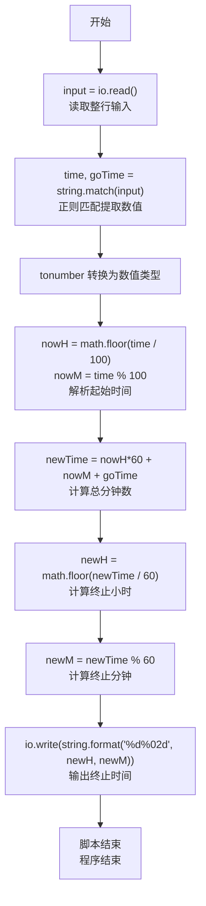
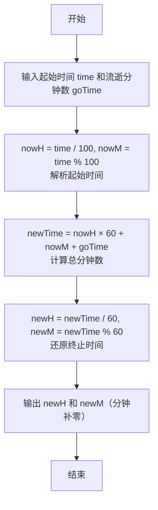

# 7-2 然后是几点（Lua语言实现）

## 前言

本题（7-2 然后是几点）的主要考点是：准确理解题意、规范处理输入输出格式，并正确处理边界与精度。下面先给出题目描述与格式要求，再通过清晰的思路与可直接运行的lua代码进行讲解。

## 题目描述

有时候人们用四位数字表示一个时间，比如 `1106` 表示 11 点零 6 分。现在，你的程序要根据起始时间和流逝的时间计算出终止时间。

读入两个数字，第一个数字以这样的四位数字表示当前时间，第二个数字表示分钟数，计算当前时间经过那么多分钟后是几点，结果也表示为四位数字。当小时为个位数时，没有前导的零，例如 5 点 30 分表示为 `530`；0 点 30 分表示为 `030`。注意，第二个数字表示的分钟数可能超过 60，也可能是负数。

## 输入格式

输入在一行中给出 2 个整数，分别是四位数字表示的起始时间、以及流逝的分钟数，其间以空格分隔。注意：在起始时间中，当小时为个位数时，没有前导的零，即 5 点 30 分表示为 `530`；0 点 30 分表示为 `030`。流逝的分钟数可能超过 60，也可能是负数。

## 输出格式

输出不多于四位数字表示的终止时间，当小时为个位数时，没有前导的零。题目保证起始时间和终止时间在同一天内。

## 输入样例

```in
1120 110
```

## 输出样例

```out
1310
```

## 解题思路

这道题的核心是**时间的加减运算**，关键在于将时间统一转换为分钟数进行计算，再将结果还原为小时和分钟的格式。

### 核心问题分析

1. **起始时间格式解析**：起始时间可能是3位数（如`530`表示5点30分）或4位数（如`1120`表示11点20分），需要正确提取小时和分钟。用整除100取小时、取模100取分钟即可：如`030`作为数值30，整除100得0、取模100得30，正好对应0点30分。
2. **流逝时间处理**：流逝分钟数可能超过60，也可能是负数，需要统一转换为总分钟数进行加减。
3. **输出格式控制**：分钟部分需要始终保持两位数（不足补零），小时部分不需要前导零。

### 算法原理说明

采用**总分钟数累加法**：
1. 将起始时间的小时和分钟转换为从0点开始的总分钟数
2. 加上流逝的分钟数（正数表示前进，负数表示倒退）
3. 将总分钟数重新换算为小时和分钟
4. 按要求格式输出

### 具体计算步骤

1. 用`io.read("*a")` 读取全部输入，用 `s:match("(-?%d+)%s+(-?%d+)")` 提取起始时间`time`和流逝分钟数`goTime`（兼容负数）
2. 用`tonumber`将两个字符串转换为数值
3. 解析起始时间：小时`nowH = math.floor(time / 100)`，分钟`nowM = time % 100`
4. 计算总分钟数：`newTime = nowH * 60 + nowM + goTime`
5. 还原终止时间：终止小时`newH = math.floor(newTime / 60)`，终止分钟`newM = newTime % 60`
6. 输出小时和分钟（分钟补零至两位）

## 完整代码

```lua
-- 7-2 然后是几点
local s = io.read("*a") or ""
local t1, t2 = s:match("(-?%d+)%s+(-?%d+)")
local time = tonumber(t1)
local goTime = tonumber(t2)

local nowH = math.floor(time / 100)
local nowM = time % 100
local newTime = nowH * 60 + nowM + goTime
local newH = math.floor(newTime / 60)
local newM = newTime % 60

io.write(string.format("%d%02d", newH, newM))
```

## 代码流程说明

1. **读取全部输入**：使用`io.read("*a")`读取全部输入，用`s:match("(-?%d+)%s+(-?%d+)")`兼容正负数提取起始时间`time`和流逝分钟数`goTime`。
2. **类型转换**：将匹配到的字符串通过`tonumber()`转换为数值类型。
3. **解析起始时间**：用`math.floor(time / 100)`提取小时`nowH`，用`time % 100`提取分钟`nowM`。
4. **计算总分钟数**：将起始时间转换为总分钟数后加上流逝分钟数：`newTime = nowH * 60 + nowM + goTime`。
5. **还原终止时间**：总分钟数通过`math.floor(newTime / 60)`得到小时`newH`，取模60得到分钟`newM`。
6. **格式化输出**：使用`string.format("%d%02d", newH, newM)`格式化，`%d`输出小时，`%02d`确保分钟输出为两位数（不足补零），通过`io.write()`输出（不自动换行）。
7. **程序结束**：Lua脚本自然结束。

## 代码流程图



## 解题流程图



## 代码解析

```lua
-- 7-2 然后是几点
local s = io.read("*a") or ""
local t1, t2 = s:match("(-?%d+)%s+(-?%d+)")
local time = tonumber(t1)
local goTime = tonumber(t2)

local nowH = math.floor(time / 100)
local nowM = time % 100
local newTime = nowH * 60 + nowM + goTime
local newH = math.floor(newTime / 60)
local newM = newTime % 60

io.write(string.format("%d%02d", newH, newM))
```

读取全部输入后用模式 `(-?%d+)%s+(-?%d+)` 同时兼容正负分钟数，避免原 `(%d+) (%d+)` 无法匹配负数的缺陷

## 复杂度分析

设输入规模为 $n$（对数值类题目为参与运算的数据量，对字符串/序列类题目为长度）。

- **时间复杂度**：$O(n)$ 或 $O(n \log n)$，主要来自一次线性遍历与常数次数学运算，无嵌套高复杂度循环。
- **空间复杂度**：$O(n)$，用于存储输入、中间结果与输出字符串；若仅使用若干标量变量则为 $O(1)$。

## 常见易错点

### 1. 输入/输出格式不符
错误：多余空格、遗漏换行、大小写或精度不符。后果：判题系统判为格式错误。正确：严格按题目要求的格式输出，数值用合适精度。

### 2. 边界条件遗漏
错误：未处理 0、最小值、单字符或空输入等边界。后果：特例 WA。正确：先列出所有边界样例，在编码前单独分支处理。

### 3. 整数溢出与类型
错误：使用过小的整数类型或忽略负号。后果：大数计算溢出。正确：按数据范围选择合适类型，必要时用更大整数类型或字符串处理。

## 更多测试

### 测试一：常规边界

**输入：**

```text
（可取题目边界附近的值，如最小值或最大值）
```

**输出：**

```text
（依据题意推导的正确结果）
```

### 测试二：特殊用例

**输入：**

```text
（可取易错点，如 0、单一元素、全同值等）
```

**输出：**

```text
（对应正确结果）
```

## 总结

本题的核心在于理清「然后是几点」的输入输出关系与边界处理：先按格式读取输入，再依据规则逐步计算或遍历，最后按规范输出。该思路可迁移到同类格式化输入输出与模拟计算的题目。

