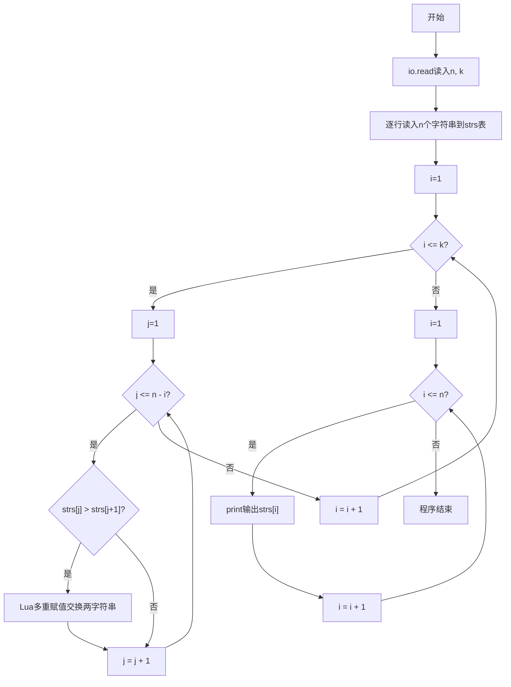
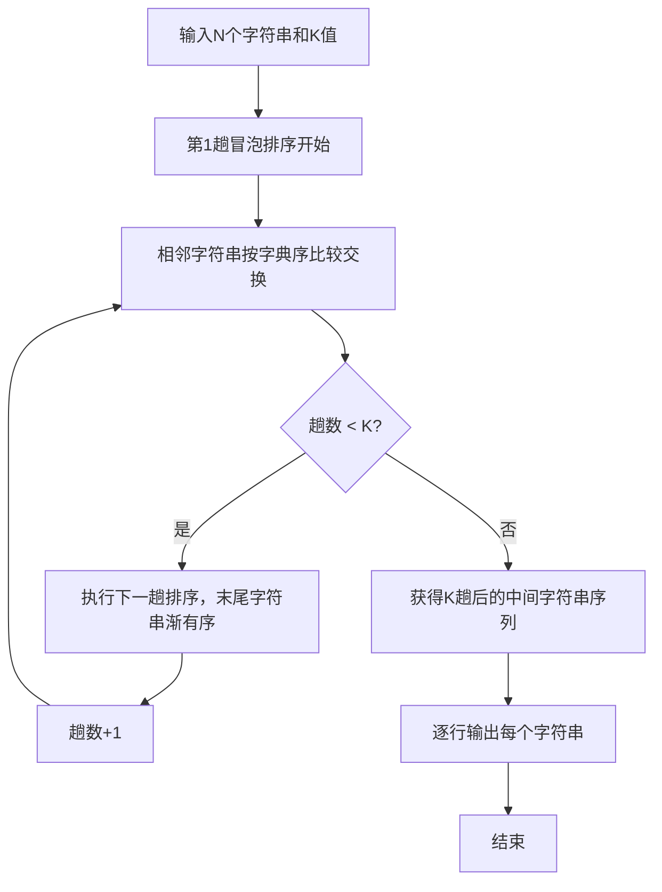

# 7-30 字符串的冒泡排序（Lua语言实现）

## 前言

本题（7-30 字符串的冒泡排序）的主要考点是：准确理解题意、规范处理输入输出格式，并正确处理边界与精度。下面先给出题目描述与格式要求，再通过清晰的思路与可直接运行的lua代码进行讲解。

## 题目描述

我们已经知道了将N个整数按从小到大排序的冒泡排序法。本题要求将此方法用于字符串序列，并对任意给定的K（<N），输出扫描完第K遍后的中间结果序列。

## 输入格式

输入在第1行中给出N和K（1≤K<N≤100），此后N行，每行包含一个长度不超过10的、仅由小写英文字母组成的非空字符串。

## 输出格式

输出冒泡排序法扫描完第K遍后的中间结果序列，每行包含一个字符串。

## 输入样例

```in
6 2
best
cat
east
a
free
day
```

## 输出样例

```out
best
a
cat
day
east
free
```

## 解题思路

**核心问题分析**：将冒泡排序算法扩展到字符串序列，按字典序升序排列字符串，执行K趟排序后输出中间结果。关键点在于使用Lua直接的字符串比较运算符比较字符串字典序，使用多重赋值直接交换字符串内容。

**算法原理说明**：使用Lua表存储N个字符串（下标从1开始），外层循环控制K趟排序，内层循环逐对比较相邻字符串。`strs[j] > strs[j+1]`表示前者的字典序大于后者时需要交换位置。Lua支持字符串直接比较和多重赋值交换。第i趟排序后，末尾i个字符串已有序。

### 1. 具体计算步骤

1. 用`tonumber(io.read("*n"))`读入N（字符串数）和K（排序趟数）
2. 逐行读入N个字符串存入表strs（Lua下标从1开始），用`:gsub("%s+$", "")`去除末尾空白字符
3. 外层i从1到K执行K趟冒泡排序
4. 第i趟内层j从1到n-i（Lua下标从1开始），用字符串比较运算符比较strs[j]和strs[j+1]，若前者字典序大则用Lua多重赋值交换
5. K趟排序后逐行用print输出表中的所有字符串

## 完整代码

```lua
-- 7-30 字符串的冒泡排序
-- 读取 N 和 K，兼容同行输入；读取后再消耗换行，EOF 安全
local n_raw, k_raw = io.read("*n", "*n")
local n = (tonumber(n_raw) or n_raw or 0)
local k = (tonumber(k_raw) or k_raw or 0)
-- 顶层无 return，用分支包裹避免 n/k 为 nil 时崩溃
if n and n > 0 then
    io.read("*l") -- 消耗数字后的换行（nil 时忽略）
    local strs = {} -- 存储 N 个字符串，Lua 下标从 1 开始
    for i = 1, n do
        local line = io.read("*l") -- 逐行读取
        if line == nil then line = "" end
        -- 若因残留换行读到空行，再读一行
        if line == "" then
            line = io.read("*l") or ""
        end
        line = line:gsub("%s+$", "") -- 去除末尾空白
        strs[i] = line
    end
    -- 仅当 0 < k < n 时执行排序，避免 k 为 nil/越界
    if k and k > 0 and k < n then
        for i = 1, k do
            for j = 1, n - i do
                if strs[j] > strs[j+1] then -- 字典序比较
                    strs[j], strs[j+1] = strs[j+1], strs[j] -- Lua 多重赋值交换
                end
            end
        end
    end
    -- 逐行输出 K 趟后的中间结果
    for i = 1, n do
        print(strs[i])
    end
end
```

## 代码流程说明

1. **输入数据**：`tonumber(io.read("*n"))`读入n和k，然后逐行读入n个字符串存入表strs，每个字符串用`:gsub("%s+$", "")`去除末尾空白字符
2. **K趟冒泡排序**：外层i从1到k，共k趟；内层j从1到n-i（Lua下标从1开始），用Lua字符串比较运算符>比较相邻两个字符串字典序
3. **字符串交换**：若strs[j] > strs[j+1]表示前串大于后串需交换，使用Lua多重赋值直接完成交换
4. **输出结果**：遍历表，每行用print输出一个字符串，即K趟排序后的中间结果

## 代码流程图



## 解题流程图



## 代码解析

```lua
-- 7-30 字符串的冒泡排序
-- 读取 N 和 K，兼容同行输入；读取后再消耗换行，EOF 安全
local n_raw, k_raw = io.read("*n", "*n")
local n = (tonumber(n_raw) or n_raw or 0)
local k = (tonumber(k_raw) or k_raw or 0)
if n and n > 0 then
    io.read("*l") -- 消耗数字后的换行（nil 时忽略）
    local strs = {}
    for i = 1, n do
        local line = io.read("*l")
        if line == nil then line = "" end
        if line == "" then
            line = io.read("*l") or ""
        end
        line = line:gsub("%s+$", "")
        strs[i] = line
    end
    if k and k > 0 and k < n then
        for i = 1, k do
            for j = 1, n - i do
                if strs[j] > strs[j+1] then
                    strs[j], strs[j+1] = strs[j+1], strs[j]
                end
            end
        end
    end
    for i = 1, n do
        print(strs[i])
    end
end
```

输入数据读取兼容同行N K并消耗换行后按行读取，避免`io.read("*n")`后残留换行导致首个字符串读空；外层以 `if n>0` 包裹消除顶层 `return` 并防 `nil` 崩溃。

## 复杂度分析

设有 n 个字符串并执行 k 趟冒泡排序，时间复杂度为 O(kn)，存储字符串序列的空间复杂度为 O(n).

## 常见易错点

- 字符串比较使用字典序而不是数值大小，并且每次交换要保持原字符串完整。
- 只执行 K 趟冒泡扫描，不能直接调用完整排序代替中间结果。

## 更多测试

边界测试：输入 3 1 及序列 c、b、a，预期输出 b、a、c。

特殊测试：输入 3 2 及序列 a、a、b，验证相同字符串不会被错误交换。

## 总结

本题的核心在于理清「字符串的冒泡排序」的输入输出关系与边界处理：先按格式读取输入，再依据规则逐步计算或遍历，最后按规范输出。该思路可迁移到同类格式化输入输出与模拟计算的题目。
