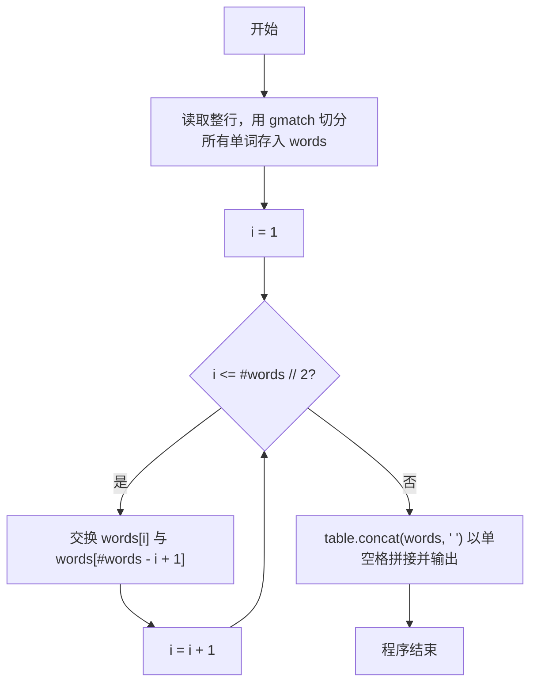
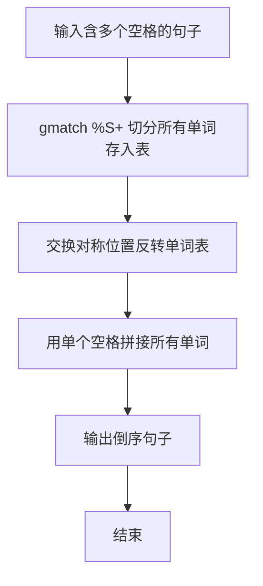

# 7-32 说反话-加强版（Lua语言实现）

## 前言

本题（7-32 说反话-加强版）的主要考点是：准确理解题意、规范处理输入输出格式，并正确处理边界与精度。下面先给出题目描述与格式要求，再通过清晰的思路与可直接运行的lua代码进行讲解。

## 题目描述

给定一句英语，要求你编写程序，将句中所有单词的顺序颠倒输出。

## 输入格式

测试输入包含一个测试用例，在一行内给出总长度不超过500 000的字符串。字符串由若干单词和若干空格组成，其中单词是由英文字母（大小写有区分）组成的字符串，单词之间用若干个空格分开。

## 输出格式

每个测试用例的输出占一行，输出倒序后的句子，并且保证单词间只有1个空格。

## 输入样例

```in
Hello World   Here I Come
```

## 输出样例

```out
Come I Here World Hello
```

## 解题思路

**核心问题分析**：本题要求将句子中的单词顺序颠倒输出，需要处理两个关键点：一是单词之间可能有多个连续空格，二是输出时单词间只能有一个空格。例如输入"Hello World   Here I Come"，需倒序输出为"Come I Here World Hello"。

**算法原理说明**：由于单词间可能有多个空格，用`io.read("*l"):gmatch("%S+")`按连续非空白字符切分单词并依次存入words表，可自动忽略所有多余空格。随后把表逆序：for循环i从1到#words // 2，交换words[i]与words[#words - i + 1]这对对称位置。最后用`table.concat(words, " ")`以单个空格拼接输出，保证单词间只有1个空格。

### 1. 具体计算步骤

1. 初始化空表words
2. 用`io.read("*l"):gmatch("%S+")`遍历所有单词，逐个存入words
3. for循环i从1到#words // 2，交换words[i]与words[#words - i + 1]实现倒序
4. 用`table.concat(words, " ")`以单个空格拼接输出倒序句子

## 完整代码

```lua
-- 7-32 说反话-加强版
local line = io.read("*l") or ""
local words = {}
for word in line:gmatch("%S+") do
    words[#words + 1] = word
end
for i = 1, #words // 2 do
    words[i], words[#words - i + 1] = words[#words - i + 1], words[i]
end
print(table.concat(words, " "))
```

## 代码流程说明

1. **切分单词**：用`io.read("*l")`读取整行句子，通过`:gmatch("%S+")`按连续非空白字符切分出所有单词，逐个存入words表，自动忽略多余空格
2. **反转表**：for循环i从1到#words // 2，用多重赋值交换words[i]与words[#words - i + 1]这对对称位置，使表内单词顺序倒序
3. **输出结果**：用`table.concat(words, " ")`以单个空格拼接所有单词并print输出，保证单词间只有1个空格

## 代码流程图



## 解题流程图



## 代码解析

```lua
-- 7-32 说反话-加强版
local line = io.read("*l") or ""
local words = {}
for word in line:gmatch("%S+") do
    words[#words + 1] = word
end
for i = 1, #words // 2 do
    words[i], words[#words - i + 1] = words[#words - i + 1], words[i]
end
print(table.concat(words, " "))
```

先以`or ""`防`io.read("*l")`返回`nil`（EOF）再`gmatch`。

## 复杂度分析

设输入规模为 $n$（对数值类题目为参与运算的数据量，对字符串/序列类题目为长度）。

- **时间复杂度**：$O(n)$ 或 $O(n \log n)$，主要来自一次线性遍历与常数次数学运算，无嵌套高复杂度循环。
- **空间复杂度**：$O(n)$，用于存储输入、中间结果与输出字符串；若仅使用若干标量变量则为 $O(1)$。

## 常见易错点

### 1. 输入/输出格式不符
错误：多余空格、遗漏换行、大小写或精度不符。后果：判题系统判为格式错误。正确：严格按题目要求的格式输出，数值用合适精度。

### 2. 边界条件遗漏
错误：未处理 0、最小值、单字符或空输入等边界。后果：特例 WA。正确：先列出所有边界样例，在编码前单独分支处理。

### 3. 整数溢出与类型
错误：使用过小的整数类型或忽略负号。后果：大数计算溢出。正确：按数据范围选择合适类型，必要时用更大整数类型或字符串处理。

## 更多测试

### 测试一：常规边界

**输入：**

```text
（可取题目边界附近的值，如最小值或最大值）
```

**输出：**

```text
（依据题意推导的正确结果）
```

### 测试二：特殊用例

**输入：**

```text
（可取易错点，如 0、单一元素、全同值等）
```

**输出：**

```text
（对应正确结果）
```

## 总结

本题的核心在于理清「说反话-加强版」的输入输出关系与边界处理：先按格式读取输入，再依据规则逐步计算或遍历，最后按规范输出。该思路可迁移到同类格式化输入输出与模拟计算的题目。

