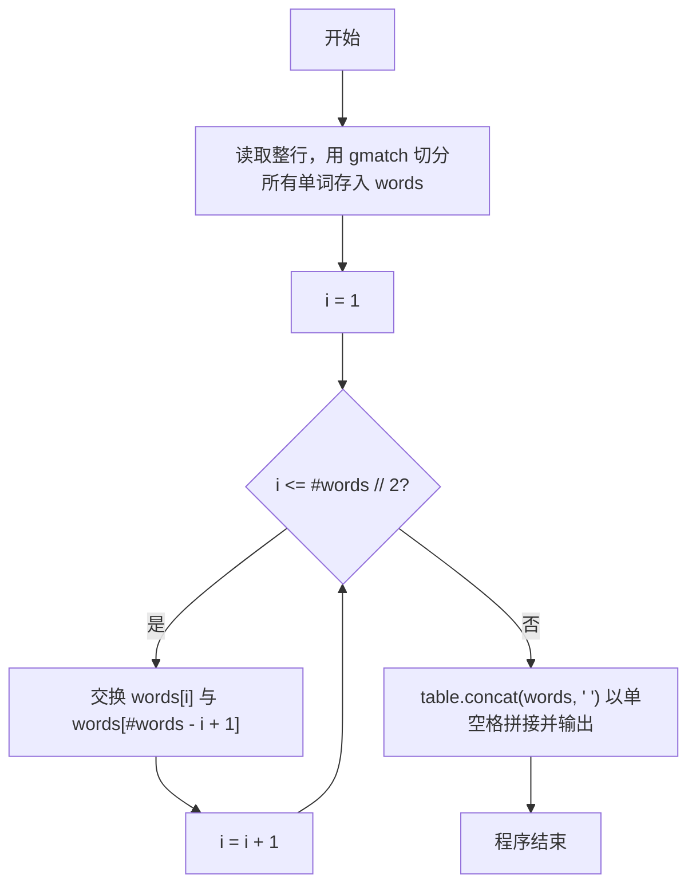
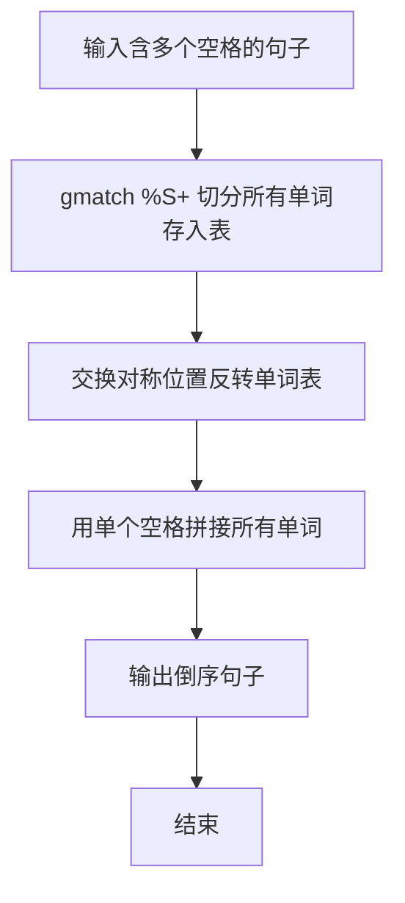

# 7-32 说反话-加强版（Lua语言实现）

## 前言

本题（7-32 说反话-加强版）的主要考点是：准确理解题意、规范处理输入输出格式，并正确处理边界与精度。下面先给出题目描述与格式要求，再通过清晰的思路与可直接运行的lua代码进行讲解。

## 题目描述

给定一句英语，要求你编写程序，将句中所有单词的顺序颠倒输出。

## 输入格式

测试输入包含一个测试用例，在一行内给出总长度不超过500 000的字符串。字符串由若干单词和若干空格组成，其中单词是由英文字母（大小写有区分）组成的字符串，单词之间用若干个空格分开。

## 输出格式

每个测试用例的输出占一行，输出倒序后的句子，并且保证单词间只有1个空格。

## 输入样例

```in
Hello World   Here I Come
```

## 输出样例

```out
Come I Here World Hello
```

## 解题思路

**核心问题分析**：本题要求将句子中的单词顺序颠倒输出，需要处理两个关键点：一是单词之间可能有多个连续空格，二是输出时单词间只能有一个空格。例如输入"Hello World   Here I Come"，需倒序输出为"Come I Here World Hello"。

**算法原理说明**：由于单词间可能有多个空格，用`io.read("*l"):gmatch("%S+")`按连续非空白字符切分单词并依次存入words表，可自动忽略所有多余空格。随后把表逆序：for循环i从1到#words // 2，交换words[i]与words[#words - i + 1]这对对称位置。最后用`table.concat(words, " ")`以单个空格拼接输出，保证单词间只有1个空格。

### 1. 具体计算步骤

1. 初始化空表words
2. 用`io.read("*l"):gmatch("%S+")`遍历所有单词，逐个存入words
3. for循环i从1到#words // 2，交换words[i]与words[#words - i + 1]实现倒序
4. 用`table.concat(words, " ")`以单个空格拼接输出倒序句子

## 完整代码

```lua
-- 7-32 说反话-加强版
local line = io.read("*l") or ""
local words = {}
for word in line:gmatch("%S+") do
    words[#words + 1] = word
end
for i = 1, #words // 2 do
    words[i], words[#words - i + 1] = words[#words - i + 1], words[i]
end
print(table.concat(words, " "))
```

## 代码流程说明

1. **切分单词**：用`io.read("*l")`读取整行句子，通过`:gmatch("%S+")`按连续非空白字符切分出所有单词，逐个存入words表，自动忽略多余空格
2. **反转表**：for循环i从1到#words // 2，用多重赋值交换words[i]与words[#words - i + 1]这对对称位置，使表内单词顺序倒序
3. **输出结果**：用`table.concat(words, " ")`以单个空格拼接所有单词并print输出，保证单词间只有1个空格

## 代码流程图



## 解题流程图



## 代码解析

```lua
-- 7-32 说反话-加强版
local line = io.read("*l") or ""
local words = {}
for word in line:gmatch("%S+") do
    words[#words + 1] = word
end
for i = 1, #words // 2 do
    words[i], words[#words - i + 1] = words[#words - i + 1], words[i]
end
print(table.concat(words, " "))
```

先以`or ""`防`io.read("*l")`返回`nil`（EOF）再`gmatch`。

## 复杂度分析

设输入行长度为 L，程序扫描并保存所有单词后再逆序输出，时间复杂度为 O(L)，额外空间复杂度为 O(L).

## 常见易错点

- 反转的是单词顺序，不是每个单词内部的字符顺序。
- 连续空格应通过非空白匹配忽略，输出单词之间只保留一个空格。

## 更多测试

边界测试：输入 Hello，预期输出 Hello。

特殊测试：输入多个连续空格分隔的单词，验证输出只保留单个空格。

## 总结

本题的核心在于理清「说反话-加强版」的输入输出关系与边界处理：先按格式读取输入，再依据规则逐步计算或遍历，最后按规范输出。该思路可迁移到同类格式化输入输出与模拟计算的题目。
