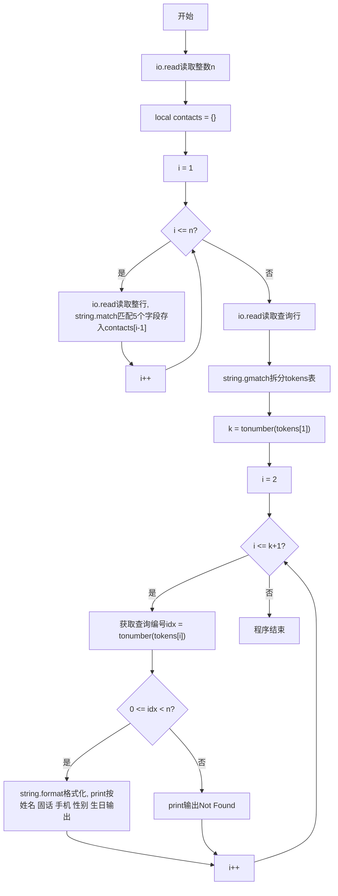
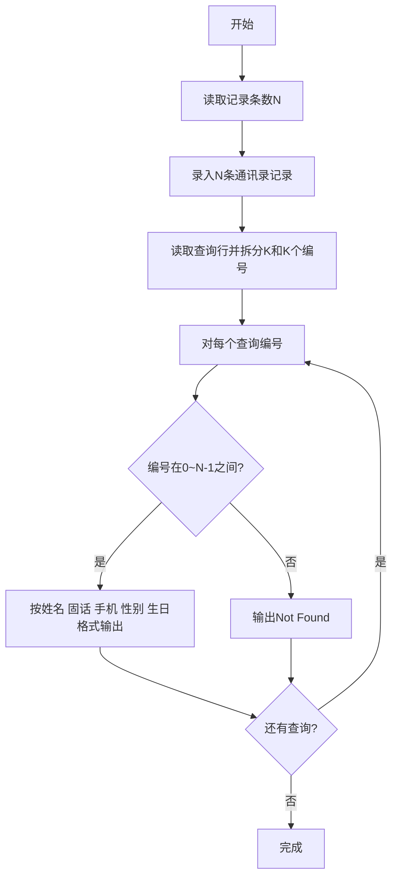

# 7-34 通讯录的录入与显示（Lua语言实现）

## 前言

本题（7-34 通讯录的录入与显示）的主要考点是：准确理解题意、规范处理输入输出格式，并正确处理边界与精度。下面先给出题目描述与格式要求，再通过清晰的思路与可直接运行的lua代码进行讲解。

## 题目描述

通讯录中的一条记录包含下述基本信息：朋友的姓名、出生日期、性别、固定电话号码、移动电话号码。
本题要求编写程序，录入N条记录，并且根据要求显示任意某条记录。

## 输入格式

输入在第一行给出正整数N（≤10）；随后N行，每行按照格式姓名 生日 性别 固话 手机给出一条记录。其中姓名是不超过10个字符、不包含空格的非空字符串；生日按yyyy/mm/dd的格式给出年月日；性别用M表示"男"、F表示"女"；固话和手机均为不超过15位的连续数字，前面有可能出现+。

在通讯录记录输入完成后，最后一行给出正整数K，并且随后给出K个整数，表示要查询的记录编号（从0到N−1顺序编号）。数字间以空格分隔。

## 输出格式

对每一条要查询的记录编号，在一行中按照姓名 固话 手机 性别 生日的格式输出该记录。若要查询的记录不存在，则输出Not Found。

## 输入样例

```in
3
Chris 1984/03/10 F +86181779452 13707010007
LaoLao 1967/11/30 F 057187951100 +8618618623333
QiaoLin 1980/01/01 M 84172333 10086
2 1 7
```

## 输出样例

```out
LaoLao 057187951100 +8618618623333 F 1967/11/30
Not Found
```

## 解题思路

### 核心问题分析
本题需要实现通讯录的录入与查询功能。核心要点有三：一是用合适的数据结构存储多条记录（包含姓名、生日、性别、固话、手机5个字段）；二是按正确顺序输出字段（注意输出顺序与输入顺序不同：输入是姓名-生日-性别-固话-手机，输出是姓名-固话-手机-性别-生日）；三是处理无效查询编号，输出Not Found。

### 算法原理说明
采用表(table)数组+索引查询的方案：
1. **数据结构设计**：使用Lua表(table)作为联系人记录，包含5个字段分别存储一条记录的各项信息。
2. **录入阶段**：读取N后，循环N次按输入顺序用string.match读取5个字段存入表数组对应下标的元素。
3. **查询阶段**：读取查询行后，用string.gmatch拆分K和K个查询编号。循环K次读取查询编号idx，若idx在[0, N)范围内，则按输出顺序用string.format格式化输出对应表的字段；否则输出"Not Found"。
- 时间复杂度O(N+K)：录入和查询均为线性扫描
- 空间复杂度O(N)：存储N条通讯录记录

### 具体计算步骤
1. 读取正整数N（通讯录记录条数）
2. 循环i从1到N：
   - 读取整行，用string.match匹配姓名、生日、性别、固话、手机，存入contacts[i-1]的对应字段
3. 读取查询行，用string.gmatch拆分出K和K个查询编号
4. 循环处理K个查询：
   - 获取查询编号idx
   - 判断idx >= 0 且 idx < N？
     - 是：按"姓名 固话 手机 性别 生日"顺序输出
     - 否：输出"Not Found"

## 完整代码

```lua
-- 7-34 通讯录的录入与显示
-- 统一读取全部输入，避免 io.read("*n") 与 io.read() 混用导致的换行残留
local all = io.read("*a") or "" -- 读取全部输入，空输入防nil
local lines = {} -- 按行分割
for line in all:gmatch("[^\r\n]+") do
    table.insert(lines, line)
end
if #lines >= 1 then
    local p = 1 -- 当前行指针
    local n = tonumber(lines[p]); p = p + 1 -- 记录条数 N
    n = n or 0
    local contacts = {} -- contacts[1] 对应编号 0
    for i = 1, n do
        local line = lines[p]; p = p + 1
        if line then
            local name, birthday, gender, fixedPhone, mobilePhone = line:match("(%S+)%s+(%S+)%s+(%S+)%s+(%S+)%s+(%S+)") -- 解析 5 个字段
            contacts[i] = { -- 按 1 基存储，便于编号+1 访问
                name = name,
                birthday = birthday,
                gender = gender,
                fixedPhone = fixedPhone,
                mobilePhone = mobilePhone
            }
        end
    end
    -- 剩余行均为查询行，可能含 K 及多个编号，统一收集 token
    local tokens = {}
    for i = p, #lines do
        for tok in lines[i]:gmatch("%S+") do
            table.insert(tokens, tok)
        end
    end
    if #tokens > 0 then
        local k = tonumber(tokens[1]) or 0 -- 查询数 K
        for i = 2, k + 1 do
            local q = tonumber(tokens[i]) -- 查询编号
            if q ~= nil and q >= 0 and q < n then
                local c = contacts[q+1] -- 编号从 0 开始，故 +1
                print(string.format("%s %s %s %s %s", c.name, c.fixedPhone, c.mobilePhone, c.gender, c.birthday))
            else
                print("Not Found")
            end
        end
    end
end
```

## 代码流程说明

1. **读取N**：io.read("*n")输入通讯录记录条数n
2. **定义表数组**：local contacts = {}，容纳n条记录
3. **录入N条记录**：循环n次，每次用io.read()读取整行，string.match按顺序匹配5个字段存入contacts[i-1]
4. **读取查询行并拆分**：io.read()读取查询行，string.gmatch遍历所有token存入tokens表
5. **获取查询次数K**：tokens[1]转为数字k
6. **处理K次查询**：循环k次：
   - 获取查询编号idx（从tokens[2]开始）
   - 判断idx是否在有效范围[0, n)内
   - 有效则用string.format按指定顺序输出5个字段（注意固话手机在前，性别生日在后），print换行输出
   - 无效print输出"Not Found"
7. **程序自然结束**

## 代码流程图



## 解题流程图



## 代码解析

```lua
-- 7-34 通讯录的录入与显示
local all = io.read("*a") or ""
local lines = {}
for line in all:gmatch("[^\r\n]+") do table.insert(lines, line) end
if #lines >= 1 then
    local p = 1
    local n = tonumber(lines[p]) or 0; p = p + 1
    local contacts = {}
    for i = 1, n do
        local line = lines[p]; p = p + 1
        if line then
            local name, birthday, gender, fixedPhone, mobilePhone = line:match("(%S+)%s+(%S+)%s+(%S+)%s+(%S+)%s+(%S+)")
            if name then contacts[i] = { name=name, birthday=birthday, gender=gender, fixedPhone=fixedPhone, mobilePhone=mobilePhone } end
        end
    end
    local tokens = {}
    for i = p, #lines do for tok in lines[i]:gmatch("%S+") do table.insert(tokens, tok) end end
    if #tokens > 0 then
        local k = tonumber(tokens[1]) or 0
        for i = 2, k+1 do
            local q = tonumber(tokens[i])
            if q ~= nil and q >=0 and q < n then
                local c = contacts[q+1]
                if c then print(string.format("%s %s %s %s %s", c.name, c.fixedPhone, c.mobilePhone, c.gender, c.birthday))
                else print("Not Found") end
            else print("Not Found") end
        end
    end
end
```

统一读取全部输入后按行分割，避免换行残留，查询编号 0 基需 +1 访问

## 复杂度分析

设有 n 条联系人记录和 k 次查询，读取和查询总时间复杂度为 O(n+k)，联系人存储空间复杂度为 O(n).

## 常见易错点

- 通讯录编号从 0 开始，查询编号必须映射到表下标 q+1。
- 查询不存在的编号要输出 Not Found，且联系人字段输出顺序不能改变。

## 更多测试

边界测试：只建立 1 条记录并查询编号 0，验证编号从 0 开始。

特殊测试：查询不存在的编号，预期输出 Not Found。

## 总结

本题的核心在于理清「通讯录的录入与显示」的输入输出关系与边界处理：先按格式读取输入，再依据规则逐步计算或遍历，最后按规范输出。该思路可迁移到同类格式化输入输出与模拟计算的题目。
