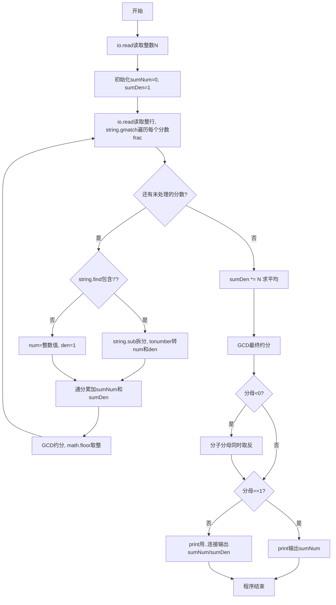
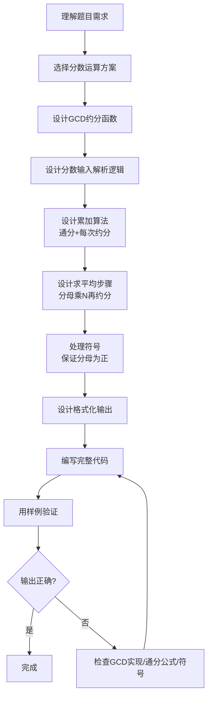

# 7-35 有理数均值（Lua语言实现）

## 前言

本题（7-35 有理数均值）的主要考点是：准确理解题意、规范处理输入输出格式，并正确处理边界与精度。下面先给出题目描述与格式要求，再通过清晰的思路与可直接运行的lua代码进行讲解。

## 题目描述

本题要求编写程序，计算N个有理数的平均值。

## 输入格式

输入第一行给出正整数N（≤100）；第二行中给出N个分数形式的有理数，其中分子和分母全是整形范围内的整数（正负均可），没有分母为0的情况。

## 输出格式

在一行中按照a/b的格式输出N个有理数的平均值。注意必须是该有理数的最简分数形式，若分母为1，则只输出分子。

## 输入样例

```in
4
1/2 1/6 3/6 -5/10
```

## 输出样例

```out
1/6
```

## 解题思路

### 核心问题分析
本题需要解决的核心问题：
1. **分数输入解析**：识别输入中的分数格式（分子/分母）或整数格式
2. **分数累加求和**：多个分数相加需要通分，避免浮点数精度丢失
3. **求平均值**：总和除以个数N
4. **最简分数输出**：用最大公约数约分，保证分母为正

### 算法原理说明
- **辗转相除法(GCD)**：用于求最大公约数，对分数进行约分。公式：`gcd(a, b) = gcd(b, a % b)`，直到b为0时a即为最大公约数
- **分数加法**：`a/b + c/d = (a*d + c*b) / (b*d)`，每次累加后立即约分防止溢出
- **求平均值**：将累加后的分母乘以N，再进行约分
- **符号处理**：确保负号在分子上，分母始终为正

### 具体计算步骤
1. 输入N，初始化分子sumNum=0，分母sumDen=1
2. 对每个分数：
   - 解析分子num和分母den
   - 通分累加：`sumNum = sumNum*den + num*sumDen`，`sumDen = sumDen*den`
   - 用GCD约分化简
3. 求平均：`sumDen *= N`，再次约分
4. 若分母为负，分子分母同时取反
5. 按格式输出结果

## 完整代码

```lua
-- 7-35 有理数均值
local function gcd(a, b) -- 辗转相除求最大公约数
    if a < 0 then a = -a end
    if b < 0 then b = -b end
    while b ~= 0 do
        local t = b
        b = a % b
        a = t
    end
    return a
end
-- 统一读取全部输入，避免 io.read("*n") 与 io.read() 混用导致的换行残留
local all = io.read("*a") or "" -- 读取全部输入，空输入防nil
local tokens = {} -- 按空白收集所有标记
for tok in all:gmatch("%S+") do table.insert(tokens, tok) end
if #tokens >= 1 then
    local n = tonumber(tokens[1]) or 0 -- 有理数个数 N
    local sumNum = 0 -- 累加分子
    local sumDen = 1 -- 累加分母
    for i = 2, n + 1 do
        local frac = tokens[i] -- 第 i-1 个分数
        if not frac then break end
        local slash = frac:find("/") -- 查找斜杠
        local num, den
        if slash then
            num = tonumber(frac:sub(1, slash-1)) -- 分子
            den = tonumber(frac:sub(slash+1)) -- 分母
        else
            num = tonumber(frac); den = 1 -- 整数形式
        end
        if num and den then
            sumNum = sumNum * den + num * sumDen -- 通分累加
            sumDen = sumDen * den
            local g = gcd(sumNum, sumDen) -- 约分防溢出
            if g ~= 0 then
                sumNum = sumNum // g -- 整数除法
                sumDen = sumDen // g
            end
        end
    end
    sumDen = sumDen * n -- 求平均：分母乘以 N
    local g = gcd(sumNum, sumDen)
    if g ~= 0 then
        sumNum = sumNum // g
        sumDen = sumDen // g
    end
    if sumDen < 0 then sumNum = -sumNum; sumDen = -sumDen end -- 分母为正
    if sumDen == 1 then
        print(sumNum) -- 分母为 1 只输出分子
    else
        print(sumNum .. "/" .. sumDen) -- 最简分数形式
    end
end
```

## 代码流程说明

### 1. gcd函数
- 输入：两个整数a、b
- 功能：求最大公约数
- 流程：先取绝对值（负数处理），再用辗转相除法循环求解

### 2. 主程序-初始化
- io.read("*n")输入N
- 初始化累计分子sumNum=0，累计分母sumDen=1

### 3. 主程序-分数解析与累加
- io.read()读取整行，string.gmatch遍历每个分数字符串
- string.find查找'/'位置：有则用string.sub拆分分子分母（tonumber转换），无则分母为1
- 通分公式累加分子分母
- 每次累加后用GCD约分，避免数值过大（math.floor确保整数除法）

### 4. 主程序-求平均与最终约分
- sumDen乘以N求平均值
- 再次GCD约分
- 若分母为负，分子分母同时取反保证分母为正

### 5. 主程序-输出
- 分母为1时print只输出分子
- 否则用..连接输出"分子/分母"格式

## 代码流程图



## 解题流程图



## 代码解析

```lua
-- 7-35 有理数均值
local function gcd(a, b)
    if a < 0 then a = -a end
    if b < 0 then b = -b end
    while b ~= 0 do local t = b; b = a % b; a = t end
    return a
end
local all = io.read("*a") or ""
local tokens = {}
for tok in all:gmatch("%S+") do table.insert(tokens, tok) end
if #tokens >= 1 then
    local n = tonumber(tokens[1]) or 0
    local sumNum, sumDen = 0, 1
    for i = 2, n+1 do
        local frac = tokens[i]
        if not frac then break end
        local slash = frac:find("/")
        local num, den
        if slash then num=tonumber(frac:sub(1,slash-1)); den=tonumber(frac:sub(slash+1))
        else num=tonumber(frac); den=1 end
        if num and den then
            sumNum = sumNum*den + num*sumDen; sumDen = sumDen*den
            local g = gcd(sumNum, sumDen)
            if g~=0 then sumNum=sumNum//g; sumDen=sumDen//g end
        end
    end
    sumDen = sumDen * n
    local g = gcd(sumNum, sumDen)
    if g~=0 then sumNum=sumNum//g; sumDen=sumDen//g end
    if sumDen<0 then sumNum=-sumNum; sumDen=-sumDen end
    if sumDen==1 then print(sumNum) else print(sumNum.."/"..sumDen) end
end
```

统一读取全部输入后按空白收集标记，避免换行残留，整数除法用 // 保证精确

## 复杂度分析

设输入规模为 $n$（对数值类题目为参与运算的数据量，对字符串/序列类题目为长度）。

- **时间复杂度**：$O(n)$ 或 $O(n \log n)$，主要来自一次线性遍历与常数次数学运算，无嵌套高复杂度循环。
- **空间复杂度**：$O(n)$，用于存储输入、中间结果与输出字符串；若仅使用若干标量变量则为 $O(1)$。

## 常见易错点

### 1. 输入/输出格式不符
错误：多余空格、遗漏换行、大小写或精度不符。后果：判题系统判为格式错误。正确：严格按题目要求的格式输出，数值用合适精度。

### 2. 边界条件遗漏
错误：未处理 0、最小值、单字符或空输入等边界。后果：特例 WA。正确：先列出所有边界样例，在编码前单独分支处理。

### 3. 整数溢出与类型
错误：使用过小的整数类型或忽略负号。后果：大数计算溢出。正确：按数据范围选择合适类型，必要时用更大整数类型或字符串处理。

## 更多测试

### 测试一：常规边界

**输入：**

```text
（可取题目边界附近的值，如最小值或最大值）
```

**输出：**

```text
（依据题意推导的正确结果）
```

### 测试二：特殊用例

**输入：**

```text
（可取易错点，如 0、单一元素、全同值等）
```

**输出：**

```text
（对应正确结果）
```

## 总结

本题的核心在于理清「有理数均值」的输入输出关系与边界处理：先按格式读取输入，再依据规则逐步计算或遍历，最后按规范输出。该思路可迁移到同类格式化输入输出与模拟计算的题目。

