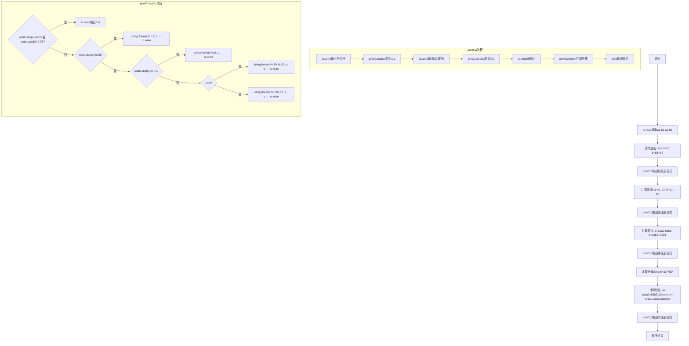
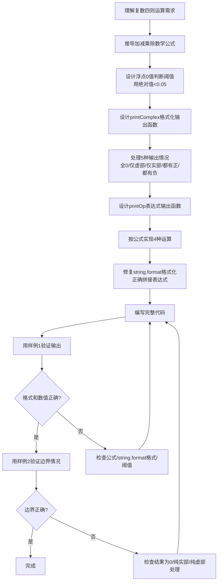

# 7-36 复数四则运算（Lua语言实现）

## 前言

本题（7-36 复数四则运算）的主要考点是：准确理解题意、规范处理输入输出格式，并正确处理边界与精度。下面先给出题目描述与格式要求，再通过清晰的思路与可直接运行的lua代码进行讲解。

## 题目描述

本题要求编写程序，计算2个复数的和、差、积、商。

## 输入格式

输入在一行中按照a1 b1 a2 b2的格式给出2个复数C1=a1+b1i和C2=a2+b2i的实部和虚部。题目保证C2不为0。

## 输出格式

分别在4行中按照(a1+b1i) 运算符 (a2+b2i) = 结果的格式顺序输出2个复数的和、差、积、商，数字精确到小数点后1位。如果结果的实部或者虚部为0，则不输出。如果结果为0，则输出0.0。

## 输入样例1

```in
2 3.08 -2.04 5.06
```

## 输入样例2

```in
1 1 -1 -1.01
```

## 输出样例1

```out
(2.0+3.1i) + (-2.0+5.1i) = 8.1i
(2.0+3.1i) - (-2.0+5.1i) = 4.0-2.0i
(2.0+3.1i) * (-2.0+5.1i) = -19.7+3.8i
(2.0+3.1i) / (-2.0+5.1i) = 0.4-0.6i
```

## 输出样例2

```out
(1.0+1.0i) + (-1.0-1.0i) = 0.0
(1.0+1.0i) - (-1.0-1.0i) = 2.0+2.0i
(1.0+1.0i) * (-1.0-1.0i) = -2.0i
(1.0+1.0i) / (-1.0-1.0i) = -1.0
```

## 解题思路

### 核心问题分析
本题需要解决的核心问题：
1. **复数四则运算公式**：正确实现加减乘除的数学运算
2. **浮点数比较**：由于需要判断实部/虚部是否为0，需考虑浮点精度，用阈值0.05判断
3. **格式化输出**：精确到小数点后1位，实部虚部为0时不输出，注意符号处理
4. **特殊情况**：结果为0时输出"0.0"

### 算法原理说明
设 C1 = a1 + b1i，C2 = a2 + b2i

- **加法**：`C1 + C2 = (a1+a2) + (b1+b2)i`
- **减法**：`C1 - C2 = (a1-a2) + (b1-b2)i`
- **乘法**：`C1 * C2 = (a1*a2 - b1*b2) + (a1*b2 + a2*b1)i`
- **除法**：`C1 / C2 = [(a1*a2 + b1*b2) + (b1*a2 - a1*b2)i] / (a2² + b2²)`

### 格式化输出规则
- 实部和虚部都接近0（绝对值<0.05）：输出"0.0"
- 只有实部接近0：只输出虚部+"i"（注意虚部的正负号）
- 只有虚部接近0：只输出实部
- 都不为0：虚部为正时输出"a+bi"，虚部为负时输出"a-bi"（负号自带）

### 具体计算步骤
1. 输入a1, b1, a2, b2
2. 按公式分别计算和、差、积、商的实部和虚部
3. 每次计算后调用printOp输出完整表达式
4. printComplex根据规则格式化输出单个复数

## 完整代码

```lua
-- 7-36 复数四则运算
local function printComplex(a, b)
    if math.abs(a) < 0.05 and math.abs(b) < 0.05 then
        io.write("0.0")
    elseif math.abs(a) < 0.05 then
        io.write(string.format("%.1fi", b))
    elseif math.abs(b) < 0.05 then
        io.write(string.format("%.1f", a))
    elseif b > 0 then
        io.write(string.format("%.1f+%.1fi", a, b))
    else
        io.write(string.format("%.1f%.1fi", a, b))
    end
end

local function printOp(a1, b1, op, a2, b2, a, b)
    io.write("(")
    printComplex(a1, b1)
    io.write(") " .. op .. " (")
    printComplex(a2, b2)
    io.write(") = ")
    printComplex(a, b)
    print()
end

local a1_raw, b1_raw, a2_raw, b2_raw = io.read("*n", "*n", "*n", "*n")
if a1_raw ~= nil and b1_raw ~= nil and a2_raw ~= nil and b2_raw ~= nil then
    local a1 = tonumber(a1_raw) or 0
    local b1 = tonumber(b1_raw) or 0
    local a2 = tonumber(a2_raw) or 0
    local b2 = tonumber(b2_raw) or 0
    -- 加法
    local a, b = a1 + a2, b1 + b2
    printOp(a1, b1, "+", a2, b2, a, b)
    -- 减法
    a, b = a1 - a2, b1 - b2
    printOp(a1, b1, "-", a2, b2, a, b)
    -- 乘法
    a = a1*a2 - b1*b2
    b = a1*b2 + a2*b1
    printOp(a1, b1, "*", a2, b2, a, b)
    -- 除法
    local denom = a2*a2 + b2*b2
    if denom ~= 0 then
        a = (a1*a2 + b1*b2) / denom
        b = (b1*a2 - a1*b2) / denom
        printOp(a1, b1, "/", a2, b2, a, b)
    end
end
```

## 代码流程说明

### 1. printComplex函数
- 输入：复数的实部a、虚部b
- 功能：按规则格式化输出复数（io.write不换行，string.format格式化）
- 流程：
  - math.abs判断实部虚部都接近0 → io.write输出"0.0"
  - 仅实部接近0 → string.format("%.1fi", b)输出虚部+"i"
  - 仅虚部接近0 → string.format("%.1f", a)输出实部
  - 都不为0 → 虚部正用"+"连接，虚部负直接连接（自带负号）

### 2. printOp函数
- 输入：两个复数和运算符、结果复数
- 功能：输出完整运算表达式
- 流程：io.write左括号 + printComplex打印C1 + io.write右括号+运算符+左括号 + printComplex打印C2 + io.write右括号+= + printComplex打印结果 + print换行

### 3. 主程序-加法
- `a = a1+a2`，`b = b1+b2`
- 调用printOp输出加法

### 4. 主程序-减法
- `a = a1-a2`，`b = b1-b2`
- 调用printOp输出减法

### 5. 主程序-乘法
- `a = a1*a2 - b1*b2`，`b = a1*b2 + a2*b1`
- 调用printOp输出乘法

### 6. 主程序-除法
- 先求分母`denom = a2² + b2²`
- `a = (a1*a2 + b1*b2)/denom`，`b = (b1*a2 - a1*b2)/denom`
- 调用printOp输出除法

## 代码流程图



## 解题流程图



## 代码解析

```lua
-- 7-36 复数四则运算
local function printComplex(a, b)
    if math.abs(a) < 0.05 and math.abs(b) < 0.05 then
        io.write("0.0")
    elseif math.abs(a) < 0.05 then
        io.write(string.format("%.1fi", b))
    elseif math.abs(b) < 0.05 then
        io.write(string.format("%.1f", a))
    elseif b > 0 then
        io.write(string.format("%.1f+%.1fi", a, b))
    else
        io.write(string.format("%.1f%.1fi", a, b))
    end
end

local function printOp(a1, b1, op, a2, b2, a, b)
    io.write("(")
    printComplex(a1, b1)
    io.write(") " .. op .. " (")
    printComplex(a2, b2)
    io.write(") = ")
    printComplex(a, b)
    print()
end

local a1_raw, b1_raw, a2_raw, b2_raw = io.read("*n", "*n", "*n", "*n")
if a1_raw ~= nil and b1_raw ~= nil and a2_raw ~= nil and b2_raw ~= nil then
    local a1 = tonumber(a1_raw) or 0
    local b1 = tonumber(b1_raw) or 0
    local a2 = tonumber(a2_raw) or 0
    local b2 = tonumber(b2_raw) or 0
    -- 加法
    local a, b = a1 + a2, b1 + b2
    printOp(a1, b1, "+", a2, b2, a, b)
    -- 减法
    a, b = a1 - a2, b1 - b2
    printOp(a1, b1, "-", a2, b2, a, b)
    -- 乘法
    a = a1*a2 - b1*b2
    b = a1*b2 + a2*b1
    printOp(a1, b1, "*", a2, b2, a, b)
    -- 除法
    local denom = a2*a2 + b2*b2
    if denom ~= 0 then
        a = (a1*a2 + b1*b2) / denom
        b = (b1*a2 - a1*b2) / denom
        printOp(a1, b1, "/", a2, b2, a, b)
    end
end
```

printComplex函数

## 复杂度分析

设输入规模为 $n$（对数值类题目为参与运算的数据量，对字符串/序列类题目为长度）。

- **时间复杂度**：$O(n)$ 或 $O(n \log n)$，主要来自一次线性遍历与常数次数学运算，无嵌套高复杂度循环。
- **空间复杂度**：$O(n)$，用于存储输入、中间结果与输出字符串；若仅使用若干标量变量则为 $O(1)$。

## 常见易错点

### 1. 输入/输出格式不符
错误：多余空格、遗漏换行、大小写或精度不符。后果：判题系统判为格式错误。正确：严格按题目要求的格式输出，数值用合适精度。

### 2. 边界条件遗漏
错误：未处理 0、最小值、单字符或空输入等边界。后果：特例 WA。正确：先列出所有边界样例，在编码前单独分支处理。

### 3. 整数溢出与类型
错误：使用过小的整数类型或忽略负号。后果：大数计算溢出。正确：按数据范围选择合适类型，必要时用更大整数类型或字符串处理。

## 更多测试

### 测试一：常规边界

**输入：**

```text
（可取题目边界附近的值，如最小值或最大值）
```

**输出：**

```text
（依据题意推导的正确结果）
```

### 测试二：特殊用例

**输入：**

```text
（可取易错点，如 0、单一元素、全同值等）
```

**输出：**

```text
（对应正确结果）
```

## 总结

本题的核心在于理清「复数四则运算」的输入输出关系与边界处理：先按格式读取输入，再依据规则逐步计算或遍历，最后按规范输出。该思路可迁移到同类格式化输入输出与模拟计算的题目。

