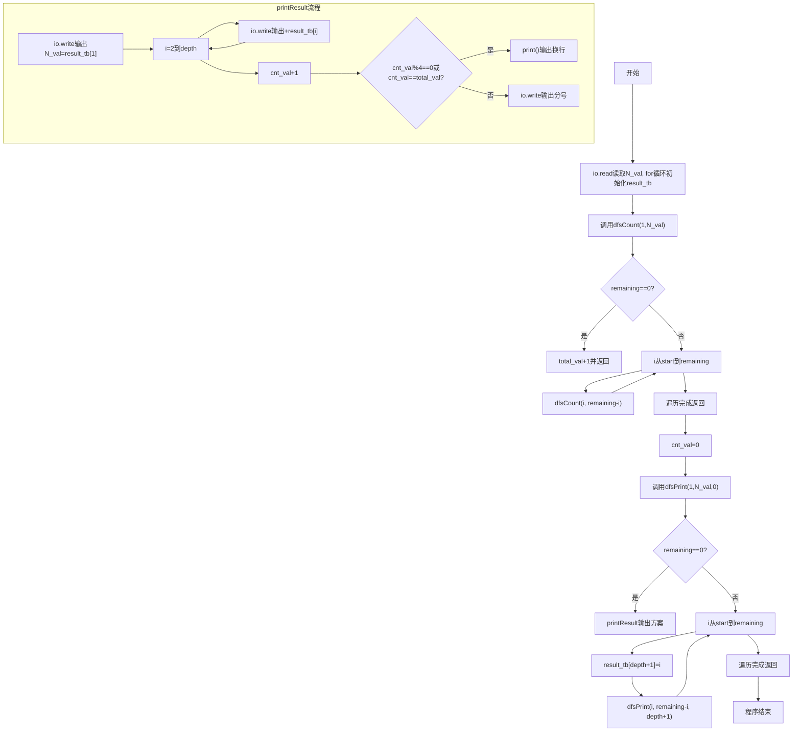
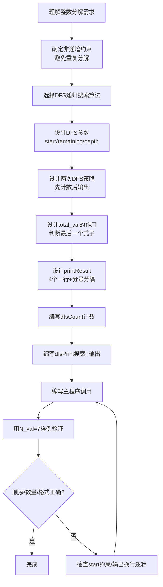

# 7-37 整数分解为若干项之和（Lua语言实现）

## 前言

本题（7-37 整数分解为若干项之和）的主要考点是：准确理解题意、规范处理输入输出格式，并正确处理边界与精度。下面先给出题目描述与格式要求，再通过清晰的思路与可直接运行的lua代码进行讲解。

## 题目描述

将一个正整数 N 分解成几个正整数相加，可以有多种分解方法，例如 7=6+1，7=5+2，7=5+1+1，…。编程求出正整数 N 的所有整数分解式子。

## 输入格式

每个输入包含一个测试用例，即正整数 N (0<N≤30)。

## 输出格式

按递增顺序输出 N 的所有整数分解式子。递增顺序是指：对于两个分解序列 N₁={n₁,n₂,⋯} 和 N₂={m₁,m₂,⋯}，若存在 i 使得 n₁=m₁,⋯,nᵢ=mᵢ，但是 nᵢ₊₁<mᵢ₊₁，则 N₁序列必定在 N₂序列之前输出。每个式子由小到大相加，式子间用分号隔开，且每输出 4 个式子后换行。

## 输入样例

```in
7
```

## 输出样例

```out
7=1+1+1+1+1+1+1;7=1+1+1+1+1+2;7=1+1+1+1+3;7=1+1+1+2+2
7=1+1+1+4;7=1+1+2+3;7=1+1+5;7=1+2+2+2
7=1+2+4;7=1+3+3;7=1+6;7=2+2+3
7=2+5;7=3+4;7=7
```

## 解题思路

### 核心问题分析
本题需要解决的核心问题：
1. **生成所有分解方案**：找出正整数N的所有正整数和分解（整数分拆）
2. **递增顺序**：分解序列必须非递减排列（如1+1+5，而非1+5+1），避免重复
3. **输出格式**：每4个式子一行，用分号分隔，最后一个式子后换行

### 算法原理说明
- **深度优先搜索(DFS)**：递归地构建分解序列。关键参数：
  - `start`：当前可选的最小数（保证序列非递减，避免重复）
  - `remaining`：剩余需要分解的值
  - `depth`：当前分解的层数（已选择的数的个数）
- **两次DFS策略**：
  - 第一遍`dfsCount`：只计数，不输出，得到方案总数total_val
  - 第二遍`dfsPrint`：实际输出，利用total_val判断是否是最后一个式子（决定输出换行还是分号）
- **非递减约束**：循环从`start`开始，下一层递归起点仍为`i`，保证后续数≥当前数

### 具体计算步骤
1. 输入正整数N_val
2. 初始化result_tb表，预分配35个位置（下标从1开始）
3. 第一遍DFS（dfsCount）：从start=1开始，遍历所有分解方式，统计总方案数total_val
4. 重置计数器cnt_val=0
5. 第二遍DFS（dfsPrint）：同样的搜索顺序，每找到一个完整方案就调用printResult输出
6. printResult中：输出"N_val=n1+n2+..."格式，根据cnt_val%4和cnt_val==total_val判断输出换行还是分号

## 完整代码

```lua
-- 7-37 整数分解为若干项之和
local N_val
local result_tb = {}
local cnt_val = 0
local total_val = 0

local function dfsCount(start, remaining)
    if remaining == 0 then
        total_val = total_val + 1
        return
    end
    for i = start, remaining do
        dfsCount(i, remaining - i)
    end
end

local function printResult(depth)
    io.write(N_val .. "=" .. result_tb[1])
    for i = 2, depth do
        io.write("+" .. result_tb[i])
    end
    cnt_val = cnt_val + 1
    if cnt_val % 4 == 0 or cnt_val == total_val then
        print()
    else
        io.write(";")
    end
end

local function dfsPrint(start, remaining, depth)
    if remaining == 0 then
        printResult(depth)
        return
    end
    for i = start, remaining do
        result_tb[depth + 1] = i
        dfsPrint(i, remaining - i, depth + 1)
    end
end

N_val = tonumber(io.read("*n")) or 0
for i = 1, 35 do
    result_tb[i] = 0
end
if N_val and N_val > 0 then
    dfsCount(1, N_val)
    cnt_val = 0
    dfsPrint(1, N_val, 0)
end
```

## 代码流程说明

### 1. 模块级变量
- `N_val`：待分解的正整数
- `result_tb`：Lua表，存储当前分解方案的各项，下标从1开始
- `cnt_val`：已输出的方案计数，用于判断换行
- `total_val`：方案总数，用于判断最后一个方案

### 2. dfsCount函数
- 输入：start（起始数），remaining（剩余值）
- 功能：统计所有分解方案总数
- 流程：
  - remaining==0：找到一种方案，total_val = total_val + 1 返回
  - 否则for i = start, remaining do：递归调用dfsCount(i, remaining - i)

### 3. printResult函数
- 输入：depth（当前分解层数）
- 功能：输出一种分解方案（io.write不换行输出，print换行输出）
- 流程：
  - io.write输出N_val .. "=" .. result_tb[1]，然后依次输出"+" .. result_tb[i]
  - cnt_val = cnt_val + 1
  - cnt_val%4==0或cnt_val==total_val → print()换行；否则io.write输出分号

### 4. dfsPrint函数
- 输入：start，remaining，depth
- 功能：DFS搜索并输出所有分解方案
- 流程：
  - remaining==0：调用printResult输出
  - 否则for i = start, remaining do：result_tb[depth+1] = i，递归调用dfsPrint

### 5. 主程序
- tonumber(io.read("*n"))读取N_val
- for i = 1, 35 do result_tb[i] = 0 end初始化表
- 调用dfsCount统计总数
- 重置cnt_val=0
- 调用dfsPrint输出所有方案，程序自然结束

## 代码流程图



## 解题流程图



## 代码解析

```lua
-- 7-37 整数分解为若干项之和
local N_val
local result_tb = {}
local cnt_val = 0
local total_val = 0

local function dfsCount(start, remaining)
    if remaining == 0 then
        total_val = total_val + 1
        return
    end
    for i = start, remaining do
        dfsCount(i, remaining - i)
    end
end

local function printResult(depth)
    io.write(N_val .. "=" .. result_tb[1])
    for i = 2, depth do
        io.write("+" .. result_tb[i])
    end
    cnt_val = cnt_val + 1
    if cnt_val % 4 == 0 or cnt_val == total_val then
        print()
    else
        io.write(";")
    end
end

local function dfsPrint(start, remaining, depth)
    if remaining == 0 then
        printResult(depth)
        return
    end
    for i = start, remaining do
        result_tb[depth + 1] = i
        dfsPrint(i, remaining - i, depth + 1)
    end
end

N_val = tonumber(io.read("*n")) or 0
for i = 1, 35 do
    result_tb[i] = 0
end
if N_val and N_val > 0 then
    dfsCount(1, N_val)
    cnt_val = 0
    dfsPrint(1, N_val, 0)
end
```

模块级变量

## 复杂度分析

设输入规模为 $n$（对数值类题目为参与运算的数据量，对字符串/序列类题目为长度）。

- **时间复杂度**：$O(n)$ 或 $O(n \log n)$，主要来自一次线性遍历与常数次数学运算，无嵌套高复杂度循环。
- **空间复杂度**：$O(n)$，用于存储输入、中间结果与输出字符串；若仅使用若干标量变量则为 $O(1)$。

## 常见易错点

### 1. 输入/输出格式不符
错误：多余空格、遗漏换行、大小写或精度不符。后果：判题系统判为格式错误。正确：严格按题目要求的格式输出，数值用合适精度。

### 2. 边界条件遗漏
错误：未处理 0、最小值、单字符或空输入等边界。后果：特例 WA。正确：先列出所有边界样例，在编码前单独分支处理。

### 3. 整数溢出与类型
错误：使用过小的整数类型或忽略负号。后果：大数计算溢出。正确：按数据范围选择合适类型，必要时用更大整数类型或字符串处理。

## 更多测试

### 测试一：常规边界

**输入：**

```text
（可取题目边界附近的值，如最小值或最大值）
```

**输出：**

```text
（依据题意推导的正确结果）
```

### 测试二：特殊用例

**输入：**

```text
（可取易错点，如 0、单一元素、全同值等）
```

**输出：**

```text
（对应正确结果）
```

## 总结

本题的核心在于理清「整数分解为若干项之和」的输入输出关系与边界处理：先按格式读取输入，再依据规则逐步计算或遍历，最后按规范输出。该思路可迁移到同类格式化输入输出与模拟计算的题目。

