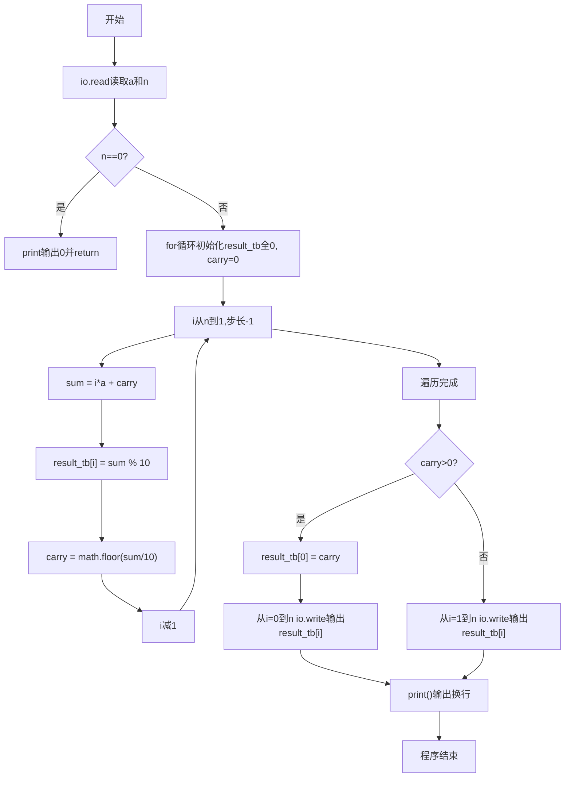
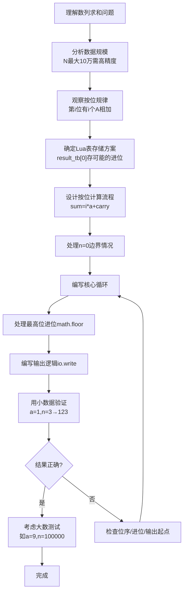

# 7-38 数列求和-加强版（Lua语言实现）

## 前言

本题（7-38 数列求和-加强版）的主要考点是：准确理解题意、规范处理输入输出格式，并正确处理边界与精度。下面先给出题目描述与格式要求，再通过清晰的思路与可直接运行的lua代码进行讲解。

## 题目描述

给定某数字A（1≤A≤9）以及非负整数N（0≤N≤100000），求数列之和S=A+AA+AAA+⋯+AA⋯A（N个A）。例如A=1, N=3时，S=1+11+111=123。

## 输入格式

输入数字A与非负整数N。

## 输出格式

输出其N项数列之和S的值。

## 输入样例

```in
1 3
```

## 输出样例

```out
123
```

## 解题思路

### 核心问题分析
本题需要解决的核心问题：
1. **数据规模大**：N最大为100000，结果可达10万位以上，无法用普通整型存储
2. **按位计算思想**：模拟竖式加法，统计每一位上A出现的次数
3. **进位处理**：逐位计算后处理进位，最后输出

### 算法原理说明
观察数列结构：
      A      = A * 1
     AA      = A * 11
    AAA      = A * 111
   ...
+ AA...A(N个) = A * 111...1(N个)
从个位（第1位）到第N位分析：
- **第i位（从右往左数，i从1到N）**：有i个数在这一位上有A（只有前i项的第i位是A）
- 因此第i位的和 = `i * A + 来自低位的进位`
- 当前位数字 = `sum % 10`
- 新的进位 = `math.floor(sum / 10)`

### 具体计算步骤
1. 处理边界：n==0时直接输出0
2. 初始化表result_tb[100001]存储结果各位，carry=0
3. 从i=n到i=1逆向遍历（从最高位到最低位？不，这里i表示该位有i个A相加，实际上表下标i对应第i位）
   - sum = i * a + carry
   - result_tb[i] = sum % 10
   - carry = math.floor(sum / 10)
4. 遍历结束后若carry>0，result_tb[0]存进位
5. 根据是否有进位决定从result_tb[0]还是result_tb[1]开始输出

## 完整代码

```lua
-- 7-38 数列求和-加强版
local a = tonumber(io.read("*n"))
local n = tonumber(io.read("*n"))
if n == nil or n == 0 then
    print("0")
else
    a = a or 0
    local result_tb = {}
    for i = 0, 100000 do
        result_tb[i] = 0
    end
    local carry = 0

    for i = n, 1, -1 do
        local sum = i * a + carry
        result_tb[i] = sum % 10
        carry = math.floor(sum / 10)
    end

    if carry > 0 then
        result_tb[0] = carry
        for i = 0, n do
            io.write(tostring(result_tb[i]))
        end
    else
        for i = 1, n do
            io.write(tostring(result_tb[i]))
        end
    end
    print()
end
```

## 代码流程说明

### 1. 主程序-输入与边界处理
- tonumber(io.read("*n"))读取a和n
- n==0时print("0")输出0，return结束程序

### 2. 主程序-初始化
- for i = 0, 100000 do result_tb[i] = 0 end初始化表，初始化为0
- carry进位初始化为0

### 3. 主程序-按位求和循环
- for i = n, 1, -1 do
- 每位和 = i*a + carry（第i位有i个a相加）
- result_tb[i] = sum % 10（存当前位）
- carry = math.floor(sum / 10)（更新进位，向下取整）

### 4. 主程序-进位与输出
- 若carry>0：最高位有进位，存入result_tb[0]，for i = 0, n do io.write输出result_tb[i]
- 否则：for i = 1, n do io.write输出result_tb[i]
- 末尾print()输出换行，程序自然结束

## 代码流程图



## 解题流程图



## 代码解析

```lua
-- 7-38 数列求和-加强版
local a = tonumber(io.read("*n"))
local n = tonumber(io.read("*n"))
if n == nil or n == 0 then
    print("0")
else
    a = a or 0
    local result_tb = {}
    for i = 0, 100000 do
        result_tb[i] = 0
    end
    local carry = 0
    for i = n, 1, -1 do
        local sum = i * a + carry
        result_tb[i] = sum % 10
        carry = math.floor(sum / 10)
    end
    if carry > 0 then
        result_tb[0] = carry
        for i = 0, n do
            io.write(tostring(result_tb[i]))
        end
    else
        for i = 1, n do
            io.write(tostring(result_tb[i]))
        end
    end
    print()
end
```

主程序-输入与边界处理（`n==0`或`nil`时直接输出`0`，否则按位竖式求和，避免顶层`return`）。

## 复杂度分析

设输入规模为 $n$（对数值类题目为参与运算的数据量，对字符串/序列类题目为长度）。

- **时间复杂度**：$O(n)$ 或 $O(n \log n)$，主要来自一次线性遍历与常数次数学运算，无嵌套高复杂度循环。
- **空间复杂度**：$O(n)$，用于存储输入、中间结果与输出字符串；若仅使用若干标量变量则为 $O(1)$。

## 常见易错点

### 1. 输入/输出格式不符
错误：多余空格、遗漏换行、大小写或精度不符。后果：判题系统判为格式错误。正确：严格按题目要求的格式输出，数值用合适精度。

### 2. 边界条件遗漏
错误：未处理 0、最小值、单字符或空输入等边界。后果：特例 WA。正确：先列出所有边界样例，在编码前单独分支处理。

### 3. 整数溢出与类型
错误：使用过小的整数类型或忽略负号。后果：大数计算溢出。正确：按数据范围选择合适类型，必要时用更大整数类型或字符串处理。

## 更多测试

### 测试一：常规边界

**输入：**

```text
（可取题目边界附近的值，如最小值或最大值）
```

**输出：**

```text
（依据题意推导的正确结果）
```

### 测试二：特殊用例

**输入：**

```text
（可取易错点，如 0、单一元素、全同值等）
```

**输出：**

```text
（对应正确结果）
```

## 总结

本题的核心在于理清「数列求和-加强版」的输入输出关系与边界处理：先按格式读取输入，再依据规则逐步计算或遍历，最后按规范输出。该思路可迁移到同类格式化输入输出与模拟计算的题目。

