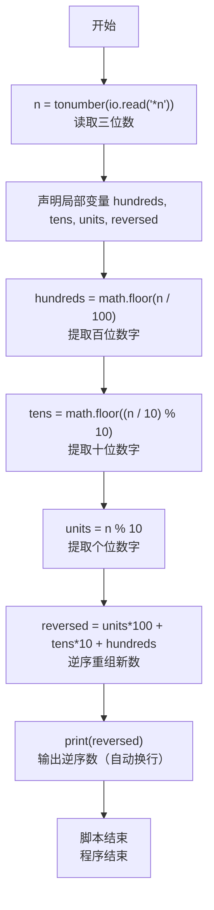
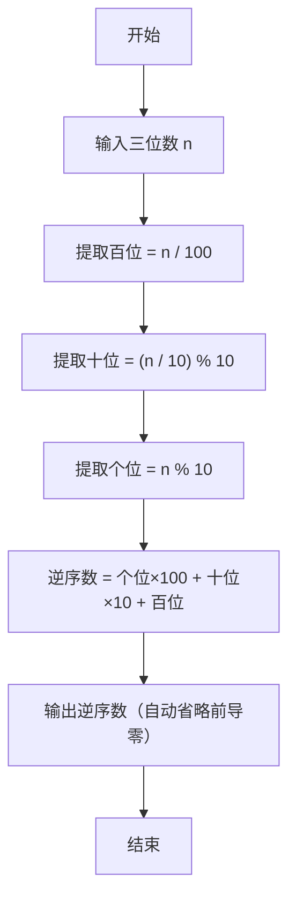

# 7-3 逆序的三位数（Lua语言实现）

## 前言

本题（7-3 逆序的三位数）的主要考点是：准确理解题意、规范处理输入输出格式，并正确处理边界与精度。下面先给出题目描述与格式要求，再通过清晰的思路与可直接运行的lua代码进行讲解。

## 题目描述

程序每次读入一个正3位数，然后输出按位逆序的数字。注意：当输入的数字含有结尾的0时，输出不应带有前导的0。比如输入700，输出应该是7。

## 输入格式

每个测试是一个3位的正整数。

## 输出格式

输出按位逆序的数。

## 输入样例

```in
123
```

## 输出样例

```out
321
```

## 解题思路

这道题的核心是**三位数的按位逆序重组**，关键在于正确提取百位、十位、个位数字，然后重新组合，同时自动处理前导零的问题。

### 核心问题分析

1. **按位提取**：需要从输入的三位数中分别提取百位、十位和个位数字。
2. **逆序重组**：将提取的个位作为新数的百位，十位保持不变，百位作为新数的个位。
3. **前导零处理**：当原数的个位为0时，逆序后的百位为0，此时输出不应带有前导零。利用整数输出的特性，前导零会自动省略。

### 算法原理说明

采用**数位分解重组法**：
1. 使用整除和取模运算分别提取百位、十位、个位数字
2. 将个位数字乘以100（新百位）、十位数字乘以10（新十位）、百位数字乘以1（新个位），相加得到逆序数
3. 直接输出整数，自动处理前导零

### 具体计算步骤

设有三位数 `n`：
1. 提取百位数字：`hundreds = n / 100`
2. 提取十位数字：`tens = (n / 10) % 10`
3. 提取个位数字：`units = n % 10`
4. 重组逆序数：`reversed = units * 100 + tens * 10 + hundreds`
5. 输出逆序数 `reversed`

## 完整代码

```lua
-- 7-3 逆序的三位数
local n = tonumber(io.read("*n"))
local hundreds = math.floor(n / 100)
local tens = math.floor((n / 10) % 10)
local units = n % 10
local reversed = units * 100 + tens * 10 + hundreds
print(reversed)
```

## 代码流程说明

1. **读取输入**：使用`io.read("*n")`读取数字，通过`tonumber()`转换为数值类型。
2. **声明局部变量**：声明`n`、`hundreds`、`tens`、`units`、`reversed`等局部变量。
3. **提取百位数字**：`math.floor(n / 100)`整除运算，只保留百位及以上部分（三位数的百位）。
4. **提取十位数字**：先`n / 10`去掉个位，再`% 10`取模得到十位数字，通过`math.floor()`确保整数。
5. **提取个位数字**：`n % 10`取模10直接得到个位数字。
6. **逆序重组**：个位×100 + 十位×10 + 百位，得到逆序后的新数。
7. **输出结果**：使用`print()`输出逆序数，整数输出自动省略前导零（自动换行）。
8. **程序结束**：Lua脚本自然结束。

## 代码流程图



## 解题流程图



## 代码解析

```lua
-- 7-3 逆序的三位数
local n = tonumber(io.read("*n"))
local hundreds = math.floor(n / 100)
local tens = math.floor((n / 10) % 10)
local units = n % 10
local reversed = units * 100 + tens * 10 + hundreds
print(reversed)
```

读取输入

## 复杂度分析

设输入规模为 $n$（对数值类题目为参与运算的数据量，对字符串/序列类题目为长度）。

- **时间复杂度**：$O(n)$ 或 $O(n \log n)$，主要来自一次线性遍历与常数次数学运算，无嵌套高复杂度循环。
- **空间复杂度**：$O(n)$，用于存储输入、中间结果与输出字符串；若仅使用若干标量变量则为 $O(1)$。

## 常见易错点

### 1. 输入/输出格式不符
错误：多余空格、遗漏换行、大小写或精度不符。后果：判题系统判为格式错误。正确：严格按题目要求的格式输出，数值用合适精度。

### 2. 边界条件遗漏
错误：未处理 0、最小值、单字符或空输入等边界。后果：特例 WA。正确：先列出所有边界样例，在编码前单独分支处理。

### 3. 整数溢出与类型
错误：使用过小的整数类型或忽略负号。后果：大数计算溢出。正确：按数据范围选择合适类型，必要时用更大整数类型或字符串处理。

## 更多测试

### 测试一：常规边界

**输入：**

```text
（可取题目边界附近的值，如最小值或最大值）
```

**输出：**

```text
（依据题意推导的正确结果）
```

### 测试二：特殊用例

**输入：**

```text
（可取易错点，如 0、单一元素、全同值等）
```

**输出：**

```text
（对应正确结果）
```

## 总结

本题的核心在于理清「逆序的三位数」的输入输出关系与边界处理：先按格式读取输入，再依据规则逐步计算或遍历，最后按规范输出。该思路可迁移到同类格式化输入输出与模拟计算的题目。

