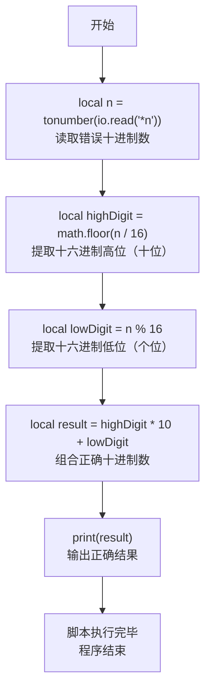
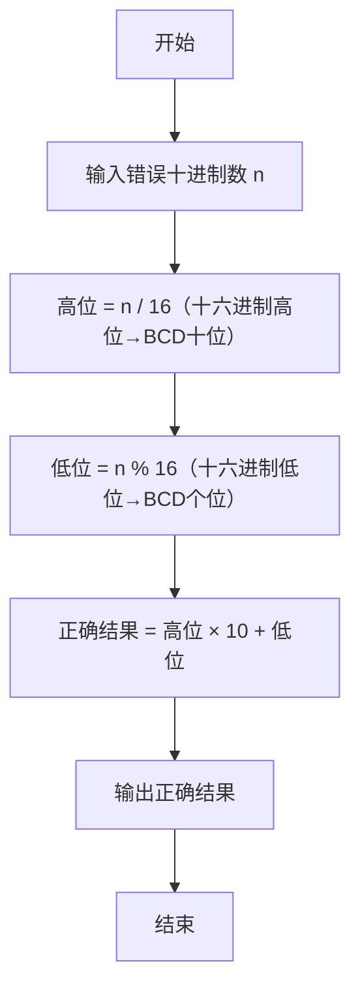

# 7-4 BCD解密（Lua语言实现）

## 前言

本题（7-4 BCD解密）的主要考点是：准确理解题意、规范处理输入输出格式，并正确处理边界与精度。下面先给出题目描述与格式要求，再通过清晰的思路与可直接运行的lua代码进行讲解。

## 题目描述

BCD数是用一个字节来表达两位十进制的数，每四个比特表示一位。所以如果一个BCD数的十六进制是0x12，它表达的就是十进制的12。但是小明没学过BCD，把所有的BCD数都当作二进制数转换成十进制输出了。于是BCD的0x12被输出成了十进制的18了！

现在，你的程序要读入这个错误的十进制数，然后输出正确的十进制数。提示：你可以把18转换回0x12，然后再转换回12。

## 输入格式

输入在一行中给出一个[0, 153]范围内的正整数，保证能转换回有效的BCD数，也就是说这个整数转换成十六进制时不会出现A-F的数字。

## 输出格式

输出对应的十进制数。

## 输入样例

```in
18
```

## 输出样例

```out
12
```

## 解题思路

这道题的核心是**BCD编码的逆向还原**，关键在于理解小明的错误逻辑：他将BCD编码的十六进制数直接当作二进制数转换为十进制。我们需要反向操作，将错误的十进制数还原为BCD编码对应的正确十进制数。

### 核心问题分析

1. **BCD编码原理**：一个字节（8位）存储两位十进制数，高4位表示十位数字，低4位表示个位数字。例如BCD的`0x12`表示十进制的`12`。
2. **错误转换分析**：小明将`0x12`按普通十六进制转换为十进制：`1×16 + 2 = 18`。
3. **逆向还原方法**：给定错误的十进制数（如18），需要将其视为十六进制的各位数字，再按十进制规则组合。

### 算法原理说明

采用**十六进制数位提取法**：
1. 小明的错误：将BCD字节（如0x12）按十六进制转十进制：`high × 16 + low`
2. 我们的修正：将错误十进制数的十六进制各位（high和low）按十进制组合：`high × 10 + low`

关键观察：对错误十进制数 `n` 做 `n / 16` 和 `n % 16`，恰好可以得到原BCD编码的高4位和低4位数字。

### 具体计算步骤

设输入的错误十进制数为 `n`：
1. 提取高位（十位）：`high_digit = n / 16`，即十六进制的高位数字
2. 提取低位（个位）：`low_digit = n % 16`，即十六进制的低位数字
3. 组合正确结果：`result = high_digit * 10 + low_digit`
4. 输出正确的十进制数 `result`

例如：`n = 18`
- `high_digit = 18 / 16 = 1`
- `low_digit = 18 % 16 = 2`
- `result = 1 × 10 + 2 = 12` ✓

## 完整代码

```lua
-- 7-4 BCD解密
local n = tonumber(io.read("*n"))
local highDigit = math.floor(n / 16)
local lowDigit = n % 16
local result = highDigit * 10 + lowDigit
print(result)
```

## 代码流程说明

1. **读取输入**：使用`io.read("*n")`读取一个数字，并用`tonumber()`转换为数值类型，赋值给局部变量`n`。
2. **提取高位数字**：`math.floor(n / 16)`整除16并向下取整，得到十六进制表示的高位数字（对应BCD的十位）。
3. **提取低位数字**：`n % 16`取模16，得到十六进制表示的低位数字（对应BCD的个位）。
4. **组合正确结果**：高位数字×10 + 低位数字，得到正确的十进制数，存入局部变量`result`。
5. **输出结果**：使用`print()`输出正确的十进制数并自动换行。
6. **程序结束**：Lua脚本执行完毕，自然结束。

## 代码流程图



## 解题流程图



## 代码解析

```lua
-- 7-4 BCD解密
local n = tonumber(io.read("*n"))
local highDigit = math.floor(n / 16)
local lowDigit = n % 16
local result = highDigit * 10 + lowDigit
print(result)
```

读取输入

## 复杂度分析

程序只进行一次十六进制高、低位拆分，时间复杂度为 O(1)，额外空间复杂度为 O(1).

## 常见易错点

- 输入值应按十六进制的高四位和低四位拆分，不能按十进制数位拆分。
- 低位可能是 0，组合结果仍要保留正确的十进制数值。

## 更多测试

边界测试：输入 0，预期输出 0。

特殊测试：输入 153，预期输出 99，验证较大的有效 BCD 输入。

## 总结

本题的核心在于理清「BCD解密」的输入输出关系与边界处理：先按格式读取输入，再依据规则逐步计算或遍历，最后按规范输出。该思路可迁移到同类格式化输入输出与模拟计算的题目。
