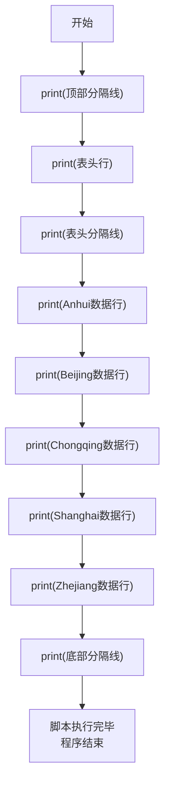
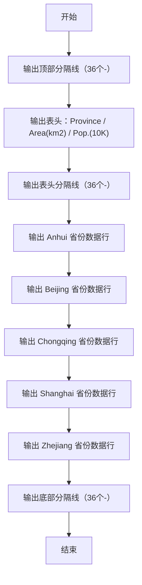

# 7-5 表格输出（Lua语言实现）

## 前言

本题（7-5 表格输出）的主要考点是：准确理解题意、规范处理输入输出格式，并正确处理边界与精度。下面先给出题目描述与格式要求，再通过清晰的思路与可直接运行的lua代码进行讲解。

## 题目描述

本题要求编写程序，按照规定格式输出表格。

## 输入格式
本题目没有输入。

## 输出格式
要求严格按照给出的格式输出下列表格：

```out
------------------------------------
Province      Area(km2)   Pop.(10K)
------------------------------------
Anhui         139600.00   6461.00
Beijing        16410.54   1180.70
Chongqing      82400.00   3144.23
Shanghai        6340.50   1360.26
Zhejiang      101800.00   4894.00
------------------------------------
```
## 输入样例
本题目没有输入。

## 输出样例
```out
------------------------------------
Province      Area(km2)   Pop.(10K)
------------------------------------
Anhui         139600.00   6461.00
Beijing        16410.54   1180.70
Chongqing      82400.00   3144.23
Shanghai        6340.50   1360.26
Zhejiang      101800.00   4894.00
------------------------------------
```
## 解题思路

这道题的核心是**格式化表格输出**，关键在于严格按照题目给定的格式逐行输出内容，包括分隔线、表头和数据行，确保空格对齐和格式一致。

### 核心问题分析

1. **无输入处理**：本题不需要读取任何输入数据，直接输出固定内容即可。
2. **格式一致性**：需要严格匹配题目给出的表格格式，包括每行的字符数、空格数量、数字的小数位数等。
3. **分隔线使用**：表格的顶部、表头下方和底部都有由36个减号`-`组成的分隔线。
4. **列对齐**：省份名称左对齐，面积和人口数据右对齐，各列之间通过精确的空格数量实现对齐。

### 算法原理说明

采用**逐行固定输出法**：
1. 分析表格结构，共有9行内容：顶部分隔线、表头、分隔线、5条数据行、底部分隔线。
2. 逐行编写`print()`语句，严格复制题目给出的每一行字符串（包括空格数量）。
3. `print()`自动在每行末尾添加换行，确保输出格式与题目完全一致。

### 具体输出步骤

1. 输出顶部分隔线：`------------------------------------`（36个减号）
2. 输出表头行：`Province      Area(km2)   Pop.(10K)`
3. 输出表头下分隔线（与顶部相同）
4. 依次输出5条省份数据行（Anhui、Beijing、Chongqing、Shanghai、Zhejiang）
5. 输出底部分隔线（与顶部相同）

## 完整代码

```lua
-- 7-5 表格输出
print("------------------------------------")
print("Province      Area(km2)   Pop.(10K)")
print("------------------------------------")
print("Anhui         139600.00   6461.00")
print("Beijing        16410.54   1180.70")
print("Chongqing      82400.00   3144.23")
print("Shanghai        6340.50   1360.26")
print("Zhejiang      101800.00   4894.00")
print("------------------------------------")
```

## 代码流程说明

1. **输出顶部分隔线**：使用`print()`打印36个减号组成的横线，并自动换行。
2. **输出表头**：打印"Province"、"Area(km2)"、"Pop.(10K)"三列表头，注意空格对齐。
3. **输出表头分隔线**：再次打印36个减号横线，分隔表头与数据。
4. **输出安徽省数据**：打印"Anhui"及其对应的面积和人口数据。
5. **输出北京市数据**：打印"Beijing"及其对应的面积和人口数据。
6. **输出重庆市数据**：打印"Chongqing"及其对应的面积和人口数据。
7. **输出上海市数据**：打印"Shanghai"及其对应的面积和人口数据。
8. **输出浙江省数据**：打印"Zhejiang"及其对应的面积和人口数据。
9. **输出底部分隔线**：打印最后一条36个减号的横线，完成表格输出。
10. **程序结束**：Lua脚本执行完毕，自然结束。

## 代码流程图



## 解题流程图



## 代码解析

```lua
-- 7-5 表格输出
print("------------------------------------")
print("Province      Area(km2)   Pop.(10K)")
print("------------------------------------")
print("Anhui         139600.00   6461.00")
print("Beijing        16410.54   1180.70")
print("Chongqing      82400.00   3144.23")
print("Shanghai        6340.50   1360.26")
print("Zhejiang      101800.00   4894.00")
print("------------------------------------")
```

输出顶部分隔线

## 复杂度分析

设输入规模为 $n$（对数值类题目为参与运算的数据量，对字符串/序列类题目为长度）。

- **时间复杂度**：$O(n)$ 或 $O(n \log n)$，主要来自一次线性遍历与常数次数学运算，无嵌套高复杂度循环。
- **空间复杂度**：$O(n)$，用于存储输入、中间结果与输出字符串；若仅使用若干标量变量则为 $O(1)$。

## 常见易错点

### 1. 输入/输出格式不符
错误：多余空格、遗漏换行、大小写或精度不符。后果：判题系统判为格式错误。正确：严格按题目要求的格式输出，数值用合适精度。

### 2. 边界条件遗漏
错误：未处理 0、最小值、单字符或空输入等边界。后果：特例 WA。正确：先列出所有边界样例，在编码前单独分支处理。

### 3. 整数溢出与类型
错误：使用过小的整数类型或忽略负号。后果：大数计算溢出。正确：按数据范围选择合适类型，必要时用更大整数类型或字符串处理。

## 更多测试

### 测试一：常规边界

**输入：**

```text
（可取题目边界附近的值，如最小值或最大值）
```

**输出：**

```text
（依据题意推导的正确结果）
```

### 测试二：特殊用例

**输入：**

```text
（可取易错点，如 0、单一元素、全同值等）
```

**输出：**

```text
（对应正确结果）
```

## 总结

本题的核心在于理清「表格输出」的输入输出关系与边界处理：先按格式读取输入，再依据规则逐步计算或遍历，最后按规范输出。该思路可迁移到同类格式化输入输出与模拟计算的题目。

