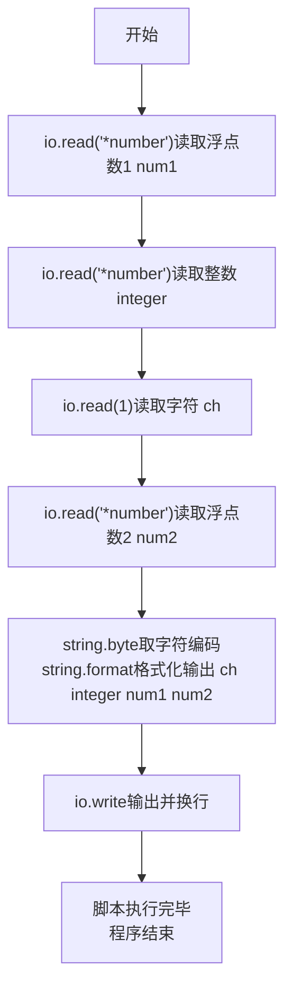
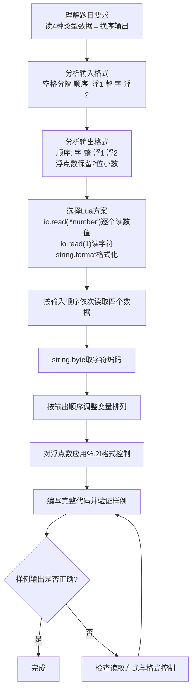

# 7-6 混合类型数据格式化输入（Lua语言实现）

## 前言

本题（7-6 混合类型数据格式化输入）的主要考点是：准确理解题意、规范处理输入输出格式，并正确处理边界与精度。下面先给出题目描述与格式要求，再通过清晰的思路与可直接运行的lua代码进行讲解。

## 题目描述

本题要求编写程序，顺序读入浮点数1、整数、字符、浮点数2，再按照字符、整数、浮点数1、浮点数2的顺序输出。

## 输入格式

输入在一行中顺序给出浮点数1、整数、字符、浮点数2，其间以1个空格分隔。

## 输出格式

在一行中按照字符、整数、浮点数1、浮点数2的顺序输出，其中浮点数保留小数点后2位。

## 输入样例

```in
2.12 88 c 4.7
```

## 输出样例

```out
c 88 2.12 4.70
```

## 解题思路

### 1. 核心问题分析

本题主要考察不同类型数据的输入输出操作，核心在于按指定顺序读入4个不同类型的数据，然后按另一种指定顺序输出，并对浮点数进行格式化处理（保留2位小数）。

### 2. 算法原理说明

1. 利用`io.read("*a")`读取全部输入，再用`string.match`按空白分割出 4 个标记，避免`%c`读取空白字符的陷阱。
2. 将前两个及最后一个标记用`tonumber`转为数值（浮点数1、整数、浮点数2），第三个标记即字符。
3. 输出时用`string.format`配合`%s`输出字符、`%d`输出整数、`%.2f`实现浮点数保留两位小数，最后用`io.write()`输出并换行。
4. 输出时按照题目要求的顺序调整变量的排列即可。

### 3. 具体计算步骤

1. 用`io.read("*a")`读取全部输入，用`:match("(%S+)%s+(%S+)%s+(%S+)%s+(%S+)")`分割出 4 个标记。
2. 将标记 1 转为浮点数1存入`num1`，标记 2 转为整数存入`integer`，标记 3 即字符`ch`，标记 4 转为浮点数2存入`num2`。
3. 按字符→整数→浮点数1→浮点数2的顺序调用`string.format("%s %d %.2f %.2f\n", ch, integer, num1, num2)`格式化输出，浮点数保留2位小数。

## 完整代码

```lua
-- 7-6 混合类型数据格式化输入
-- 读取整行并按空白分割，依次得到浮点数1、整数、字符、浮点数2
local s = io.read("*a") -- 读取全部输入
if not s then return end
local t1, t2, ch, t3 = s:match("(%S+)%s+(%S+)%s+(%S+)%s+(%S+)") -- 按空白分割 4 个标记
local num1 = tonumber(t1) -- 浮点数1
local integer = tonumber(t2) -- 整数
local num2 = tonumber(t3) -- 浮点数2
-- 按字符、整数、浮点数1、浮点数2的顺序输出，浮点数保留 2 位小数
io.write(string.format("%s %d %.2f %.2f\n", ch, integer, num1, num2))
```

## 代码流程说明

1. **读取输入**：使用`io.read("*a")`读取全部输入，用`string.match`按空白分割出 4 个标记。
2. **转换类型**：将标记 1、2、4 用`tonumber`转为数值（浮点数1、整数、浮点数2），标记 3 即字符`ch`。
3. **格式化输出**：
   - 使用`string.format()`进行格式化：`%s`输出字符、`%d`输出整数、`%.2f`输出保留2位小数的浮点数
   - 按字符→整数→浮点数1→浮点数2的顺序排列参数，末尾`\n`换行
   - 外层用`io.write()`输出
4. **程序结束**：Lua脚本执行完毕，自然结束。

## 代码流程图



## 解题流程图



## 代码解析

```lua
-- 7-6 混合类型数据格式化输入
local s = io.read("*a")
local t1, t2, ch, t3 = s:match("(%S+)%s+(%S+)%s+(%S+)%s+(%S+)")
local num1 = tonumber(t1)
local integer = tonumber(t2)
local num2 = tonumber(t3)
io.write(string.format("%s %d %.2f %.2f\n", ch, integer, num1, num2))
```

读取全部输入后按空白分割出 4 个标记，再按要求换序输出

## 复杂度分析

设输入规模为 $n$（对数值类题目为参与运算的数据量，对字符串/序列类题目为长度）。

- **时间复杂度**：$O(n)$ 或 $O(n \log n)$，主要来自一次线性遍历与常数次数学运算，无嵌套高复杂度循环。
- **空间复杂度**：$O(n)$，用于存储输入、中间结果与输出字符串；若仅使用若干标量变量则为 $O(1)$。

## 常见易错点

### 1. 输入/输出格式不符
错误：多余空格、遗漏换行、大小写或精度不符。后果：判题系统判为格式错误。正确：严格按题目要求的格式输出，数值用合适精度。

### 2. 边界条件遗漏
错误：未处理 0、最小值、单字符或空输入等边界。后果：特例 WA。正确：先列出所有边界样例，在编码前单独分支处理。

### 3. 整数溢出与类型
错误：使用过小的整数类型或忽略负号。后果：大数计算溢出。正确：按数据范围选择合适类型，必要时用更大整数类型或字符串处理。

## 更多测试

### 测试一：常规边界

**输入：**

```text
（可取题目边界附近的值，如最小值或最大值）
```

**输出：**

```text
（依据题意推导的正确结果）
```

### 测试二：特殊用例

**输入：**

```text
（可取易错点，如 0、单一元素、全同值等）
```

**输出：**

```text
（对应正确结果）
```

## 总结

本题的核心在于理清「混合类型数据格式化输入」的输入输出关系与边界处理：先按格式读取输入，再依据规则逐步计算或遍历，最后按规范输出。该思路可迁移到同类格式化输入输出与模拟计算的题目。

