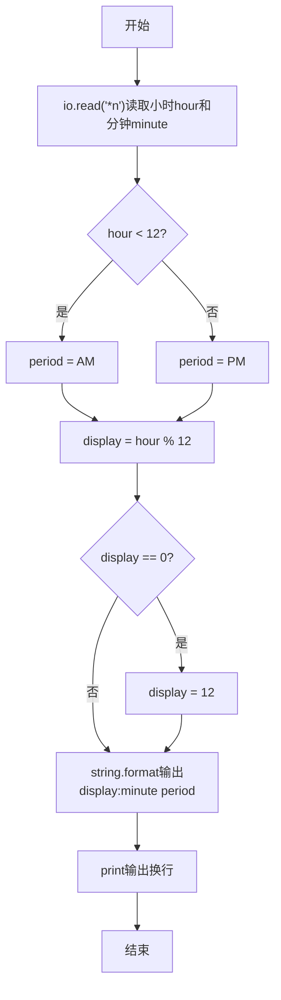
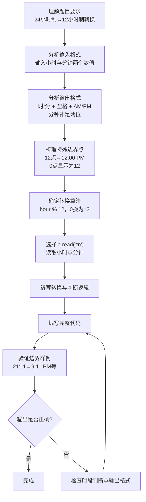

# 7-7 12-24小时制（Lua语言实现）

## 前言

本题（7-7 12-24小时制）的主要考点是：准确理解题意、规范处理输入输出格式，并正确处理边界与精度。下面先给出题目描述与格式要求，再通过清晰的思路与可直接运行的lua代码进行讲解。

## 题目描述

编写一个程序，要求用户输入24小时制的时间，然后显示12小时制的时间。

## 输入格式

输入在一行中给出带有中间的:符号（半角的冒号）的24小时制的时间，如12:34表示12点34分。当小时或分钟数小于10时，均没有前导的零，如5:6表示5点零6分。

提示：在scanf的格式字符串中加入:，让scanf来处理这个冒号。

## 输出格式

在一行中输出这个时间对应的12小时制的时间，数字部分格式与输入的相同，然后跟上空格，再跟上表示上午的字符串AM或表示下午的字符串PM。如5:6 PM表示下午5点零6分。注意，在英文的习惯中，中午12点被认为是下午，所以24小时制的12:00就是12小时制的12:0 PM；而0点被认为是第二天的时间，所以是0:0 AM。

## 输入样例

```in
21:11
```

## 输出样例

```out
9:11 PM
```

## 解题思路

### 1. 核心问题分析

本题需要完成两个核心任务：一是读取24小时制的小时和分钟，二是根据转换规则判断输出12小时制时间及AM/PM标识。关键边界点在于0点和12点的处理：中午12点被认为是下午（PM），0点被认为是第二天的时间（AM）。

### 2. 算法原理说明

1. **读取输入**：用`io.read("*l")`读取整行，再用`:match("(%d+):(%d+)")`按冒号分割小时和分钟。
2. **AM/PM判断**：以 0 与 12 为边界分四种情况：0→0 AM、1~11→原值 AM、12→12 PM、13~23→hour-12 PM。
3. **12小时制小时转换**：0 点保持 0，12 点保持 12，其余按上述规则映射，避免将 0 误转为 12。
4. **输出格式**：分钟保持原样，用`string.format("%d:%d %s", ...)`格式化，数字部分与输入相同（无前导零）。

### 3. 具体计算步骤

1. 用`io.read("*l")`读取整行并去除空白，用`match`按冒号分割得到`hour`和`minute`。
2. 按 hour 分四分支：0→0 AM、<12→原值 AM、==12→12 PM、>12→hour-12 PM。
3. 用`string.format("%d:%d %s", outHour, minute, period)`输出转换结果，分钟不补零。

## 完整代码

```lua
-- 7-7 12-24小时制
-- 输入为 h:m 形式，小时与分钟均无前导零，冒号分隔
local line = io.read("*l") -- 读取整行如 21:11
if not line or line:match("^%s*$") then line = io.read("*a") end -- 兼容空读
line = line:gsub("%s+", "") -- 去除空白
local hour, minute = line:match("(%d+):(%d+)") -- 按冒号分割
hour = tonumber(hour); minute = tonumber(minute)
local period, outHour
if hour == 0 then
    outHour = 0 -- 0 点保持 0:xx AM
    period = "AM"
elseif hour < 12 then
    outHour = hour -- 1~11 保持 AM
    period = "AM"
elseif hour == 12 then
    outHour = 12 -- 12 点为 12:xx PM
    period = "PM"
else
    outHour = hour - 12 -- 13~23 减 12 为 PM
    period = "PM"
end
-- 输出数字部分与输入相同（无前导零），空格 + AM/PM
print(string.format("%d:%d %s", outHour, minute, period))
```

## 代码流程说明

1. **读取输入**：使用`io.read("*l")`读取整行并去除空白，用`match("(%d+):(%d+)")`分割小时和分钟。
2. **判断时段并转换小时**：按 hour 分四分支（0→0 AM、<12→原值 AM、==12→12 PM、>12→hour-12 PM）。
3. **格式化输出**：用`string.format("%d:%d %s", outHour, minute, period)`按"时:分 AM/PM"格式拼接，`print()`自动换行。
4. **程序结束**：Lua脚本执行完毕，自然结束。

## 代码流程图



## 解题流程图



## 代码解析

```lua
-- 7-7 12-24小时制
local line = io.read("*l")
line = line:gsub("%s+", "")
local hour, minute = line:match("(%d+):(%d+)")
hour = tonumber(hour); minute = tonumber(minute)
local period, outHour
if hour == 0 then outHour = 0; period = "AM"
elseif hour < 12 then outHour = hour; period = "AM"
elseif hour == 12 then outHour = 12; period = "PM"
else outHour = hour - 12; period = "PM" end
print(string.format("%d:%d %s", outHour, minute, period))
```

按冒号分割读取，0 点保持 0 而非 12，分钟不补零

## 复杂度分析

程序只完成一次时间解析和分支转换，时间复杂度为 O(1)，额外空间复杂度为 O(1).

## 常见易错点

- 0 点应输出 0:分钟 AM，12 点应输出 12:分钟 PM，不能套用普通的减 12 规则。
- 分钟按输入格式输出，不要擅自补前导零。

## 更多测试

边界测试：输入 0:0，预期输出 0:0 AM。

特殊测试：输入 12:0，预期输出 12:0 PM，验证中午边界。

## 总结

本题的核心在于理清「12-24小时制」的输入输出关系与边界处理：先按格式读取输入，再依据规则逐步计算或遍历，最后按规范输出。该思路可迁移到同类格式化输入输出与模拟计算的题目。
